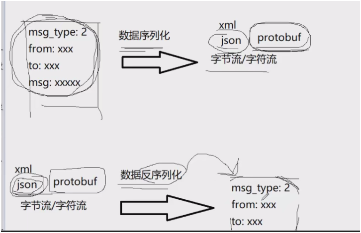
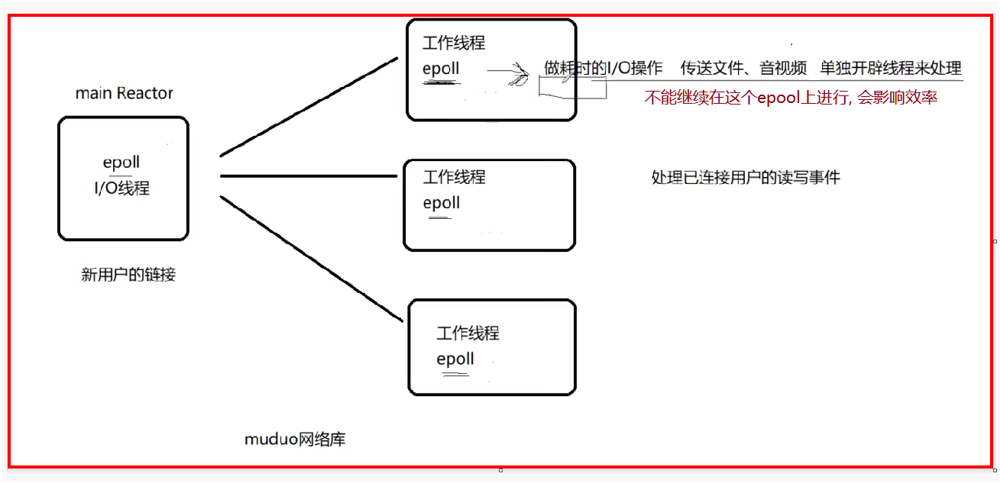
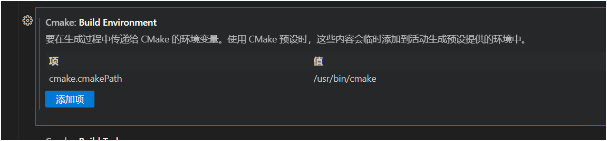
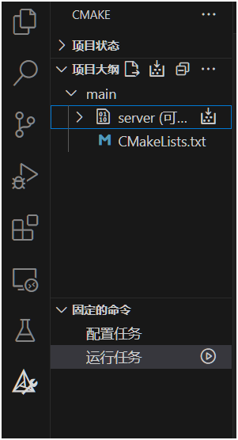

# 技术栈

> 1. Json序列化和反序列化
> 2. muduo网络库开发
> 3. nginx源码编译安装和环境部署
> 4. nginx的tcp负载均衡器配置
> 5. redis缓存服务器编程实践
> 6. 基于发布-订阅的服务器中间件redis消息队列编程实践
> 7. MySQL数据库编程
> 8. CMake构建编译环境
> 9. Github托管项目

# 项目需求

> 1. 客户端新用户注册
> 2. 客户端用户登录
> 3. 添加好友和添加群组
> 4. 好友聊天
> 5. 群组聊天
> 6. 离线消息
> 7. nginx配置tcp负载均衡
> 8. 集群聊天系统支持客户端跨服务器通信


# 环境安装

## muduo网络库安装

具体安装方法: 见老师博客

https://blog.csdn.net/QIANGWEIYUAN/article/details/89023980


### 编译错误:

以下编译错误, 是由于 Boost 库在头文件中使用了 C 风格的类型转换（`(Model*)0`），而你的编译器设置了 `-Werror=old-style-cast`，将所有警告视为错误，导致编译失败。

```c++
/root/anaconda3/include/boost/concept/detail/general.hpp: In static member function ‘static void boost::concepts::requirement<Model>::failed()’:
/root/anaconda3/include/boost/concept/detail/general.hpp:35:37: error: use of old-style cast to ‘Model*’ [-Werror=old-style-cast]
   35 |     static void failed() { ((Model*)0)->~Model(); }
      |                                     ^
/root/anaconda3/include/boost/concept/detail/general.hpp: In static member function ‘static void boost::concepts::requirement<boost::concepts::failed************ Model::************>::failed()’:
/root/anaconda3/include/boost/concept/detail/general.hpp:50:37: error: use of old-style cast to ‘Model*’ [-Werror=old-style-cast]
   50 |     static void failed() { ((Model*)0)->~Model(); }
      |                                     ^
/root/anaconda3/include/boost/concept/detail/general.hpp: In static member function ‘static void boost::concepts::constraint<Model>::failed()’:
/root/anaconda3/include/boost/concept/detail/general.hpp:65:37: error: use of old-style cast to ‘Model*’ [-Werror=old-style-cast]
   65 |     static void failed() { ((Model*)0)->constraints(); }
      |                                     ^
In file included from /root/anaconda3/include/boost/concept_check.hpp:31,
                 from /root/anaconda3/include/boost/circular_buffer/base.hpp:22,
                 from /root/anaconda3/include/boost/circular_buffer.hpp:58,
                 from /root/hzhdata/2025-bigproject/1-chat-web/package/muduo/muduo/base/BoundedBlockingQueue.h:12,
                 from /root/hzhdata/2025-bigproject/1-chat-web/package/muduo/muduo/base/AsyncLogging.h:10,
                 from /root/hzhdata/2025-bigproject/1-chat-web/package/muduo/muduo/base/AsyncLogging.cc:6:
/root/anaconda3/include/boost/concept/usage.hpp: In destructor ‘boost::concepts::usage_requirements<Model>::~usage_requirements()’:
/root/anaconda3/include/boost/concept/usage.hpp:20:38: error: use of old-style cast to ‘Model*’ [-Werror=old-style-cast]
   20 |     ~usage_requirements() { ((Model*)0)->~Model(); }
      |                                      ^
cc1plus: all warnings being treated as errors
make[2]: *** [muduo/base/CMakeFiles/muduo_base.dir/build.make:63: muduo/base/CMakeFiles/muduo_base.dir/AsyncLogging.cc.o] Error 1
make[1]: *** [CMakeFiles/Makefile2:196: muduo/base/CMakeFiles/muduo_base.dir/all] Error 2
make: *** [Makefile:141: all] Error 2
```

### 解决办法:

**修改 CMakeLists.txt**

在 `CMakeLists.txt` 中添加：

```cmake
if(CMAKE_CXX_COMPILER_ID MATCHES "GNU|Clang")
    add_compile_options(-Wno-old-style-cast)  # 忽略该警告
endif()
```

### 移动头文件和库文件

**install命令并没有把它们拷贝到系统路径下**，导致我们每次编译程序都需要指定muduo库的头文件和库文件路径，很麻烦，所以我们选择直接把inlcude（头文件）和lib（库文件）目录下的文件拷贝到系统目录下：

```bash
root@tony-virtual-machine:/home/tony/package/build/release-install-cpp11# ls
include  lib
root@tony-virtual-machine:/home/tony/package/build/release-install-cpp11# cd include/
root@tony-virtual-machine:/home/tony/package/build/release-install-cpp11/include# ls
muduo
root@tony-virtual-machine:/home/tony/package/build/release-install-cpp11/include# mv muduo/ /usr/include/
root@tony-virtual-machine:/home/tony/package/build/release-install-cpp11/include# cd ..
root@tony-virtual-machine:/home/tony/package/build/release-install-cpp11# ls
include  lib
root@tony-virtual-machine:/home/tony/package/build/release-install-cpp11# cd lib/
root@tony-virtual-machine:/home/tony/package/build/release-install-cpp11/lib# ls
libmuduo_base.a  libmuduo_http.a  libmuduo_inspect.a  libmuduo_net.a
root@tony-virtual-machine:/home/tony/package/build/release-install-cpp11/lib# mv * /usr/local/lib/
root@tony-virtual-machine:/home/tony/package/build/release-install-cpp11/lib# 
```

拷贝完成以后使用muduo库编写C++网络程序，**不用在指定头文件和lib库文件路径信息了**，因为g++会自动从/usr/include和/usr/local/lib路径下寻找所需要的文件。


## redis和mysql安装

ubuntu的  包安装

```c++
sudo apt install mysql-server
sudo apt install redis-server
```


## 验证mysql环境

查看 运行中的 服务

```c++
netstat -tanp
```

mysql 默认 **3306** 端口

```c++
tcp        0      0 127.0.0.1:3306          0.0.0.0:*               LISTEN      70276/mysqld 
```


登录一下 mysql

初次安装----->  先查看 默认密码

```c++
sudo cat /etc/mysql/debian.cnf
```

然后

```c++
mysql -u root -p<密码>
```

可能的错误:

```c++
ERROR 2002 (HY000): Can't connect to local MySQL server through socket '/tmp/mysql.sock' (2)
```

这是由于 **socket**文件路径不正确

临时修改:---->  查看密码时, 就显示了 socket的路径

```c++
mysql -u root -p<密码> -S /var/run/mysqld/mysqld.sock
```

永久修改:

```c++
sudo nano /etc/mysql/my.cnf
    
//添加
[client]
socket = /var/run/mysqld/mysqld.sock
```


## 修改mysql密码

```c++
//进入mysql后
ALTER USER 'root'@'localhost' IDENTIFIED BY '你的新密码';
FLUSH PRIVILEGES;  -- 刷新权限
```


## Nginx--先不安装

先做一个 单机的 


# Json介绍


## 为什么需要json?

之所以需要 **JSON（JavaScript Object Notation）**，是因为它是一种非常方便、通用的**数据交换格式**。简单来说，JSON 是让不同系统或程序之间**沟通**的一种“通用语言”。


## 什么是 json 序列化?

一个形象的例子:




## 常用的数据传输序列化格式?

在网络中，常用的数据传输序列化格式有**XML，Json，ProtoBuf**，在**公司级别的项目**中，大量的在使用**ProtoBuf**作为数据序列化的方式，**以其数据压缩编码传输，占用带宽小**，同样的数据信息，是Json的**1/10**，XML的**1/20**，但是使用起来**比Json稍复杂**一些，所以项目中我们选择常用的Json格式来打包传输数据。

关于 protobuf , 有另一个项目, rpc 框架


## 直接使用json第三方库

`JSON for Modern C++`

优点如下： 

- 仅是一个头文件 : `json.hpp`， 直接 拉入项目 即可
- C++ 11 标准编写
- 使用 json 像使用 STL 容器一样
- STL 和 json 容器之间可以相互转换

> 直接去 github 下载 `json.hpp` 文件即可
>
> https://github.com/nlohmann/json/releases/tag/v3.12.0


## json序列化代码演示

**何为序列化?** ----> `数据对象 转化为 json 字符串`

**主要函数:** `string str = js.dump();`    这是 转换字符串的 主要 函数

> `nlohmann::json` 默认使用 `std::map` 存储对象，而 `std::map` 本身就是自动按 key 排序（字典序）的。
>
> 因此 默认 输出 是字典序
>
>
> using ordered_json = nlohmann::ordered_json;   就可以不排序, 按照插入顺序 

**头文件:**

```c++
#include "json.hpp"
using json = nlohmann::json;    // 这个作用域是作者名字, 在 hpp文件就可以看到, 不用记
```

演示:

```c++
#include "json.hpp"
using json = nlohmann::json;

#include <iostream>
#include <vector>
#include <map>
#include <string>
using namespace std;

// json序列化示例1
void func1()
{
    json js;
    js["msg_type"] = 2;
    js["from"] = "zhangsan";
    js["to"] = "li si";
    js["msg"] = "hello, waht are you doing?";

    cout << js << endl;

    // 转字符串输出
    string sendbuf = js.dump();
    cout << sendbuf.c_str() << endl;   // 网络传送一般都是 char*, string 转一下
}

int main()
{
    func1();

    return 0;
}
```

输出:

```c++
{"from":"zhangsan","msg":"hello, waht are you doing?","msg_type":2,"to":"li si"}
{"from":"zhangsan","msg":"hello, waht are you doing?","msg_type":2,"to":"li si"}
```


## 复杂键值对演示

`键的值还是键`

```c++
void func2()
{
    json js;
    // 添加数组
    js["id"] = {1, 2, 3, 4, 5};
    // 添加key-value
    js["name"] = "zhang san";
    // 添加对象
    js["msg"]["zhang san"] = "hello world";
    js["msg"]["liu shuo"] = "hello china";
    // 上面等同于下面这句一次性添加数组对象
    js["msg"] = {{"zhang san", "hello world"}, {"liu shuo", "hello china"}};
    cout << js << endl;
}
```

输出:

```c++
{"id":[1,2,3,4,5],"msg":{"liu shuo":"hello china","zhang san":"hello world"},"name":"zhang san"}
```

**发现:** msg是一个键,  其内部还有两个键值对

## 容器序列化演示

```c++
void func3()
{
    json js;
    // 直接序列化一个vector容器
    vector<int> vec;
    vec.push_back(1);
    vec.push_back(2);
    vec.push_back(5);
    js["list"] = vec;
    
    // 直接序列化一个map容器
    map<int, string> m;
    m.insert({1, "黄山"});
    m.insert({2, "华山"});
    m.insert({3, "泰山"});
    js["path"] = m;

    cout << js << endl;
    
    string sendbuf = js.dump();
    cout<<sendbuf.c_str()<<endl;
    
}
```

输出:

```c++
{"list":[1,2,5],"path":[[1,"黄山"],[2,"华山"],[3,"泰山"]]}
{"list":[1,2,5],"path":[[1,"黄山"],[2,"华山"],[3,"泰山"]]}
```


## json反序列化演示

`json 字符串 ---> 数据对象`

**主要函数**:  `json jsbuf = json::parse(string);` --->  这里的`string: js.dump()`

**会保留 原来的 数据类型!!**

将 上面的 函数 返回值 修改为 string, `return js.dump()`

```c++
#include "json.hpp"
using json = nlohmann::json;

#include <iostream>
#include <vector>
#include <map>
#include <string>
using namespace std;

// json序列化示例1
string func1()
{
    json js;
    js["msg_type"] = 2;
    js["from"] = "zhangsan";
    js["to"] = "li si";
    js["msg"] = "hello, waht are you doing?";

    // cout << js << endl;

    // // 转字符串输出
    // string sendbuf = js.dump();
    // cout << sendbuf.c_str() << endl; // 网络传送一般都是 char*, string 转一下
    return js.dump();
}

int main()
{

    string recvBuf = func1();
    json jsbuf = json::parse(recvBuf);
    cout<<jsbuf["from"]<<endl; 
     cout<<jsbuf["msg_type"]<<endl; 
    cout<<jsbuf["to"]<<endl; 

    return 0;
}
```

```c++
string func2()
{
    json js;
    // 添加数组
    js["id"] = {1, 2, 3, 4, 5};
    // 添加key-value
    js["name"] = "zhang san";
    // 添加对象
    js["msg"]["zhang san"] = "hello world";
    js["msg"]["liu shuo"] = "hello china";
    // 上面等同于下面这句一次性添加数组对象
    js["msg"] = {{"zhang san", "hello world"}, {"liu shuo", "hello china"}};
    // cout << js << endl;
    return js.dump();
}

int main()
{

    //使用 auto 不关注 返回类型, 并且可以存储
    string recvBuf = func2();
    json jsbuf = json::parse(recvBuf);
    auto arr = jsbuf["id"];
    cout<<arr<<endl;   // [1,2,3,4,5]

    return 0;
}
```

```c++
string func3()
{
    json js;
    // 直接序列化一个vector容器
    vector<int> vec;
    vec.push_back(1);
    vec.push_back(2);
    vec.push_back(5);
    js["list"] = vec;

    // 直接序列化一个map容器
    map<int, string> m;
    m.insert({1, "黄山"});
    m.insert({2, "华山"});
    m.insert({3, "泰山"});
    js["path"] = m;

    // cout << js << endl;
    
    // string sendbuf = js.dump();
    // cout<<sendbuf.c_str()<<endl;
    return js.dump();
}

int main()
{

    string recvBuf = func3();
    json jsbuf = json::parse(recvBuf);
    vector<int> vec = jsbuf["list"];
    for(int &v:vec)
    {
        cout<<v<<" ";
    }
    cout<<endl;

    map<int, string> mymap = jsbuf["path"];
    for(auto &p:mymap)
    {
        cout<<p.first<<" "<<p.second<<" ";
    }
    cout<<endl;
    

    return 0;
}

```


## 使用总结

序列化: dump

反序列化: json::parse(...);


# muduo网络库简介

> 多看pdf
>
> 先学会用
>
> 再去看源码, 去手撕

## muduo网络库是什么?

Muduo 网络库是一个 **用 C++ 编写的高性能网络编程库**，它的核心目标是让你能用现代 C++ 编写**高并发、高性能的服务器**程序，特别适合 Linux 平台上的多线程网络编程。

> 网络程序 项目 用的最多的第三方库:
>
> 1. muduo网络库
> 2. libevent库(黑马网络编程有)
>
> 二者都是基于 多路IO复用的 epool+线程池 网络模型

## 核心思想

`reactors in threads - one loop per thread`

> **每个线程只运行一个 EventLoop，这个 EventLoop 只处理自己负责的连接。**

这就叫：**One loop per thread（一个线程对应一个事件循环）**

这也是高并发的基础

**线程数量--> 一般由 cpu核数确定**

过多耗费 cpu io 的任务, 会被交给Threadpool 线程池 中, 专门处理耗时 的计算任务, 如下图




# 补充muduo网络库知识

## Muduo 的线程模型概览：

Muduo 网络库一般分为两个主要的线程角色：

1. **主线程（IO线程 / Reactor线程 / EventLoop线程）**
2. **工作线程（线程池中的线程 / 业务线程）**


## 主线程（EventLoop 所在线程）

- 每个 `EventLoop` 对象运行在**一个特定线程中**，一般称之为 IO 线程。

- 用来**监听 IO 事件（如连接、读写事件）**，并调用对应的回调函数。

- **连接也是 IO 事件的一种**，更准确地说是：

  > **"新连接到来" 是监听 socket（listen fd）上的一种“可读事件（readable event）"。**

- 典型用途：

  - 接受新连接（通过 `Acceptor`）
  - 分发读写事件
  - 执行 `Channel` 上绑定的回调函数（如 `onMessage`, `onConnection`）

**特点：**

- 一个 `EventLoop` 不能被多个线程调用（有断言保证）。
- 所有操作必须在它自己的线程中执行，避免加锁。


## 工作线程（线程池中的线程）

- Muduo 提供了 `EventLoopThreadPool`，可以配置多个工作线程，每个线程都拥有一个独立的 `EventLoop`。
- 新连接接入后，主线程通过**轮询（round-robin）方式**将连接分发给工作线程。
- 工作线程处理与该连接相关的 IO 操作。


## 为什么这样设计？

- 主线程只负责**接入连接和分发**，避免在主线程中执行复杂逻辑，保持高响应。
- 工作线程处理数据读写，用户可以在这些线程中执行业务逻辑。
- 这种模式提高了系统的并发处理能力，同时又能保持线程之间的最小同步需求。


## 线程之间如何通信？

- 主线程和工作线程之间通过**`EventLoop::runInLoop()` 或 `queueInLoop()`**机制异步通信。
- 所有跨线程调用最终都在 `EventLoop` 所在线程中执行，避免数据竞争。


# muduo网络库编程

## 库的搜索路径问题

muduo网络库在使用时, 需要链接 一些动态库文件

```c++
lmuduo_net -lmuduo_base -lpthread
```

```bash
g++ main.cpp -o myserver -lmuduo_net -lmuduo_base -lpthread -lrt
```

如果动态库 在 usr/lib  或者 usr/local/lib   就不需要配置了

如果不在系统路径, 就需要 自己配置了


## muduo的便利性

> muduo网络库给用户`提供了两个主要的类`
>
> 1. **`TcpServer`**：用于编写服务器程序的
>
> 2. **`TcpClient`**：用于编写客户端程序的

epoll + 线程池

好处：能够把**网络I/O的代码**和**业务代码**区分开


> 业务代码 主要 暴露仅 两个 : 用户的连接和断开用户可读写事件

不需要关心怎么连接, 多少连接,  这些在网络io模块 就完成了


## 基于muduo的服务器编程

**头文件**:

```c++
#include <muduo/net/TcpServer.h> //服务端
#include <muduo/net/EventLoop.h>
```

**TcpServer 构造函数的参数:**

```c++
  TcpServer(EventLoop* loop,
            const InetAddress& listenAddr,
            const string& nameArg,
            Option option = kNoReusePort);
```

 

> 在实际使用muduo库 时,  仅需要关注 -------------->  其余的 代码基本是死的,  不用管
>
> 1. `连接与断开 的回调函数`-----> 下面的 onConnection函数
> 2. `处理用户 的 读写时间 的回调函数`-----> 下面的 onMessage 函数

```c++
#include <muduo/net/TcpServer.h>
#include <muduo/net/EventLoop.h>
#include <iostream>
#include <string>
using namespace std;
using namespace muduo;
using namespace muduo::net; // muduo::net::TcpServer

#include <functional> // 内含绑定器 bind

/*基于muduo网络库开发服务器程序
1. 组合TcpServer对象
2. 创建EventLoop事件循环对象的指针
3. 明确TcpServer构造函数需要什么参数, 输出ChatServer的构造函数----需要看源码
4. 在当前服务器类的 构造函数中, 注册 处理连接的 回调函数和 处理读写事件 的回调函数
5. 设置合适的 服务端线程数量, muduo 库会自己划分 i/o线程和 worker线程
*/

class ChatServer
{
public:
    // 构造函数 #3
    ChatServer(EventLoop *loop,               // 时间循环--反应堆
               const InetAddress &listenAddr, // 服务器地址结构--IP+PORT
               const string &nameArg)         // 服务器名字
        : _loop(loop), _server(loop, listenAddr, nameArg)

    {
        // 由于使用了 网络库, 就代表 不需要 自己写网络代码, 只需要关注 业务代码 漏出的 接口

        // 由于不知道什么时候发生, 因此 借助回调函数, 在事件发生后, 去进行回调, 执行回调函数里的代码即可

        // 1. 给服务器注册用户连接的 创建 和 断开 回调 #5
        // void setConnectionCallback(const ConnectionCallback& cb){..}  函数原型
        _server.setConnectionCallback(std::bind(&ChatServer::onConnection, this, _1)); // 传入的就是 回调函数, 而在这个类里, 写的回调函数是 成员方法, 有this指针, 但是只需要第二个传参,  因此使用 绑定器: this固定, const TcpConnectionPtr& 交给 传入者

        // 2. 给服务器注册用户 读写时间回调
        _server.setMessageCallback(std::bind(&ChatServer::onMessage, this, _1, _2, _3));

        // 设置 服务器端的 线程数量
        // 设定为 4, 一个 IO线程, 3个worker线程
        _server.setThreadNum(4); // 如果不加, 默认是一个线程, 既要监听, 还要处理 读写----> 如果设置为 2, 则监听占用一个, 剩下一个, 要处理所有的读写事件,  效率都不高
    };

    // 开启事件循环 #4
    void start()
    {
        _server.start();
    }

private:
    // 专门处理用户的连接与断开  仅处理回调接口即可 #4
    //  经过epoll litsenfd accept, 到达accept 说明有新用户连接了
    /* 然而 网络库 已经封装好 socket相关的了, 仅暴露了 回调接口!!!*/
    void onConnection(const TcpConnectionPtr &conn) // 要学会 从源码 找 类型
    // typedef std::function<void (const TcpConnectionPtr&)> ConnectionCallback;
    {
        if (conn->connected()) // bool值
        {
            cout << conn->peerAddress().toIpPort() << "->" << conn->localAddress().toIpPort() << "  state:online" << endl;
        }
        else
        {
            cout << conn->peerAddress().toIpPort() << "->" << conn->localAddress().toIpPort() << "  state:off" << endl;

            conn->shutdown();   // close(fd)
            // _loop->quit(); //退出整个服务器
        }
    }

    // 专门处理用户的 读写事件
    void onMessage(const TcpConnectionPtr &conn, // 连接
                   Buffer *buffer,               // 缓冲区
                   Timestamp time)               // 时间
    {
        string buf = buffer->retrieveAllAsString();                          // 封装了 把数据 全部放到 字符串中
        cout << "recv data: " << buf << " time:" << time.toString() << endl; // time 也是 封装的, 把时间信息转化为字符串
        conn->send(buf);                                                     // 收到 并处理后返回, 这里测试 使用 原数据返回
    }

    TcpServer _server; // #1
    EventLoop *_loop;  // #2 epoll循环, 可以注册信号,捕捉信号, 时间循环
};

int main()
{
    EventLoop loop;                      // 相当于 创建epoll      muduo::net::EventLoop
    InetAddress addr("127.0.0.1", 6000); //  muduo::net::InetAddress
    ChatServer server(&loop, addr, "ChatServer");

    server.start();  // listenfd --- 使用epoll_ctl 添加到epoll上
    loop.loop(); // epoll_wait 以阻塞方式 等待新用户连接, 已连接用户的读写事件等

    return 0;
}
```

> `InetAddress addr("127.0.0.1", 6000);`
> 这行代码创建了一个 InetAddress 对象，代表服务器监听的 IP地址和端口号。
>
> 具体解释如下：
>
> "127.0.0.1"：是 本地回环地址（localhost），意味着这个`服务器只接受来自本机的连接`。如果你希望接受外部机器的连接，可以将其改成 `0.0.0.0（表示监听所有网络接口）或者具体的本机IP`。
>
> 6000：是 端口号，表示服务器将监听这个端口，等待客户端连接。


## 编译错误问题解决

直接run code 会出现 **编译错误**:

`g++的 ld.....` ------->  这是 **链接错误**, `ld` 是 **link editor** 的缩写


**解决办法1:**

> 这里就 用到了 [库的搜索路径问题](#库的搜索路径问题)
>
> ```bash
> g++ nuduo_server.cpp -o server -lmuduo_net -lmuduo_base -lpthread
> ```
>
> -lmuduo_net 必须在前面, 后面的base 用到了 net


**解决办法2:**

> 直接设置 vscode
>
> 按F1 ----> 搜 c++的json配置文件  ----> `c_cpp_properties.json`
>
> ```bash
> //一般的 编译命令
> gcc -I头文件搜索路径  -L库文件搜索路径 -l库名称
> ```
>
> ```c++
> /usr/include    /usr/local/include
> //一般是 默认的 头文件搜索路径, 这个就不用加了
> 
> //对应的
>  /usr/lib    /usr/local/lib
> ```
>
> 
>
> 在项目文件页, `ctrl+shift+b(build)`--->**关闭搜狗输入法的 没用的快捷键, 会冲突**, 打开 g++ 配置文件 `task.json`
>
> 在编译选项, 添加那几个即可:
>
> ```c++
> "args": [
> 				"-fdiagnostics-color=always",
> 				"-g",
> 				"${file}",
> 				"-o",
> 				"${fileDirname}/${fileBasenameNoExtension}",
> 				"-lmuduo_net",
> 				"-lmuduo_base",
> 				"-lpthread"
> 			],
> ```
>
> 继续 `ctrl+shift+b(build)`, 进行编译!!!
>
> 即可 看到 输出 里包含了 这些库


> vscode 三大最重要的 json 文件:  
>
> 1. **`c_cpp_properties.json`**：配置编译器路径和头文件搜索路径，让 VSCode 能正确识别代码（自动补全、跳转定义）。
> 2. **`tasks.json`**：定义一键编译命令（如 `g++`），按 `Ctrl+Shift+B` 直接运行，省去手动输命令。
> 3. **`launch.json`**：配置调试器（如 GDB），按 `F5` 启动调试，可设断点、看变量。
>
> 三文件配合，实现 **写代码 → 编译 → 调试** 全流程自动化！


## 更多内容

muduo还有很多功能, 这里仅是简单使用, 更多可以看看  源码


# Cmake简单介绍

## Cmake与Makefile

Makefile 在大项目里, 很难写 出来,  **推荐Cmake**

1. **Makefile**
   - **直接构建工具**：定义编译规则（如 `gcc -o main main.c`），由 `make` 直接执行。
   - **手动编写**：需指定每个文件的依赖和命令，适合小型项目。
   - **平台差异**：不同系统的 `make` 可能有兼容性问题。
2. **CMake**
   - **构建系统生成器**：通过 `CMakeLists.txt` 描述项目结构，自动生成平台相关的构建文件（如 Makefile 或 IDE 工程）。
   - **跨平台**：一套配置适配多平台（Linux/Mac/Windows）。
   - **高级功能**：自动处理依赖、安装规则等，适合中大型项目。

## Cmake配置

直接手写 cmake配置文件`CMakeLists.txt`, 命令行执行, 是可行的

**vscode的cmake插件**,  再写 cmake 时 会**有代码提示**----------> **cmake 与 cmake tools**

1. cmake tools 设置里, 在对应的 本机或者 远程 设置一下 cmake 的 build enviroment:  添加一下 cmake的 路径(需要安装 cmake)

   




## CmakeLists.txt 编写

1. **CMAKE_CXX_FLAGS** 是 CMake 中用于设置 全局 C++ 编译器选项 的变量，影响项目中所有 C++ 目标的编译行为。

2. 在 CMake 中，`set()` 命令用于 **定义或修改变量**，是 CMake 脚本中最基础且重要的命令之一

   ```cmake
   set(变量名 值)  # 定义普通变量
   ```

3. 在 CMake 中，`add_executable` 是一个核心命令，用于**定义可执行文件目标**。

   ```cmake
   add_executable(<目标名称> [WIN32] [MACOSX_BUNDLE] [EXCLUDE_FROM_ALL] <源文件列表>)
   ```

   最主要的是 目标名称 和 源文件列表

   **例子:**

   ```cmake
   #单文件
   add_executable(hello_world main.cpp)
   
   #多文件
   add_executable(my_app 
       main.cpp 
       utils.cpp 
       include/utils.h
   )
   
   #条件编译--不同平台
   if(WIN32)
       add_executable(my_win_app WIN32 win_main.cpp)
   else()
       add_executable(my_win_app main_unix.cpp)
   endif()
   
   #使用变量组织源文件
   set(APP_SOURCES 
       src/main.cpp 
       src/core.cpp
   )
   add_executable(my_app ${APP_SOURCES})
   ```

4. 在 CMake 中，`target_link_libraries` 是一个关键命令，用于**为指定的目标（可执行文件或库）链接依赖库**。它管理目标的所有链接依赖关系，是现代 CMake 推荐的做法。  --- 更多使用, 多见多总结 --- 老师pdf也有很多, 多看

   ```c++
   target_link_libraries(<目标名称>
       <PRIVATE|PUBLIC|INTERFACE> <库1> [<库2>...]
       [<PRIVATE|PUBLIC|INTERFACE> <库3>...]
   )
   ```

5. `aux_source_directory` 是 CMake 中一个 **用于自动收集源文件** 的命令，但现代 CMake 已不再推荐使用它。

   ```c++
   aux_source_directory(<目录路径> <变量名>)
   ```

   **为什么不推荐使用？**

   1. **不会自动检测新增文件**
      需要手动重新运行 CMake 才能识别新添加的源文件。
   2. **包含无关文件风险**
      可能意外包含测试文件、备份文件（如 `main.cpp.bak`）。
   3. **破坏构建系统的确定性**
      隐式文件收集会导致构建行为不可预测。
   4. **与现代 CMake 理念冲突**
      现代 CMake 强调显式声明源文件（`target_sources()`）。

   推荐使用 set 手动, 很麻烦


## 完整cmake例子

```cmake
cmake_minimum_required(VERSION 3.0)
project(main) #工程名

# 配置编译选项
set(CMAKE_CXX_FLAGS ${CMAKE_CXX_FLAGS} -g)

# 配置头文件搜索路径
include_directories()
# 配置库文件搜索路径
link_directories()

#设置需要编译的 源文件列表
set(SRC_LIST ./nuduo_server.cpp)

#把 . 指定路径下的 所有源文件名字 放入变量名--不用手动一个个输入
# aux_source_directory(. SRC_LIST) #暂时不用

#生成可执行文件
add_executable(server ${SRC_LIST})

# 表示server 这个目标程序 需要链接的 库
target_link_libraries(server muduo_net muduo_base pthread)

```

然后 先执行  `cmake .`----> 得到 makefile文件 ---> 再`make` 即可


## 文件夹杂乱问题

直接 使用上面的 构建, 生成许多杂乱的 文件夹

一般 开源性代码 会有以下结构:

| 目录/文件        | 用途描述                           | 文件类型示例               |
| ---------------- | ---------------------------------- | -------------------------- |
| `bin/`           | 存放生成的可执行文件（二进制文件） | `myapp`, `myapp.exe`       |
| `lib/`           | 存放编译生成的库文件               | `libmylib.a`, `mylib.so`   |
| `include/`       | 存放项目的公共头文件               | `utils.h`, `config.hpp`    |
| `src/`           | 存放项目的主要源代码文件           | `main.cpp`, `module.c`     |
| `build/`         | 存放CMake生成的构建文件            | `Makefile`, `build.ninja`  |
| `example/`       | 存放示例代码或测试用例             | `demo.cpp`, `test_case.py` |
| `thirdparty/`    | 存放第三方依赖库或源码             | `googletest/`, `boost/`    |
| `CMakeLists.txt` | CMake的主配置文件                  | -                          |
| `autobuild.sh`   | 自动化构建脚本                     | -                          |

1. 在 CMake 中，`EXECUTABLE_OUTPUT_PATH` 是一个用于**设置可执行文件输出路径**的全局变量。它控制通过 `add_executable()` 生成的可执行文件的存放位置。

   在 CMake 中，`PROJECT_SOURCE_DIR` 是一个**预定义变量**，表示**当前项目的根目录路径**（即包含顶层 `CMakeLists.txt` 的目录）。

   ```cmake
   set(EXECUTABLE_OUTPUT_PATH ${PROJECT_SOURCE_DIR}/bin)
   ```

2. 建立 build 文件, 进入build 进行 `cmake ..`,  之前的 杂乱的文件夹就在这个目录里了, 并且  可执行文件 在bin目录里

3. 完整如下:

   ```cmake
   cmake_minimum_required(VERSION 3.0)
   project(main) #工程名
   
   # 配置编译选项
   set(CMAKE_CXX_FLAGS ${CMAKE_CXX_FLAGS} -g)
   
   # 配置头文件搜索路径
   include_directories()
   # 配置库文件搜索路径
   link_directories()
   
   #设置需要编译的 源文件列表
   set(SRC_LIST ./nuduo_server.cpp)
   
   # 设置可执行文件最终目录
   set(EXECUTABLE_OUTPUT_PATH ${PROJECT_SOURCE_DIR}/bin)
   
   # 设置库文件最终目录
   set(LIBRARY_OUTPUT_DIRECTORY ${PROJECT_SOURCE_DIR}/lib)
   
   #把 . 指定路径下的 所有源文件名字 放入变量名--不用手动一个个输入
   # aux_source_directory(. SRC_LIST) #暂时不用
   
   #生成可执行文件
   add_executable(server ${SRC_LIST})
   
   # 表示server 这个目标程序 需要链接的 库
   target_link_libraries(server muduo_net muduo_base pthread)
   
   ```

   

## 多级目录Cmake

**内部的`CMakeLists.txt`**  不需要 前5行, 这是 cmake的 入口
把这5行 放入 **最外部的 `CMakeLists.txt`**,  并且 加入 指定搜索的 子目录   即可

```cmake
cmake_minimum_required(VERSION 3.0)
project(main) #工程名

# 配置编译选项
set(CMAKE_CXX_FLAGS ${CMAKE_CXX_FLAGS} -g)

# 指定搜索的 子目录
add_subdirectory(testmuduo)
```


## vscode 极其推荐 的 cmake方式

vscode 插件 会有图标, 使用这个 进行 编译------>  即完成,  并会 外部 **自动构建   build 文件**



> 注意:  仅会自动构建 build 文件,  bin 文件 还需要手动指定, 在 内部CMakeLists.txt 里 进行

**VS Code CMake 插件的自动化机制**

**(1) 自动行为说明**

- **自动生成 `build/` 目录**
  插件默认会在项目根目录下创建 `build/`（或用户配置的路径），自动处理以下内容：

  bash

  复制

  ```
  mkdir -p build && cd build
  cmake .. -DCMAKE_BUILD_TYPE=Debug  # 自动选择编译器工具链
  ```

- **实时更新**
  插件会监控 `CMakeLists.txt` 和源码文件的修改，但**不会实时构建**，仅在以下情况触发：

  - 手动点击编译按钮
  - 保存文件时（若开启 `"cmake.configureOnEdit": true`）
  - 执行调试/运行任务时

**(2) 优势**

- 无需手动输入 CMake 命令
- 自动匹配编译器工具链（通过 `CMake: Scan for Kits`）
- 与 VS Code 调试功能深度集成


**Cmake 到此为止----->  更多内容 见 pdf**

## 命令行cmake方法

进入build文件夹

```c++
cmake ..

make

就行了
```


# Mysql环境与编程

登录 之前写过, 略

mysql 有课程, 建议看一下  --- >   **必须要了解 数据库 mysql !!!**

## mysql简单使用

1. 创建数据库:

   ```c++
   CREATE DATABASE database_name;   // 大小写都行
   ```

2. 选择要操作的 数据库:

   ```c++
   use database_name; 
   ```

3. 查看默认的字符编码:

   ```c++
   show variables like "char%";
   ```

   修改表的字符编码：`alter table user default character set utf8;`
   修改属性的字符编码：`alter table user modify column name varchar(50) character set utf8;`

4. 从已有的 sql文件读取,  需要先创建 一个数据库, 并且选中它进行操作,  再 `source ./<..>.sql`

5. 根据表, 在mysql里 进行创建. --- 具体表

   ## User表
   | 字段名称 | 字段类型                 | 字段说明     | 约束                        |
   | -------- | ------------------------ | ------------ | --------------------------- |
   | id       | INT                      | 用户id       | PRIMARY KEY, AUTO_INCREMENT |
   | name     | VARCHAR(50)              | 用户名       | NOT NULL, UNIQUE            |
   | password | VARCHAR(50)              | 用户密码     | NOT NULL                    |
   | state    | ENUM('online','offline') | 当前登录状态 | DEFAULT 'offline'           |

   ## Friend表
   | 字段名称 | 字段类型 | 字段说明 | 约束               |
   | -------- | -------- | -------- | ------------------ |
   | userid   | INT      | 用户id   | NOT NULL, 联合主键 |
   | friendid | INT      | 好友id   | NOT NULL, 联合主键 |

   ## AllGroup表
   | 字段名称  | 字段类型     | 字段说明   | 约束                        |
   | --------- | ------------ | ---------- | --------------------------- |
   | id        | INT          | 组id       | PRIMARY KEY, AUTO_INCREMENT |
   | groupname | VARCHAR(50)  | 组名称     | NOT NULL, UNIQUE            |
   | groupdesc | VARCHAR(200) | 组功能描述 | DEFAULT ''                  |

   ## GroupUser表
   | 字段名称  | 字段类型                 | 字段说明 | 约束               |
   | --------- | ------------------------ | -------- | ------------------ |
   | groupid   | INT                      | 组id     | NOT NULL, 联合主键 |
   | userid    | INT                      | 组员id   | NOT NULL, 联合主键 |
   | grouprole | ENUM('creator','normal') | 组内角色 | DEFAULT 'normal'   |

   ## OfflineMessage表
   | 字段名称 | 字段类型     | 字段说明                 | 约束     |
   | -------- | ------------ | ------------------------ | -------- |
   | userid   | INT          | 用户id                   | NOT NULL |
   | message  | VARCHAR(500) | 离线消息(存储Json字符串) | NOT NULL |


# 集群聊天项目工程目录创建

略---> bin  build  include src thirdparty 文件夹

外层 CMakeLists.txt  和  src 的两层 CMakeLists.txt

```cmake
cmake_minimum_required(VERSION 3.0)
project(main) #工程名

# 配置编译选项
set(CMAKE_CXX_FLAGS ${CMAKE_CXX_FLAGS} -g)

# 配置最终的可执行文件输出的路径
set(EXECUTABLE_OUTPUT_PATH ${PROJECT_SOURCE_DIR}/bin)

# 配置 头文件 搜索路径
include_directories(${PROJECT_SOURCE_DIR}/include)
include_directories(${PROJECT_SOURCE_DIR}/include/server)

# 加载子目录  src   既然进去, 就有 CMakeLists.txt
add_subdirectory(src)


```

```cmake
# 加载子目录  src   既然进去, 就有 CMakeLists.txt
add_subdirectory(server)
```

```cmake
# 所有源文件
aux_source_directory(. SRC_LIST)
# 生成可执行
add_executable(Chatserver ${SRC_LIST})

# 链接库
target_link_libraries(Chatserver muduo_net muduo_base pthread)
```


# 网络模块代码Chatserver

hpp文件 写声明

源文件 进行定义使用

## 头文件

**include/chatserver.hpp**

```c++
#ifndef CHATSERVER_H
#define CHATSERVER_H

#include <muduo/net/TcpServer.h>
#include <muduo/net/EventLoop.h>
using namespace muduo;
using namespace muduo::net;

// 聊天服务器主类
class ChatServer
{
public:
    // 初始化聊天服务器对象
    ChatServer(EventLoop *loop,
               const InetAddress &listenAddr,
               const string &nameArg);
    // 启动服务
    void start();

private:
    // 上报连接 相关信息的回调
    void onConnect();
    // 上报读写事件相关信息的 回调
    void onMessage();

    TcpServer _server; // 组合的muduo库, 实现服务器功能的 类对象
    EventLoop *_loop;  // 指向事件循环对象的 指针
};

#endif 
```


## 类函数定义文件

**src/server/chatserver.cpp**

不完整, 回调内部 还没写

```c++
#include "chatserver.hpp"

#include <functional>
using namespace std;
using namespace placeholders;

// 类外 定义成员函数
ChatServer::ChatServer(EventLoop *loop,
                       const InetAddress &listenAddr,
                       const string &nameArg)
    : _server(loop, listenAddr, nameArg), _loop(loop)
{
    // 注册连接回调函数
    _server.setConnectionCallback(std::bind(&ChatServer::onConnect, this, _1));

    // 注册消息回调
    _server.setMessageCallback(std::bind(&ChatServer::onMessage, this, _1, _2, _3));

    // 设置线程数
    _server.setThreadNum(4);
}

void ChatServer::start()
{
    _server.start();
}

void ChatServer::onConnect(const TcpConnectionPtr& conn)
{

}

void ChatServer::onMessage(const TcpConnectionPtr& conn,
    Buffer* buf,
    Timestamp time)
{   
    
}
```

## 主函数文件

**src/server/main.cpp**

```c++
#include "chatserver.hpp"
#include <iostream>
using namespace std;


int main()
{
    EventLoop loop;
    InetAddress addr("127.0.0.1", 6000);
    ChatServer server(&loop, addr, "ChatServer");

    server.start();
    loop.loop();


    return 0;
}

```

# 业务模块ChatService

## 网络模块-连接回调

先补充一下 这部分   ChatServer::onConnect 函数

> 先考虑一下: 
>
> ```c++
> 不想在这里 写 ifelse等等, 调用登录业务啥的,注册服务啥的---- 这样不好----这样把 网络模块和 业务模块 放一起了, 强耦合性, 并没有解耦
> ```
>
> 


强耦合（Tight Coupling）是指 **模块（类、组件、服务）之间高度依赖彼此的实现细节**


## 实现解耦

不要在 网络模块里 直接调用业务模块的 代码和方法,  我们希望 在网络模块里, 是看不到业务模块的 代码

> **解耦**
>
> - 网络模块应避免直接依赖业务模块的代码或方法，保持模块间的隔离性。理想情况下，网络模块的代码中不应出现业务逻辑相关的引用。
>
> 
>
> **怎么实现解耦呢?**
>
> - 可以通过**回调、协议抽象或事件通知**等方式实现解耦，确保网络模块只处理通信相关逻辑，业务模块负责具体的数据处理和业务规则。


在**oop语言里**边，要解偶模块之间的这个关系啊，一般有**两种方法**:

1. 一种就是使用基于面向接口的编程

   在C++里边没有所谓的接口。

   实际上，**在C++里边接口就是抽象类**嘛，抽象基类，面向抽象基类的编程，或者就是基于这个。

2. ....


英语: 在编程中，**handler**（中文常译为“处理器”或“处理程序”）通常指**用于响应特定事件或管理特定任务的代码单元**。


## 业务头文件

**include/server/chatservice.hpp**

```c++
// 仅需要一个 实例即可 因此使用单例模式

#ifndef CHATSERVICE_H
#define CHATSERVICE_H

#include <muduo/net/TcpConnection.h>
#include <unordered_map>
#include <functional>
using namespace std;
using namespace muduo;
using namespace muduo::net;

#include "json.hpp"
using namespace nlohmann;

//表示处理消息的事件回调方法类型
using MsgHandler = std::function<void(const TcpConnectionPtr &conn, json &js, Timestamp time)>; // #1

// 聊天服务器 业务类
class ChatService
{
public:
    // 获取单例对象的接口函数 #6
    static ChatService *instance();

    // 处理的登录业务 #2
    void login(const TcpConnectionPtr &conn, json &js, Timestamp time);
    // 处理注册业务 #3
    void reg(const TcpConnectionPtr &conn, json &js, Timestamp time);

    //获取消息对应的处理器 #7
    MsgHandler getHandler(int msgid);

private:
    // 单例模式----构造函数私有化,并写一个惟一的实例
    ChatService(); // #5

    // 存储消息id 和 其对应的 业务处理方法
    unordered_map<int, MsgHandler> _msghandlermap; // #4
};

#endif
```

## 公共头文件

**include/public.hpp**

```c++
#ifndef PUBLIC_H
#define PUBLIC_H
/*
server 和 client 的公共文件
*/

enum EnMsgType  // 枚举
{
    LOGIN_MSG=1,   // 与业务的login函数连接
    REG_MSG  //注册消息
};


#endif
```

## 业务函数定义文件

**src/server/service.cpp**

使用了 **线程安全的 非互斥锁** **懒汉式单例模式**---详见c++笔记专栏


在 **C++** 中，**如果异常没有被捕获（uncaught exception），默认情况下会调用 `std::terminate()`，导致程序终止**。这是 C++ 异常处理机制的核心行为之一。

> "如果网络模块（如 `muduo`）调用了服务模块（如 `ChatService`），而服务模块抛出了异常，但网络模块没有捕获它，那整个进程就会崩溃。这种情况下，我们是不是必须在网络模块里处理服务模块抛出的异常？否则程序就完蛋了？"

**答案是：是的！** 如果异常没有被捕获，它会导致 **程序终止（std::terminate 被调用）**，这在服务器程序中是 **灾难性的**（所有客户端连接都会断开，服务不可用）。


```c++
#include "chatservice.hpp"
#include "public.hpp"
#include <muduo/base/Logging.h>
using namespace muduo;


// 获取单例对象的 函数接口
ChatService *ChatService::instance()
{
    static ChatService service; // 线程安全 懒汉式单例
    return &service;
}

// 注册消息以及对应的 handler 回调
ChatService::ChatService()
{
    // 网络模块和业务模块 解耦的核心

    _msghandlermap.insert({LOGIN_MSG, std::bind(&ChatService::login, this, _1, _2, _3)});

    _msghandlermap.insert({REG_MSG, std::bind(&ChatService::reg, this, _1, _2, _3)});
}

//获取消息对应的处理器
MsgHandler ChatService::getHandler(int msgid)
{
    //记录错误日志, msgid 没有对应的事件回调
    auto it = _msghandlermap.find(msgid);
    if(it == _msghandlermap.end())
    {
        // 使用 muduo 自带的日志系统
        // 不要endl, 已经封装了
        // LOG_ERROR<<"msgid: "<<msgid<<"can not find Handler!"; 

        return [=](const TcpConnectionPtr &conn, json &js, Timestamp time){
            LOG_ERROR<<"msgid: "<<msgid<<"can not find Handler!"; 
        };
    }

    else 
    {
        return _msghandlermap[msgid];
    }
    
}

// 处理登录业务
void ChatService::login(const TcpConnectionPtr &conn, json &js, Timestamp time)
{
    LOG_INFO<<"do login service"; //测试用
}

// 处理注册业务
void ChatService::reg(const TcpConnectionPtr &conn, json &js, Timestamp time)
{
    LOG_INFO<<"do reg service"; ////测试用
}
```

## 补充网路模块onMessgae()

```c++
void ChatServer::onMessage(const TcpConnectionPtr& conn,
    Buffer* buffer,
    Timestamp time)
{   
    string buf = buffer->retrieveAllAsString();
    // 数据反序列化
    json js = json::parse(buf);

     //达到的目的: 完全解耦网络模块的代码 和 业务模块的 代码
     //通过js["msgid"]获取=>业务handler=>传 conn, js, time等信息
    /*
        这样, 业务仅有 两行代码, 没有任何业务层的方法(login,reg等)调用
        仅需在 服务层内部, 做一个 业务相应的 回调
    */
     //获取msgid 对应的处理器
     auto msgHandler = ChatService::instance()->getHandler(js["msgid"].get<int>());  //json键是字符串, 要换成整型----get方法, 会用就行
     // 回调消息绑定好的 事件处理器, 来执行相应的业务处理
    msgHandler(conn, js, time);

}
```


## 测试

注意: 前面的 CMakeLists.txt 要添加 json 头文件搜索路径

```c++
//client
{"msgid":1}

//server 打印
20250418 03:41:52.258725Z 31993 INFO  do login service - chatservice.cpp:50
```


## 至此

每一个大的模块, 写完都要测试一下

**网络 模块 完毕, 剩下的 将专注于 业务层 与 数据层!!!**


# mysql数据库代码封装

业务层处理 数据层----> 要低耦合, 不要在 业务层 写数据库代码

## ORM (对象关系映射) 框架

**ORM (Object-Relational Mapping)** 是一种编程技术，用于在面向对象编程语言中实现不兼容类型系统之间的数据转换，即在**关系型数据库和面向对象语言之间**建立**映射**关系。


## DAO (Data Access Object) 数据访问对象模式

DAO 是一种核心的J2EE设计模式，用于抽象和封装对数据源的访问，将**底层数据访问逻辑与业务逻辑分离**。

**1. 定义**

DAO (Data Access Object) 是数据访问对象模式的简称，它：

- 位于业务逻辑与持久化存储之间
- 封装所有数据访问细节
- 为上层提供统一的数据操作接口

**2. 核心组件**

- **DAO接口**：定义数据操作的标准方法
- **DAO实现类**：针对不同数据源的具体实现
- **数据传输对象(DTO)**：在层间传输数据的载体


## 分离数据层与业务层

业务层操作的都是 对象 ---> 使用ORM

数据层 封装了所有数据库操作 ---> 使用DAO


## 数据库读取头文件

添加 数据层头文件搜索路径 以及 编译要加 mysqlclient

```cmake
include_directories(${PROJECT_SOURCE_DIR}/include/server/db) #数据层头文件


target_link_libraries(Chatserver muduo_net muduo_base pthread mysqlclient)
```

一定要安装 libmysqlclient-dev, 要有这个库文件

```bash
sudo apt-get install libmysqlclient-devsudo apt-get install libmysqlclient-dev
```


**include/db/db.h**

```c++
#ifndef DB_H
#define DB_H

#include <mysql/mysql.h> //只有安装了 库, 才有这个头文件
#include <string>
using namespace std;


// 数据库配置信息
static string server = "127.0.0.1";
static string user = "root";
static string password = "123456";
static string dbname = "chat";
// 数据库操作类
class MySQL
{
public:
    // 初始化数据库连接
    MySQL();
   
    ~MySQL();
    // 连接数据库
    bool connect();
    
    // 更新操作
    bool update(string sql);
    
    // 查询操作
    MYSQL_RES *query(string sql);
    

private:
    MYSQL *_conn;
};

#endif
```


## 数据库类函数源文件

要注意: CMakeLists.txt 编译时 要包含这个cpp

```cmake
# 所有源文件
aux_source_directory(. SRC_LIST)
# 数据层步骤 需要添加
aux_source_directory(./db DB_LIST)
# 生成可执行 
add_executable(Chatserver ${SRC_LIST} ${DB_LIST})

# 链接库
target_link_libraries(Chatserver muduo_net muduo_base pthread mysqlclient)
```


**src/db/db.cpp**

代码看不明白----需要补充mysql知识

```c++
#include "db.h"
#include <muduo/base/Logging.h>
using namespace muduo;

// 初始化数据库连接
MySQL::MySQL()
{
    _conn = mysql_init(nullptr);
}
// 释放数据库连接资源这里用UserModel示例，通过UserModel如何对业务层封装底层数据库的操作。代码示例如下：
MySQL::~MySQL()
{
    if (_conn != nullptr)
        mysql_close(_conn);
}
// 连接数据库
bool MySQL::connect()
{
    MYSQL *p = mysql_real_connect(_conn, server.c_str(), user.c_str(),
                                  password.c_str(), dbname.c_str(), 3306, nullptr, 0);
    if (p != nullptr)
    {
        // c/c++代码默认的编码字符是ASCII, 如果不设置, 从mysql 拉下来的中文显示 不能正常用
        mysql_query(_conn, "set names gbk");
    }
    return p;
}
// 更新操作
bool MySQL::update(string sql)
{
    if (mysql_query(_conn, sql.c_str()))
    {
        LOG_INFO << __FILE__ << ":" << __LINE__ << ":"
                 << sql << "更新失败!";
        return false;
    }
    return true;
}
// 查询操作
MYSQL_RES *MySQL::query(string sql)
{
    if (mysql_query(_conn, sql.c_str()))
    {
        LOG_INFO << __FILE__ << ":" << __LINE__ << ":"
                 << sql << "查询失败!";
        return nullptr;
    }
    return mysql_use_result(_conn);
}
```


# 使用ORM, 实现注册业务

## **第一步:** 

需要**先定义类**, 这个类 需要跟 数据库里的表 **一一对应**

`sprintf` 是一个用于格式化字符串的函数，它将格式化的数据写入一个字符串缓冲区，而不是像 `printf` 那样直接输出到标准输出（stdout）

以用户类为例:

**include/server/user.hpp**

```c++
// 映射类
// user的 ORM类, 用于映射字段

#ifndef USER_H
#define USER_H
#include <string>
using namespace std;


class User
{
public:
    User(int id=-1, string name="", string password = "", string state="offline")
    {
        this->id = id;
        this->name = name;
        this->password=password;
        this->state=state;
    }

    // 修改接口
    void setId(int id) {this->id = id;}
    void setName(string name) {this->name = name;}
    void setPwd(string pwd) {this->password = pwd;}
    void setState(string state) {this->state = state;}

    // 获取
    int getId() {return this->id ;}
    string getName() {return this->name;}
    string getPwd() {return this->password;}
    string getState() {return this->state;}


private:
    int id;
    string name;
    string password;
    string state;
};

#endif
```


## **第二步:** 

修改 用户类的 头文件

**include/server/usermodel.hpp**

```c++
// 实际操作 表 的 类----增删改查

#ifndef USERMODEL_H
#define USERMODEL_H

#include "user.hpp"

//User 表的 数据操作类
class UserModel
{
    public:
    //user表的 增加方法
    bool insert(User &user);
};

#endif;
```


## **第三步:**

定义 修改 类 的 函数

db.h 与 db.cpp 添加 获取数据库对象的 方法

```c++
MYSQL *MySQL::getConnection()
{
    return _conn;
}
```


**src/server/usermodel.cpp**

```c++
#include "usermodel.hpp"
#include "db.h"

#include <iostream>
using namespace std;

//user表的 增加方法
bool UserModel::insert(User &user)
{
    //1. 组装 sql语句
    char sql[1024]={0};
    sprintf(sql, "insert into user(name, password, state) values('%s', '%s', '%s')", user.getName().c_str(), user.getPwd().c_str(), user.getState().c_str());  // 注意 %s, 每个要单独''起来, 整个''是连起来的一个字符串

    MySQL mysql;
    if(mysql.connect())
    {
        if(mysql.update(sql))
        {
            //获取插入成功的 用户数据生成的 主键id
            user.setId(mysql_insert_id(mysql.getConnection()));
            return true;
        }
    }
    return false;
}
```

## 错误1:

```c++
sprintf(sql, "insert into user(name, password, state) values('%s', '%s', '%s')", user.getName().c_str(), user.getPwd().c_str(), user.getState().c_str());
```

```c++
insert into user(name, password, state) values('%s', '%s', '%s');  // 这是mysql中的添加语句, user与表名必须一致!!
```


## 小技巧--红色波浪线问题

在vscode里, 有时候cmake能正常编译, 但是 编写代码 有的 会出现 红色波浪线, 尽管包含了头文件, 它也还在 ,  这个 对于 有点强迫症的, 可忍受不了!!!!!!!!


修改一下 .vscode的 json文件:  `c_cpp_properties.json`

```c++
"includePath": [
                "${workspaceFolder}/**"
    }

// 改成 下面这个, 具体看自己的 头文件在哪

"includePath": [
                "${workspaceFolder}/**",
                "${workspaceFolder}/include/**",
                "${workspaceFolder}/thirdparty/**"
            ],
```


**更简单的:** 让 cmake 管理 路径

```c++
"configurationProvider": "ms-vscode.cmake-tools"  // 关键！让CMake接管配置
```


还有一种是 右下角 会有 IntelliSense 提示 未配置, 黄色感叹号, 可以点击 以下, 选择 cmake , 也能解决


一共三种 方法, 那种能用 用哪个


## 补充并测试注册业务

model 给 业务 提供的 都是 对象!!

```c++
select * from user;   //mysql里查看 user表的全部信息
```


**第一步:** **业务中添加 数据操作类对象**

**chatservice.hpp**

```c++
private:
// 注册业务测试
    // 数据操作类对象
    UserModel _usermodel;
```


**第二步:补充 注册业务代码**

**src/server/chatservice.cpp**

```c++
// 处理注册业务
void ChatService::reg(const TcpConnectionPtr &conn, json &js, Timestamp time)
{
    // LOG_INFO<<"do reg service"; ////测试用

    // 注册仅需要 name password
    string name = js["name"];
    string password = js["password"];

    User user;
    user.setName(name);
    user.setPwd(password);
    bool state = _usermodel.insert(user);
    if(state)
    {
        //注册成功
        json response;
        response["msgid"] = REG_MSG_ACK;
        response["errno"] = 0;
        response["id"] = user.getId();
        conn->send(response.dump());
    }
    else
    {
        //注册失败
        json response;
        response["msgid"] = REG_MSG_ACK;
        response["errno"] = 1;
        conn->send(response.dump());
    }

}
```


## mysql连接失败解决

- `auth_socket` 插件**只允许通过 Unix Socket 本地连接**（不能用于 TCP/IP 或远程连接）
- 如果你的代码使用 `127.0.0.1`（TCP/IP）连接，`auth_socket` **会拒绝认证**
  （即使是在本机，`127.0.0.1` 也算 TCP/IP 连接，不是 Unix Socket）


查看当前认证插件：

```
SELECT user, plugin FROM mysql.user;
```

修改 root 认证方式（两种选择）：

- **改为 mysql_native_password**（兼容旧客户端）：

  ```
  ALTER USER 'root'@'localhost' IDENTIFIED WITH mysql_native_password BY '123456';
  FLUSH PRIVILEGES;
  ```


# 阶段总结-1

> 自己的 语言: 
>
> db.h---> 提供 数据库 基本连接,查询等的 声明
>
> db.cpp---> 提供db.h 的具体实现
>
> user.hpp ---> 数据库的 模型类 , 由于内容少, 直接 包含了 具体实现
>
> usermodel.hpp ---> 提供 给 业务 的 对象, 仅包含 操作方法的 声明
>
> usermodel.cpp ---> 对 操作方法的 具体实现
>
> 在 业务模块中, 例如 chatservice.hpp 和 cpp, 都是 仅接收了 对象, 调用 对应方法,  没有设计 具体实现,  达到了 解耦性

ai 润色:

1. **数据库基础层**
   - `db.h`：声明数据库基本连接、查询等接口
   - `db.cpp`：实现数据库核心功能的具体细节
2. **数据模型层**
   - `user.hpp`：定义与数据库表对应的模型类（采用头文件实现模式）
3. **业务逻辑层**
   - `usermodel.hpp`：声明面向业务的操作接口
   - `usermodel.cpp`：实现具体的业务逻辑操作
4. **服务层**
   - `chatservice.hpp/cpp`：通过接口调用业务方法，完全隔离具体实现


# 实现登录业务

## 登录业务代码

要考虑细一点: 登陆成功, 登录失败, 哪里失败了, 登录成功更新状态

**chatservice.cpp**

```c++
// 处理登录业务
void ChatService::login(const TcpConnectionPtr &conn, json &js, Timestamp time)
{
    // LOG_INFO<<"do login service"; //测试用
    //int id = js["id"];
    int id = js["id"].get<int>();  // js字符串 转成整型
    string pwd = js["password"];

    User user = _usermodel.query(id);
    if (user.getId() == id && user.getPwd() == pwd) // id默认为-1
    {
        // 登陆成功
        if (user.getState() == "online") // 用户在线, 不允许重复登录
        {
            json response;
            response["msgid"] = LOGIN_MSG_ACK;
            response["errno"] = 2;
            response["errmsg"] = "用户已经登录, 不允许重复登录!";
            conn->send(response.dump());
        }
        else
        {
             user.setState("online");   //登录成功, 更新状态
            _usermodel.updateState(user);  // 刷新状态
            json response;
            response["msgid"] = LOGIN_MSG_ACK;
            response["errno"] = 0;
            response["id"] = user.getId();
            response["name"] = user.getName();
            conn->send(response.dump());
        }
    }
    else
    {
        // 登录失败
        if (user.getId() == -1) // 没找到
        {
            json response;
            response["msgid"] = LOGIN_MSG_ACK;
            response["errno"] = 1;
            response["errmsg"] = "用户名不存在!";
            conn->send(response.dump());
        }
        else if (user.getPwd() != pwd)
        {
            json response;
            response["msgid"] = LOGIN_MSG_ACK;
            response["errno"] = 3;
            response["errmsg"] = "密码错误!";
            conn->send(response.dump());
        }
    }
}
```

## 补全数据库接口:查询,更新状态

**usermodel.hpp** 

```c++
// 更新 用户状态信息
    bool updateState(User user);
```

**usermodel.cpp**

```c++
User UserModel::query(int id)
{
    //1. 组装 sql语句
    char sql[1024]={0};
    sprintf(sql, "select * from user where id=%d", id);

    MySQL mysql;
    if(mysql.connect())
    {
        MYSQL_RES *res = mysql.query(sql);   // 数据库api
        if(res!=nullptr)
        {
            MYSQL_ROW row = mysql_fetch_row(res);
            if(row != nullptr)
            {
                User user;
                user.setId(atoi(row[0]));
                user.setName(row[1]);
                user.setPwd(row[2]);
                user.setState(row[3]);

                mysql_free_result(res); // 释放一下资源, 否则内存不断泄露
                return user;
            }
        }
    }
    return user();

}

// 更新 用户状态信息
bool UserModel::updateState(User user)
{
    //1. 组装 sql语句
    char sql[1024]={0};
    sprintf(sql, "update user set state='%s' where id=%d",user.getState().c_str(), user.getId());

    MySQL mysql;
    if(mysql.connect())
    {
        if(mysql.update(sql))
        {
            return true;
        }
    }
    return false;
}
```

## 注意学习一下里面用到的数据库api

## 测试与问题

### **问题1:**

```c++
reason: [json.exception.type_error.302] type must be number, but is null
```

检查一下, 本代码 使用 用户id 进行登录, 而不是用户名!

测试的话, 事先查一下 用户id

```c++
{"msgid":1,"id":22,"password":"101010"}
```

### **问题2:**

`.get<int>()`--js字符串转整型-->**错误, 不支持 字符串转int**

- `get<T>()` **不是设计用来做隐式转换的**，而是**严格类型检查工具**。
- 它的意义在于 **强制开发者明确处理类型问题**，避免隐藏的运行时错误。

```c++
int id = js["id"].get<int>();  // js字符串 转成整型
```

```c++
{"msgid":1,"id":22,"password":"101010"}
//还没有设计下线 状态改变,  自己多试试那几种登录情况
```

**`js["id"]` 转 `int` 的几种方式**

1. **`js["id"].get<int>()`**
   - ✅ `"id":22` → `22`
   - ❌ `"id":"22"` → **抛出异常**（需 `try-catch`）
2. **`int id = js["id"]`**
   - ✅ `"id":22` → `22`（隐式转换）
   - ❌ `"id":"22"` → **编译错误**
3. **`js.value("id", 0)`**
   - ✅ `"id":22` → `22`
   - ✅ `"id":"22"` → **返回默认值 `0`**（不抛异常）


# 用户连接信息与线程安全

## 聊天服务器是长连接服务器

**长连接的特点**

1. **持久连接**：客户端与服务器建立连接后保持长时间开放
2. **双向通信**：服务器可以主动向客户端推送消息
3. **低延迟**：省去了频繁建立/断开连接的开销

**聊天服务器为何适合长连接**

1. **实时性要求**：需要即时推送新消息给在线用户
2. **频繁交互**：聊天场景下用户会持续发送和接收消息
3. **状态保持**：可以维持用户在线状态、未读消息等上下文


## 如何找到用户B的连接？

**服务器必须主动推**：当用户A发给用户B时，服务器需要**立刻找到用户B的连接**，把消息推过去

**解决方案：**维护一个"用户ID ⇨ 连接"的映射表


## 在业务层存储用户的连接信息

**include/server/chatservice.hpp**

```c++
//存储在线用户的 连接信息
    unordered_map<int, TcpConnectionPtr> _userConnMap; // 只有登录成功了, 才会存储
```

**src/server/chatservice.cpp**

```c++
//登陆成功里 添加---具体看自己代码, 哪里是登陆成功
// 存储用户登录信息
            // _userConnMap.insert({id, conn});
            _userConnMap.emplace(id,conn);
```


## 多线程安全问题

onMessage()---> 在网络库中, 会被多线程调用, 业务层要 考虑 现成安全

**在线用户信息  在 运行中, 是不断改变的, 一定要考虑 线程安全!!**

## 加锁!

**锁的力度 一定要小!!!**

**include/server/chatservice.hpp**

```c++
//定义互斥锁, 保证_userConnMap安全
    mutex _connMutex;

    //存储在线用户的 连接信息
    unordered_map<int, TcpConnectionPtr> _userConnMap; // 只有登录成功了, 才会存储
```

**src/server/chatservice.cpp**

使用 作用域, 时加锁力度 尽可能小!!

```c++
// 存储用户登录信息
            // _userConnMap.insert({id, conn});
            {
                lock_guard<mutex> lock(_connMutex); // 自动解锁
            _userConnMap.emplace(id,conn);
            }
```


# 处理客户端异常退出

## 处理情况:-功能不完善

> 必须是客户端 断开连接, 服务端不能断开, 就算是 服务端断开连接, 客户端必须先退出, 否则 这个 修改状态 无法完成

客户端只要断开连接,  就需要修改用户的 状态

## 两个任务:

1. **删除该用户的 在线用户连接信息**
2. **修改用户在数据库中的状态**

**include/server/chatservice.hpp**

```c++
// 客户端异常退出处理
    void clientCloseException(const TcpConnectionPtr &conn);
```

**src/server/chatservice.cpp**

```c++
// 客户端异常退出处理

void ChatService::clientCloseException(const TcpConnectionPtr &conn)
{
    User user;
    {
        lock_guard<mutex> lock(_connMutex);
        for (auto it = _userConnMap.begin(); it != _userConnMap.end(); ++it)
        {
            if (it->second == conn)
            {
                user.setId(it->first);
                _userConnMap.erase(it);
                break;
            }
        }
    }
    if(user.getId()!=-1)
    {
        //更新用户状态信息
    user.setState("offline");
    _usermodel.updateState(user);
    }
    
}
```

**src/server/chatserver.cpp**

```c++
void ChatServer::onConnect(const TcpConnectionPtr& conn)
{
    // 客户端断开连接 
    if(!conn->connected())
    {
        //客户端异常退出
        ChatService::instance()->clientCloseException(conn);
        conn->shutdown();
    }
}
```


## 测试

**一定要退出 telnet**

完成


# 点对点聊天业务(在线)

## 传什么?--后续客户端用

```c++
msgid: //说明是什么业务
fromid: id
fromname:
to: id
msg: "......"
time: ..

```

## 业务处理逻辑

客户端发送聊天消息 → 服务器收到并解析

首先判断接收者（`to`）是否在线：

- **在线：**直接通过 connection 转发消息
- **离线：**将消息存入离线消息表（后续上线时再发送）

为保证**线程安全**，访问用户连接表时加锁（用 `lock_guard`）


## 代码结构规划

**include/public.hpp**

```c++
ONE_CHAT_MSG //一对一聊天
```

**include/server/chatservice.hpp**

```c++
// 一对一 聊天业务
    void oneChat(const TcpConnectionPtr &conn, json &js, Timestamp time);
```

**src/server/chatservice.cpp**

```c++
// 一对一 聊天业务  并进行处理器绑定
void ChatService::oneChat(const TcpConnectionPtr &conn, json &js, Timestamp time)
{
    int toid = js["to"].get<int>();

    {
        lock_guard<mutex> lock(_connMutex);
        auto it = _userConnMap.find(toid);
        if(it!=_userConnMap.end())
        {
            //在线, 转发消息
            it->second->send(js.dump());
            return;
        }
    }

    //不在线, 存储离线消息

}
```

## 调试与测试：

- 使用手动构造 JSON 数据模拟客户端行为进行测试
- 验证用户注册、登录、消息发送与接收是否正常

```c++
{"msgid":1,"id":22,"password":"101010"}
{"msgid":3,"name":"hzh1","password":"101010"}
{"msgid":1,"id":23,"password":"101010"}
{"msgid":5,"id":22,"from":"hzh","to":23,"msg":"i am hzh!hello!"}
{"msgid":5,"id":23,"from":"hzh1","to":22,"msg":"我不认识你!"}
```


# 离线消息存储业务

## 设计数据库表：

- 创建 `offline_message` 表，包含 `user_id` 和 `message` 两个字段。
- 这样设计是为了简单高效地存储每个用户的离线消息。

## Model 类封装：

> 定义了 `OfflineMessage` 类来封装与离线消息表的交互。这样做的目的是将数据库操作与业务逻辑解耦，符合“分层设计”的原则。通过这一层的封装，业务代码与数据库操作分离，减少了耦合，提高了代码的可维护性。

- 创建 `OfflineMessage` 类，提供方法：
  - `insert`: 存储离线消息。
  - `remove`: 删除某个用户的所有离线消息（避免用户登录后再收到历史消息）。
  - `query`: 查询用户的所有离线消息，返回一个 `vector` 容器。

## 操作流程：

- **插入消息**：当用户不在线时，将消息存入 `offline_message` 表。
  - 离线消息的增加会在数据库表 `offlinemessage` 中插入一条新记录。即使 `userid`相同，每次插入的消息都会作为一条独立的记录存储在表中，因为没有任何逻辑限制`userid`的重复。
- **查询消息**：用户登录时，查询该用户的所有离线消息，并返回给用户。
  - 由于会重复, 所以 要用`vector`, 每条都加进去
- **删除消息**：用户登录后，查询并返回离线消息后，删除该用户的所有消息，确保下次登录时不再重复。

## 代码结构:-单台

还不考虑 在另一台 上, 需要同步消息

**include/server/offlinemessagemodel.hpp**

```c++
#ifndef OFFLINEMESSAGEMODEL_H
#define OFFLINEMESSAGEMODEL_H

#include <string>
#include <vector>
using namespace std;

// 提供离线消息表的操作接口方法
class OfflineMessageModel
{
public:
    // 添加离线消息
    void insert(int userid, const string &msg);

    // 删除离线消息
    void remove(int userid);

    // 查询离线消息
    vector<string> query(int userid);
};

#endif
```

**src/server/offlinemessagemodel.cpp**

```c++
#include "offlinemessagemodel.hpp"
#include "db.h"
#include <iostream>

// 添加离线消息
void OfflineMessageModel::insert(int userid, const string &msg)
{
    // 1. 创建数据库连接
    // 2. 执行 SQL 语句插入离线消息
    // 3. 关闭数据库连接
    // 4. 返回插入结果
    char sql[1024] = {0};
    sprintf(sql, "insert into offlinemessage (userid, message) values (%d, '%s')", userid, msg.c_str());

    MySQL mysql;
    if (mysql.connect())
    {
        mysql.update(sql);
    }

}

// 删除离线消息
void OfflineMessageModel::remove(int userid)
{
    // 1. 创建数据库连接
    // 2. 执行 SQL 语句删除离线消息
    // 3. 关闭数据库连接
    // 4. 返回删除结果
    char sql[1024] = {0};
    sprintf(sql, "delete from offlinemessage where userid = %d", userid);

    MySQL mysql;
    if(mysql.connect())
    {
        mysql.update(sql);
    }

}

// 查询离线消息
vector<string> OfflineMessageModel::query(int userid)
{
    // 1. 创建数据库连接
    // 2. 执行 SQL 语句查询离线消息
    // 3. 关闭数据库连接
    // 4. 返回查询结果
    char sql[1024] = {0};
    sprintf(sql, "select message from offlinemessage where userid = %d", userid);

    vector<string> vec;
    MySQL mysql;
    if(mysql.connect())
    {
        MYSQL_RES *res = mysql.query(sql);   // 数据库api
        if(res!=nullptr)
        {
            MYSQL_ROW row;
            while((row = mysql_fetch_row(res)) != nullptr)
            {
                vec.push_back(row[0]); // 将查询到的消息添加到结果向量中
            }
            mysql_free_result(res); // 释放一下资源, 否则内存不断泄露
        }
        return vec;
    }

    return vec;
}
```

**include/server/chatservice.hpp**

```c++
#include <offlinemessagemodel.hpp>


// 离线消息操作对象
    OfflineMessageModel _offlineMsg;
```

**src/server/chatservice.cpp**

```c++
//补充 点对点聊天的 离线存储业务    
//不在线, 存储离线消息
    _offlineMsg.insert(toid, js.dump());
```

```c++
//补充 登录业务, 登陆成功后, 查询是否有离线消息

// 查询离线消息
vector<string> vec = _offlineMsg.query(id);
if (!vec.empty())
{
    response["offlinemsg"] = vec; // 离线消息  js可以直接序列化容器
    // 离线消息发送完毕, 删除离线消息
    _offlineMsg.remove(id);       
}
```

## 问题

新增了文件, 容易出现 链接错误, 因为找不到

需要把 build里面的全部删了, 重新 cmake

## 测试

```c++
{"msgid":1,"id":22,"password":"101010"}
{"msgid":5,"id":22,"from":"hzh","to":23,"msg":"i am hzh!hello!"}
```

至此, 数据库 离线消息 表已经存储了, 可以自行查看

```c++
{"msgid":1,"id":23,"password":"101010"}
```

至此, 数据库 离线消息 表已经 删除了


# 服务器异常下线

## 功能不完整

> 之前，客户端异常下线主要导致了用户状态的变化。然而，目前更常遇到的是服务器端异常，例如无法识别字符或格式错误，这些问题通常会导致服务器异常下线。
>
> 这种异常 导致 用户 状态 没改变, 所以 需要 进行完善!!

目前 **仅处理 服务端 ctrl+c 的异常**, 暂不处理 客户端发过来消息 不对导致的 服务器退出问题

## 解决核心

使用信号捕捉函数: signal------这个实际一般不推荐

(一般使用sigaction()函数)-----老师没用这个

## 解决步骤

**捕获终止信号**：使用 `signal.h` 来捕获 Ctrl+C 终止信号（SIGINT），并在信号处理函数中进行用户状态的重置。

**编写重置函数**：

- 在 `chat service` 中添加 `reset` 方法，用来重置用户的状态。
- `reset` 方法调用 `user model` 中的 `update` 方法，将所有在线（online）状态的用户状态更新为离线（offline）。

**确保正确更新数据库**：通过 SQL 语句 `UPDATE user SET state = 'offline' WHERE state = 'online'` 来批量更新数据库中用户的状态。

**测试过程**：

- 在正常登录和退出后，测试通过 Ctrl+C 强制结束服务器，确保所有用户的状态都被成功更新为离线（offline）。
- 在服务器重启后，验证用户状态是否恢复正确。

## 低耦合性

`main.cpp` 仅负责信号捕获，`ChatService` 处理业务逻辑，`UserModel` 负责数据库操作

## 代码结构

**src/server/main.cpp**

使用信号捕捉

```c++
#include <signal.h>
#include "chatservice.hpp"

void resetHandler(int)
{
    ChatService::instance()->reset();
    exit(0);
}


//main
signal(SIGINT, resetHandler);
```

**include/server/chatservice.hpp**

```c++
    // 服务器异常退出处理, 重置用户状态函数
    void reset();
```

**src/server/chatservice.cpp**

```c++
// 服务器异常退出处理, 重置用户状态函数
void ChatService::reset()
{
    // 更新所有用户的状态----把在线用户都设置为离线
    _usermodel.resetState();
}
```

**include/server/usermodel.hpp**

```c++
// 重置用户状态
    void resetState();
```

**src/server/usermodel.cpp**

```c++
// 重置用户状态
void UserModel::resetState()
{
    //1. 组装 sql语句
    char sql[1024]={0};
    sprintf(sql, "update user set state='offline' where state='online'");

    MySQL mysql;
    if(mysql.connect())
    {
        mysql.update(sql);
    }
}
```

## 测试

```c++
{"msgid":1,"id":22,"password":"101010"}
服务器:  ctrl+c
```


# 添加好友业务

## 实现的功能-简单实现

基于 控制台的 好友显示

1. 用户登录后，服务器返回**好友列表信息**，用户可以与好友聊天。
2. **添加好友操作**通过**客户端发送请求到服务器**，服务器将用户关系写入数据库的`friend`表。

## 功能不完善

本项目并没有非常的严格的, 必须是好友才能聊天, 只需要知道用户 id 和 name, 就能聊天----有能力可以进行改进

## 表设计-每个表对应一个单独的处理文件

`friend`表只包含两个字段：`user_id` 和 `friend_id`。通过联合主键确保同一好友关系不会重复。

## 业务逻辑:-显然不好, 可以改进

用户可以直接添加好友，**不需要对方同意。**添加好友时，`user_id`和`friend_id`会被插入到数据库中。查询好友时，通过数据库的联合查询返回好友的详细信息，包括ID、名字和在线状态**（不返回密码）**。


## 为什么功能少

C和C++并**不像Java或PHP**那样内置很多方便的框架和工具来快速处理复杂的业务逻辑。C/C++更偏向底层操作，开发人员需要自己管理更多的细节（如数据库连接、查询等），这会影响功能的扩展。


## 优化

考虑到客户端登录后好友列表**一般不会变化**，服务器可以在用户登录时返回好友列表，并将**该列表保存在客户端**，避免每次登录都从服务器获取。---降低服务器压力

如果有修改, 在下次上线 进行修改


## SQL联合查询语句

通过SQL联合查询来获取用户的好友信息，**避免重复查询**。

**内连接查询类型**:

- 只返回两个表中匹配的记录。
- 如果某一表中没有匹配的记录，则不会出现在结果中。

```c++
select a.id a.name a.state from user a inner join friend b on b.friendid = a.id where b.userid=%d
```

**LEFT JOIN（左连接）:**

- 返回左表中的所有记录，即使右表中没有匹配的记录。

- 如果右表中没有匹配的记录，结果中对应的字段为 `NULL`。

- ```c++
  SELECT u.id, u.name, f.friendid
  FROM user u
  LEFT JOIN friend f ON u.id = f.friendid;
  ```

  

## 代码结构

**include/public.hpp**

```c++
ADD_FRIEND_MSG // 添加好友
```

**include/server/chatservice.hpp**

```c++
// 处理添加好友业务
    void addFriend(const TcpConnectionPtr &conn, json &js, Timestamp time); // conn用来维护用户与其网络连接之间的映射关系 , 快速找到某个用户的连接
```

**include/server/friendmodel.hpp**

```c++
#ifndef  ADD_FRIEND_H
#define ADD_FRIEND_H
#include "user.hpp"
#include <vector>

// 维护好友信息的操作接口方法
class FriendModel
{
public:
    // 添加好友
    void insert(int userid, int friendid);

    // 返回好友列表 要显示好友的信息
    // 两个表的 联合查询
    vector<User> query(int userid);

};


#endif
```

**src/server/friendmodel.cpp**

```c++
#include "friendmodel.hpp"
#include "db.h"

// 添加好友
void FriendModel::insert(int userid, int friendid)
{
    // 1. 创建sql语句
    char sql[1024] = {0};
    sprintf(sql, "insert into friend (userid, friendid) values (%d, %d)", userid, friendid);

    // 2. 执行sql语句
    MySQL mysql;
    if (mysql.connect())
    {
        mysql.update(sql);
    }
}

// 返回好友列表 要显示好友的信息
// 两个表的 联合查询
vector<User> FriendModel::query(int userid)
{
    // 1. 创建sql语句
    char sql[1024] = {0};
    sprintf(sql, "select a.id, a.name, a.state from user a inner join friend b on b.friendid = a.id where b.userid = %d", userid); 

    // 2. 执行sql语句
    MySQL mysql;
    if (mysql.connect())
    {
        MYSQL_RES *res = mysql.query(sql);
        if (res != nullptr)
        {
            // 3. 解析结果
            MYSQL_ROW row;
            vector<User> vec;
            while ((row = mysql_fetch_row(res)) != nullptr)
            {
                User user;
                user.setId(atoi(row[0]));
                user.setName(row[1]);
                user.setState(row[2]);
                vec.push_back(user);
            }
            mysql_free_result(res);
            return vec;
        }
    }
    return vector<User>();  //比vec好点
}
```

**include/server/chatservice.hpp**

```c++
#include "friendmodel.hpp"

// 好友操作对象
    FriendModel _friendModel;
```

**src/server/chatservice.cpp**

```c++
//绑定业务
_msghandlermap.insert({ADD_FRIEND_MSG, std::bind(&ChatService::addFriend, this, _1, _2, _3)});


//登陆成功里加
// 查询好友列表并返回
vector<User> uservec = _friendmodel.query(id);
if(!uservec.empty())
{
    // response["friends"] = uservec; // 这是不行的, 因为是自定义类型
    // map也不行, 因为map的value 不确定
    vector<string> vec;
    for(auto &user:uservec)
    {
        json js;
        js["id"] = user.getId();
        js["name"] = user.getName();
        js["state"] = user.getState();
        vec.push_back(js.dump());
    }
    response["friends"] = vec; // 好友列表
}


// 添加好友业务
// 处理添加好友业务 带msgid
void ChatService::addFriend(const TcpConnectionPtr &conn, json &js, Timestamp time)
{
    int id = js["id"].get<int>();
    int friendid = js["friendid"].get<int>();
    // 添加好友   显示好友信息 在登陆成功那里
    _friendmodel.insert(id, friendid);

}

```

## 测试

```c++
{"msgid":1,"id":22,"password":"101010"}
{"msgid":6,"id":22,"friendid":23}
{"msgid":6,"id":22,"friendid":25}

//客户端正常退出
{"msgid":1,"id":22,"password":"101010"}
```


## 问题

代码现在有个问题, 服务器异常退出, 用户状态可能没有改变, 还是`online`, 当再次连接时, 用户无法重复登录, 而且 **记录在线用户信息的 map** 也没有这个用户, 就会导致 即使此时 客户端断开连接, 也无法 下线


# 群组业务

## 主要功能

**创建群组**：群组管理员创建一个新的群组，群名唯一，描述可选。每次创建群组时，数据库中会插入新的记录。群组的 ID 会自动生成，插入时会返回并更新到相应的群组对象。

**加入群组**：用户加入群组时，会向 `group user` 表中插入一条记录，记录该用户在某个群组中的身份（如管理员或普通成员）。`group user` 表的联合主键是 `group ID` 和 `user ID`，确保每个用户在同一群组中只有一条记录。

**群聊功能**：通过查询群组中的其他成员，将消息转发给他们。这里使用数据库的联合查询，查询指定群组内所有成员的 ID 和角色，来确定要转发消息的对象。


**功能目标：**

- 支持用户之间进行**群聊交流**。
- 用户可以**创建群组、加入群组、群聊通信**。

**设计前提：**

- 一个用户可以属于多个群组。
- 一个群组可以包含多个用户。
- 群组内成员可能有不同的角色（如管理员）

## 表设计

`allgroup` 表：存储群组信息（id、name、desc(群描述)）。

字段：

- `id`: 群组主键，自增。
- `groupname`: 群名（唯一）。
- `groupdesc`: 群描述。


`groupuser` 表：记录用户和群组的关系，包含 `groupid`、`userid` 和 `grouprole`(成员身份)。

字段：

- `groupid`: 所属群组ID。
- `userid`: 成员用户ID。
- `grouprole`: 在群内的角色（如 `creator`、`normal`）。

主键为联合主键（`groupid`, `userid`）防止重复加群。

## 多表查询：

为了提高效率，尽量在**单次数据库查询中**完成**所有相关数据**的获取，而不是分多次查询。使用内连接（`INNER JOIN`）进行联合查询，获取用户所在群组的详细信息以及群组内成员的详细信息。

所以使用一个 vector 存储 `groupuser` 表

大型项目 会采用 数据库 连接池 提高效率


避免“查group ID后，再查group info，再查group members”的多次循环查法


## `Group` 类

- 表示一个群组，包含群信息及成员列表。
- 成员变量：
  - `id`, `groupname`, `groupdesc`
  - `vector<GroupUser> users`：群内成员列表

**include/server/group.hpp**

```c++
// group的ORM类

#ifndef GROUP_HPP
#define GROUP_HPP

#include <string>
#include <vector>
using namespace std;
#include "groupuser.hpp"

class Group
{
    public:
    // 群组的构造函数
    Group(int id=-1, string name="", string desc="")
    {
        this->id = id;
        this->name = name;
        this->desc = desc;
    }

    void setId(int id)
    {
        this->id = id;
    }
    void setName(string name)
    {
        this->name = name;
    }
    void setDesc(string desc)
    {
        this->desc = desc;
    }
    int getId()
    {
        return this->id;
    }
    string getName()
    {
        return this->name;
    }
    string getDesc()
    {
        return this->desc;
    }
    // 群组的成员列表
    vector<GroupUser> &getUsers()
    {
        return this->users;
    }


private:
    int id; // 群组id
    string name; // 群组名称
    string desc; // 群组描述
    vector<GroupUser> users; // 群组成员id列表

};


#endif
```


## `GroupUser` 类

- 继承自 `User` 类，增加 `grouprole` 字段。
- 表示“某个群内”的一个用户。
- 方便在群成员列表中体现其角色信息。

群成员不仅要有用户信息，还需知道其在群内身份。

继承 + 扩展字段是一种清晰可维护的做法。

**include/server/groupuser.hpp**

```c++
#ifndef GROUPUSER_H
#define GROUPUSER_H

#include <string>
using namespace std;
#include "user.hpp"

// 群组用户, 多了一个角色属性, 从User类继承
class GroupUser: public User
{
public:
    void setRole(string role)
    {
        this->role = role;
    }
    string getRole()
    {
        return this->role;
    }

private:
    string role; // 群组角色
    
};

#endif
```


## `GroupModel`（数据访问层）

**1. 创建群组 `createGroup`**

- 插入 `allgroup` 表。
- 获取生成的自增ID，填回 `Group` 对象。
- 默认将创建者添加到 `groupuser` 表，角色为 `creator`。

**2. 加入群组 `addGroup`**

- 插入 `groupuser` 表，角色为 `normal`。
- 若联合主键存在，避免重复插入。

**3. 查询用户所有群组及成员信息 `queryGroups`**

- **第一步：** 查询用户所在群的基本信息（联合查询 `groupuser` + `allgroup`）。
- **第二步：** 对每个群，再查询其所有成员（联合查询 `groupuser` + `user`）。
- 构建完整的 `vector<Group>`，其中每个 `Group` 包含 `vector<GroupUser>` 成员。

**查询优化思路：**

- 利用 **多表联合查询** 一次性获取结构化数据，减少数据库连接次数。
- 避免“查group ID后，再查group info，再查group members”的多次循环查法。

**4. 查询某个群内除自己外的所有成员 ID（用于群聊转发）**

- 用于群聊时，找出接收方用户ID。
- SQL：`select userid from groupuser where groupid = ? and userid != ?`


**include/server/groupmodel.hpp**

```c++
#ifndef GROUPMODEL_HPP
#define GROUPMODEL_HPP

#include "group.hpp"

class GroupModel
{
    public:
    bool createGroup(Group &group); // 创建群组

    // 加入群组
    bool addGroup(int groupid, int userid, string role);

    // 查询用户所在群组
    vector<Group> queryGroups(int userid);

    // 根据指定群组id查询群组用户id列表, 除了自己, 主要用户群聊业务
    vector<int> queryGroupUsers(int userid, int groupid);
};
#endif
```

**src/server/groupmodel.cpp**

查询用户所在id 的 函数, 可以优化为 只进行一次 mysql查询, 使用三表联合查询

```c++
#include "groupmodel.hpp"
#include <db.h>


bool GroupModel::createGroup(Group &group) // 创建群组
{   
    // sql语句
    char sql[1024] = {0};
    sprintf(sql, "insert into allgroup(groupname, groupdesc) values('%s', '%s')",
            group.getName().c_str(), group.getDesc().c_str());

    // 连接数据库
    MySQL mysql;
    if (mysql.connect())
    {
        if (mysql.update(sql))
        {
            // 获取插入的id
            group.setId(mysql_insert_id(mysql.getConnection()));
            return true;
        }
    }
    return false;
}

// 加入群组
bool GroupModel::addGroup(int groupid, int userid, string role)
{
    // sql语句
    char sql[1024] = {0};
    sprintf(sql, "insert into groupuser(groupid, userid, grouprole) values(%d, %d, '%s')",
            groupid, userid, role.c_str());

    // 连接数据库
    MySQL mysql;
    if (mysql.connect())
    {
        if (mysql.update(sql))
        {
            return true;
        }
    }
    return false;
}

// 查询用户所在群组---联合查询, 直接取出群组的 全部信息
// 根据用户id查询群组id, 再根据群组id查询群组信息
vector<Group> GroupModel::queryGroups(int userid)
{
    // 1.先查询用户所在的所有群组的 群组信息
    // sql语句
    char sql[1024] = {0};
    sprintf(sql, "select a.id, a.groupname, a.groupdesc from allgroup a inner join groupuser b on a.id = b.groupid where b.userid = %d", userid);

    // 连接数据库
    MySQL mysql;
    vector<Group> groupVec; // 存储群组信息以及群组用户信息
    if (mysql.connect())
    {
        MYSQL_RES *res = mysql.query(sql);
        if (res != nullptr)
        {

            while (MYSQL_ROW row = mysql_fetch_row(res))
            {
                Group group;
                group.setId(atoi(row[0]));
                group.setName(row[1]);
                group.setDesc(row[2]);
                groupVec.push_back(group);
            }
            mysql_free_result(res);
        }
        // 2.查询每个群组的其他用户信息---群组用户id列表
        for (auto &group : groupVec) // 注意这里是引用, 不能用auto group : groupVec
        {
            sprintf(sql, "select a.id,a.name, a.state,b.grouprole from user a inner join groupuser b on a.id = b.userid where b.groupid = %d", group.getId());
            MYSQL_RES *res = mysql.query(sql);
            if (res != nullptr)
            {
                while (MYSQL_ROW row = mysql_fetch_row(res))
                {
                    GroupUser user;
                    user.setId(atoi(row[0]));
                    user.setName(row[1]);
                    user.setState(row[2]);
                    user.setRole(row[3]); // 群组角色
                    // 将用户添加到群组对象中
                    group.getUsers().push_back(user);
                }
                mysql_free_result(res);
            }
        }

        return groupVec;
    }

    return vector<Group>();
}


// 根据指定群组id查询群组用户id列表, 除了自己
// 群聊转发业务!!!, 通过群组id查询群组用户id列表
vector<int> GroupModel::queryGroupUsers(int userid, int groupid)
{
    // sql语句
    char sql[1024] = {0};
    // 经过上面的查询用户所在群组的函数, 每个群组的用户id都已经存储在了数据库中
    sprintf(sql, "select userid from groupuser where groupid = %d and userid != %d", groupid, userid);

    // 连接数据库
    MySQL mysql;
    vector<int> userVec; // 存储群组用户id列表
    if (mysql.connect())
    {
        MYSQL_RES *res = mysql.query(sql);
        if (res != nullptr)
        {
            while (MYSQL_ROW row = mysql_fetch_row(res))
            {
                userVec.push_back(atoi(row[0]));
            }
            mysql_free_result(res);
            return userVec;
        }
    }
    return vector<int>();
}
```

## 添加群聊业务

**include/public.hpp**

```c++
CREATE_GROUP_MSG, // 创建群组
ADD_GROUP_MSG, // 添加群组
GROUP_CHAT_MSG, // 群聊
```

**include/server/chatservice.hpp**

```c++
    // 处理群组业务
    GroupModel _groupModel;
```

```c++
    // 处理创建群组业务
    void createGroup(const TcpConnectionPtr &conn, json &js, Timestamp time);

    // 处理添加群组业务
    void addGroup(const TcpConnectionPtr &conn, json &js, Timestamp time);

    // 处理群组聊天业务
    void groupChat(const TcpConnectionPtr &conn, json &js, Timestamp time);
```


**src/server/chatservice.cpp**

```c++
// 处理创建群组业务
void ChatService::createGroup(const TcpConnectionPtr &conn, json &js, Timestamp time)
{
    int uerid = js["id"].get<int>();  // 这是 哪个用户要创建群组,  不是群组id
    string groupname = js["groupname"];
    string groupdesc = js["groupdesc"];

    // 存储新创建的群组信息-----此时还未添加到 数据库, 群id还未知
    Group group(-1, groupname, groupdesc);

    if(_groupModel.createGroup(group))
    {
        // 创建群后, 存储群组创建人 信息
        _groupModel.addGroup(group.getId(), uerid, "creator");
        // 服务器响应 可以自行添加
    }
    
    
}

// 处理添加群组业务
void ChatService::addGroup(const TcpConnectionPtr &conn, json &js, Timestamp time)
{
    int userid = js["id"].get<int>();
    int groupid = js["groupid"].get<int>();

    // 添加群组
    _groupModel.addGroup(groupid, userid, "normal");
}

// 处理群组聊天业务
void ChatService::groupChat(const TcpConnectionPtr &conn, json &js, Timestamp time)
{
    int userid = js["id"].get<int>();
    int groupid = js["groupid"].get<int>();
    vector<int> userVec = _groupModel.queryGroupUsers(userid, groupid); // 群组用户id列表

    // 群组聊天, 需要将消息转发给群组中的所有用户
    lock_guard<mutex> lock(_connMutex);
    for(int id : userVec)
    {
        // 用户在线, 就直接转发
        auto it = _userConnMap.find(id);  
        if(it != _userConnMap.end())
        {
            // 在线, 转发消息
            it->second->send(js.dump());
        }
        else
        {
            // 不在线, 存储离线消息
            _offlineMsg.insert(id, js.dump());
        }
    }

}

```

# 群组阶段面试问题

#### 1. **项目介绍怎么讲**

- 先说整体架构（客户端 + 服务端 + 数据库）。
- 强调使用了多线程、网络库（如 muduo）、多表联合查询、离线消息处理等。
- 群聊业务涵盖：建群、加群、群聊消息转发，突出线程安全处理、connection map、model 层封装等设计。

#### 2. **面试官常问点**

- **你这个项目数据库有哪些表？**
  - 答：user、friend、group、group_user、offline_message 等。
- **数据量多少？**
  - **别说 100 万、500 万级别**，会被追问“你怎么优化？表怎么拆？”。
  - **建议说“万级”**，比如 1~2 万行，合理且真实。

#### 3. **容易翻车的地方**

- 别一张嘴就说“我表里 100 万数据”，会被问爆：
  - 表的索引怎么设计？
  - 是否做了 **水平/垂直拆表**？
  - 有没有用 **分库分表工具**（如 ShardingSphere）？
- 数据量吹太大，面试官会质疑你是否真的做过项目。

#### 4. **加分点**

- 主动提到：
  - 使用了线程池+IO线程模型。
  - 使用 STL map 做连接管理，但注意了线程不安全问题，加锁处理。
  - 将代码结构分层（model 层抽象数据逻辑，service 层处理业务，server 层处理网络通信）。

#### 5. **别忘了这些细节**

- CMake 项目结构是否清晰，有没有考虑 include 路径、模块拆分。
- 聊群组业务时要提到 **联合查询**（从 group_user 表查成员，转发消息）。
- 如何做**离线消息存储**（存到 offline_message 表）。


# 对于c++, 业务不重要!!!

业务是很灵活的, 

### **为什么 C++ 更适合做底层，不是业务逻辑？**

1. **C++ 更适合系统开发**：擅长高性能、高并发、底层控制（如网络通信、内存管理、线程控制）。
2. **业务逻辑适合用其他语言**：像 Java、Go 这样的语言，开发效率更高，适合快速实现业务需求。
3. **C++ 做核心模块**：像集群聊天中的长连接、消息转发引擎等，由 C++ 提供高性能支持。
4. **Go / Java 处理业务**：这些语言适合做用户管理、消息记录等业务层面工作。
5. **核心关注点**：网络通信、协议设计、多线程、IO 模型、内存管理；
6. **业务逻辑在 C++ 项目里只是“壳子”**，重点是“底层系统能力”；
7. 聊天系统这种项目里，**真正难的是搞定高效、稳定、可扩展的通信框架**，不是谁跟谁发了个消息。


# 至此, 服务器业务代码完毕

转移以下代码文件, 把数据层 头文件 的 代码, 放到model文件夹里-----**分开数据层与业务层代码**

这时就要改cmake, 头文件搜索路径------对应的cpp 同理, 这样完成并修改 cmake

自行修改----不会修改的 等于白看了


# 客户端开发开始

客户端

# 客户端首页面功能


## 为何不逐行开发？

- 客户端**不需要高并发**（仅需处理用户输入和服务器响应），无需像服务端那样处理多线程竞争、IO复用等复杂问题。
- **协议驱动开发**：客户端只需按服务端定义的JSON协议收发数据（服务端要什么，客户端就发什么；服务端返回什么，客户端就解析什么），**业务逻辑简单**。

- **模块化直接讲解**：因后续需重点讲解集群改造（如Redis发布订阅、跨服务器通信），客户端代码采用模块化展示，核心分为：
  - **网络通信层**（TCP连接、数据收发）
  - **协议解析层**（JSON序列化/反序列化）
  - **业务逻辑层**（登录/注册/退出等）


## 客户端CMake

**src/CMakeLists.txt**

```c++
# 加载子目录  src   既然进去, 就有 CMakeLists.txt
add_subdirectory(server)

# 加载子目录
add_subdirectory(client)
```

**src/client/CMakeLists.txt**

```c++
# 所有源文件
aux_source_directory(. SRC_LIST)

# 生成可执行
add_executable(Chatserver ${SRC_LIST})

# 链接库  -- 仅有两个线程, 读取和写入
target_link_libraries(Chatserver pthread )
```


## 代码搭配知识补充--有很多漏的

## 客户端main-登录,注册,退出

- **无高并发需求**：客户端只需处理单一用户的输入输出，无需考虑服务端级别的并发问题（如EPOLL、线程池）。
- **从业务角度**: 客户端 需要做的 就是 **登录, 注册, 退出**

因此, 直接使用 一个简单的 网络连接即可------**基于linux的tcp**

**c++11版本**


**提高效率**:

用户登录成功后，服务器会将该用户的相关信息一次性返回，包括：

- 当前登录用户的信息（如用户名、用户ID）；
- 用户的好友列表；
- 用户的群组列表；
- 显示登录用户信息;
- 离线消息记录。

客户端在接收到这些信息后，会将其本地保存，方便用户随时查看，无需再次向服务器请求，从而提高整体交互效率。


从后往前写业务, 退出最简单, 注册次之, 登录及登录后最麻烦


```c++
#include <iostream>
#include <thread>
#include <string>
#include <chrono>
#include <ctime>
using namespace std;

#include <unistd.h>
#include <sys/types.h>
#include <sys/socket.h>
#include <netinet/in.h>
#include <arpa/inet.h>

#include "json.hpp"
using json = nlohmann::json;

#include "user.hpp"
#include "public.hpp"
#include "group.hpp"

// 记录当前系统登录的用户信息
User g_currentUser;
// 记录当前登录用户的好友列表
vector<User> g_currentUserFriendsList;
// 记录当前登录用户的群组列表
vector<Group> g_currentUserGroupsList;
// 显示当前登录用户的基本信息
void showCurrentUserInfo();

// 接收线程----一共两个线程, 接收和发送, 是并行的   --- main主线程用于发送
void readTaskHandler(int clientfd);
// 获取系统时间(聊天信息添加时间信息)
string getCurrentTime();
// 主聊天页面程序
void mainMenu();

// 聊天客户端程序实现, main线程用作发送线程, 子线程用作接受线程

int main(int argc, char **argv)
{
    if (argc < 3)
    {
        cerr << "command invalid example ./bin/chatserver 127.0.0.1 6000" << endl;
        exit(-1);
    }

    // 解析通过命令行参数传递的ip和port
    char *ip = argv[1];
    uint16_t port = atoi(argv[2]);

    // 创建socket
    int clientfd = socket(AF_INET, SOCK_STREAM, 0);

    if (clientfd < 0)
    {
        cerr << "socket error" << endl;
        exit(-1);
    }

    // 设置服务器地址结构
    // sockaddr_in serverAddr;
    sockaddr_in server;
    memset(&server, 0, sizeof(sockaddr_in)); // 清空结构体, 确保没有脏数据

    server.sin_family = AF_INET;
    server.sin_port = htons(port);
    server.sin_addr.s_addr = inet_addr(ip);

    // 连接服务器
    if (connect(clientfd, (struct sockaddr *)&server, sizeof(server)) < 0)
    {
        cerr << "connect error" << endl;
        close(clientfd);
        exit(-1);
    }

    // main线程用于发送数据
    for (;;)
    {
        // 显示登录首页面 登录, 注册, 退出
        cout << "========================================" << endl;
        cout << "1. login" << endl;
        cout << "2. register" << endl;
        cout << "3. exit" << endl;
        cout << "========================================" << endl;
        cout << "please input your choice: ";
        int choice;
        cin >> choice;
        cin.get(); // 清空输入缓冲区

        switch (choice)
        {

        // # 3
        case 1: // 登录  根据业务, 需要id与密码
        {
            int id = 0;
            char password[50] = {0};
            cout << "please input your id: ";
            cin >> id;
            cin.get(); // 清空输入缓冲区
            cout << "please input your password: ";
            cin.getline(password, 50); // 读取一行, 包括空格 cin和scanf不能读空格

            // 组装json数据
            json js;
            js["msgid"] = LOGIN_MSG; // 登录消息
            js["id"] = id;
            js["password"] = password;
            // 发送登录请求
            string request = js.dump();                                                // json转字符串  序列化
            int len = send(clientfd, request.c_str(), strlen(request.c_str()) + 1, 0); // 发送数据
            if (len < 0)
            {
                cerr << "send login msg error: " << request << endl;
                cerr << "connect error" << endl;
            }
            else
            {
                char buffer[1024] = {0};               // 接收服务器返回的数据
                len = recv(clientfd, buffer, 1024, 0); // 接收数据
                if (len < 0)
                {
                    cerr << "recv error" << endl;
                }
                else
                {
                    // 解析json数据
                    json response = json::parse(buffer); // 反序列化 字符串转json
                    string tmp = response.dump(); // json转字符串  序列化
                    if (response["errno"] == 0)
                    { // 根据业务代码处理 1.登录成功返回 2.好友列表 3.群组列表 4.离线消息
                        cout << "login success" << endl;
                        // 客户端记录登录用户信息
                        g_currentUser.setId(response["id"]);
                        g_currentUser.setName(response["name"]);

                        // if(response["friends"].is_null())
                        // 处理好友列表
                        // if (response["friends"].contains("friends")) // 判断是否包含字段, 跟好点,  而不是看 是不是空
                        if(response.contains("friends"))
                        {
                            vector<string> friends = response["friends"]; // 类型是vector<string>, 不是vector<User>,  根据服务器业务,存的是js.dump() 字符串
                            g_currentUserFriendsList.clear();
                            for (auto &friendUser : friends)
                            {
                                json js = json::parse(friendUser); // 反序列化
                                User user;
                                user.setId(js["id"]);
                                user.setName(js["name"]);
                                user.setState(js["state"]);
                                g_currentUserFriendsList.push_back(user);
                            }
                            for (auto &friendUser : g_currentUserFriendsList)
                            {
                                cout << "friendid: " << friendUser.getId() << " name: " << friendUser.getName() << " state: " << friendUser.getState() << endl;
                            }
                        }
                        else
                        {
                            cout << "friends list is empty" << endl;
                        }

                        // 处理群组列表
                        if (response.contains("groups")) // 判断是否包含字段, 跟好点,  而不是看 是不是空
                        {
                            vector<string> groups = response["groups"]; // 类型是vector<string>, 不是vector<User>,  根据服务器业务,存的是js.dump() 字符串
                            g_currentUserGroupsList.clear();
                            for (auto &groupl : groups)
                            {
                                json js = json::parse(groupl); // 反序列化
                                Group group;
                                group.setId(js["id"]);
                                group.setName(js["groupname"]);
                                group.setDesc(js["groupdesc"]);

                                // 处理群组成员列表
                                vector<string> users = js["users"];
                                for (auto &userl : users)
                                {
                                    json js = json::parse(userl); // 反序列化
                                    GroupUser user;
                                    user.setId(js["id"]);
                                    user.setName(js["name"]);
                                    user.setState(js["state"]);
                                    user.setRole(js["role"]);
                                    group.getUsers().push_back(user);
                                }
                                g_currentUserGroupsList.push_back(group);
                            }
                            for(auto &group : g_currentUserGroupsList)
                            {
                                cout << "groupid: " << group.getId() << " name: " << group.getName() << " desc: " << group.getDesc() << endl;
                                for (auto &groupUser : group.getUsers())
                                {
                                    cout << "group user id: " << groupUser.getId() << " name: " << groupUser.getName() << " state: " << groupUser.getState() << " role: " << groupUser.getRole() << endl;
                                }
                            }
                        }
                        else
                        {
                            cout << "groups list is empty" << endl;
                        }

                        // 显示当前登录用户的基本信息---包含好友列表和群组列表
                        showCurrentUserInfo();

                        // 处理离线消息
                        if (response["offlinemsg"].contains("offlinemsg")) // 判断是否包含字段, 跟好点,  而不是看 是不是空
                        {
                            vector<string> offlinemsg = response["offlinemsg"]; // 类型是vector<string>, 不是vector<User>,  根据服务器业务,存的是js.dump() 字符串
                            for (auto &msg : offlinemsg)
                            {
                                json js = json::parse(msg); // 反序列化
                                // 时间+fromid+fromname+msg-----详看笔记 一对一聊天发送的格式
                                cout << js["time"] << "[" << js["id"] << "] " << js["name"] << "said : " << js["msg"] << endl;
                            }
                        }
                        else
                        {
                            cout << "offlinemsg list is empty" << endl;
                        }

                        // 登录成功, 启动接收线程
                        std::thread readTask(readTaskHandler, clientfd); // thread 支持跨平台
                        readTask.detach();                               // 分离线程, 让其独立运行, 不阻塞主线程

                        // 主线程继续执行, 进入聊天菜单页面
                        mainMenu(clientfd);
                    }
                    // else if(response["errno"] == 1)
                    // {
                    //     // 用户不存在
                    //     cout << "login failed, error: " << response["errmsg"] << endl;
                    // }
                    // else if(response["errno"] == 2)
                    // {
                    //     // 重复登录
                    //     cout << "login failed, error: " << response["errmsg"] << endl;
                    // }
                    // else if(response["errno"] == 3)
                    // {
                    //     // 密码错误
                    //     cout << "login failed, error: " << response["errmsg"] << endl;
                    // }
                    else // 不分那么细, 服务器已经确定错误信息了
                    {
                        // 登录失败
                        cout << "login failed, error: " << response["errmsg"] << endl;
                        break;
                    }
                }
            }
        }
        break;
        // # 2
        case 2: // 注册
        {
            char name[50]; // 比string更好, 因为string会有内存分配, 还可以限制长度
            char password[50];
            cout << "please input your name: ";
            cin.getline(name, 50); // 读取一行, 包括空格 cin和scanf不能读空格
            cout << "please input your password: ";
            cin.getline(password, 50);

            // 组装json数据
            json js;
            js["msgid"] = REG_MSG; // 注册消息
            js["name"] = name;
            js["password"] = password;

            // 发送注册请求
            string request = js.dump(); // json转字符串  序列化

            // int len = send(clientfd, request.c_str(), request.size(), 0); // 发送数据
            // 第二个参数必须这么写, 因为规定是const void*类型, 不能直接传入string类型
            int len = send(clientfd, request.c_str(), strlen(request.c_str()) + 1, 0); // 发送数据 这样的+1, 是加了 \0, strlen不算这个
            if (len < 0)
            {
                cerr << "send error" << request << endl;
            }
            else
            {
                char buffer[1024] = {0};               // 接收服务器返回的数据
                len = recv(clientfd, buffer, 1024, 0); // 接收数据
                if (len < 0)
                {
                    cerr << "recv error" << endl;
                }
                else
                {
                    // 解析json数据
                    json response = json::parse(buffer); // 反序列化 字符串转json
                    if (response["errno"] == 0)
                    { // 根据业务代码处理
                        cout << "register success, userid: " << response["id"] << " do not forget it!" << endl;
                    }
                    else
                    {
                        // 注册失败
                        cout << "register failed, error: " << name << " is already exit!" << endl;
                    }
                }
            }
        }
        break;
        // # 1
        case 3: // 这个最简单 quit业务
        {
            cout << "exit system" << endl;
            close(clientfd);
            exit(0);
        }
        default:
        {
            cout << "input error" << endl;
            break;
        }
        }
    }
    return 0;
}


void readTaskHandler(int clientfd)
{
    
}

void mainMenu()
{
    
}
```


一定要根据之前的 服务器业务, 写这个首页面功能

## 群组有问题

在服务器登录业务不分, 没有返回 群组字段信息

## 测试

每种情况都测试一下, 各种错误也试试,  不然会漏掉错误

# 客户端好友添加与聊天功能

## 表驱动设计：

- **表驱动（commandMap + commandHandlerMap）**：
  - **解耦**：将命令的定义、帮助文本、处理逻辑分离，新增命令只需扩展映射表。
  - **用户友好**：`help`命令动态展示所有功能，降低学习成本。

- **`commandMap`**：存储命令名称和帮助文本（如`"chat" : "一对一聊天，格式:chat:friendID:message"`）。
- **`commandHandlerMap`**：关联命令名称和处理函数（如`"chat"`绑定到`chatHandler`函数）。
- **优势**：符合开闭原则，新增命令只需扩展映射表，无需修改主逻辑。

## commandMap

`commandMap` 是一个 **命令-格式说明** 的映射表，用于 **向用户清晰展示所有可用命令及其正确输入格式**，帮助用户快速上手并减少输入错误。

```c++
// 系统支持的客户端命令列表
unordered_map<string, string> commandList = {
    {"help", "显示所有支持的命令, 格式help"},
    {"chat", "一对一聊天, 格式chat:friend:msg"},
    {"addfriend", "添加好友, 格式addfriend:friendid"},
    {"creategroup", "创建群组, 格式creategroup:groupname:groupdesc"},
    {"addgroup", "添加群组, 格式addgroup:groupid"},
    {"groupchat", "群组聊天, 格式groupchat:groupid:msg"},
    {"loginout/quit", "退出系统/注销, 格式quit"}
};
```


## commandHandlerMap

`commandHandlerMap` 是一个 **命令-处理函数** 的映射表，用于 **将用户输入的命令动态绑定到对应的业务逻辑**。它的核心价值在于：

- **解耦输入解析与业务逻辑**：分离“用户输入的是什么”和“该输入如何被执行”。
- **统一管理所有命令的执行入口**：避免冗长的 `if-else` 或 `switch-case` 分支判断。

```c++
// 注册系统支持的客户端命令处理
unordered_map<string, function<void(int, string)>> commandHandlerMap = {
    {"help", help},
    {"chat",chat},  // 一对一聊天
    {"addfriend", addfriend}, // 添加朋友
    {"creategroup", creategroup}, // 创建群组
    {"addgroup", addgroup}, // 添加群组
    {"groupchat", groupchat}, // 群组聊天
    {"quit", quit}
    
};
```

## 为什么都是int, string

1. **`int`（`clientFd`）**：
   - 代表 **Socket 文件描述符**，所有网络操作（如发送聊天消息、添加好友）必须通过这个 `int` 标识符与服务器通信。它是 **客户端与服务器交互的唯一通道**，因此必须传递给每个命令处理函数。
2. **`string`（用户输入）**：
   - 用户输入的命令参数--**commandMap格式**（如好友ID、消息内容）都是 **字符串形式**，方便解析和序列化成 JSON 发送。
3. **统一接口**：
   - 所有命令处理函数保持 **相同参数类型**（`int, string`），便于映射到 `commandHandlerMap`，实现 **标准化调用**。

## 添加好友和聊天功能

```c++

// 接收线程---实时就收 服务器返回的数据--包括别人发来的聊天消息
void readTaskHandler(int clientfd)
{
    for (;;)
    {
        char buffer[1024] = {0};                   // 接收服务器返回的数据
        int len = recv(clientfd, buffer, 1024, 0); // 接收数据
        if (len < 0)                               // ==-1
        {
            cerr << "recv error" << endl;
            close(clientfd);
            exit(-1);
        }
        else if (len == 0) // 服务器关闭连接
        {
            cout << "server close" << endl;
            close(clientfd);
            exit(-1);
        }

        // 解析json数据
        json response = json::parse(buffer);   // 反序列化 字符串转json
        if (response["msgid"] == ONE_CHAT_MSG) // 一对一聊天消息
        {
            cout << response["time"].get<string>() << "[" << response["id"] << "] " << response["name"].get<string>() << " said: " << response["msg"].get<string>() << endl;
        }
        // else if (response["msgid"] == GROUP_CHAT_MSG) // 群组聊天消息
        // {
        //     cout<<response["time"].get<string>()<<"["<<response["id"]<<"] "<<response["name"].get<string>()<<" said: "<<response["msg"].get<string>()<<endl;
        // }
    }
}

// handler合集
// 显示帮助信息
void help(int clientfd, string msg);

// 一对一聊天
void chat(int clientfd, string msg);

// 添加好友
void addfriend(int clientfd, string msg);

// 创建群组
void creategroup(int clientfd, string msg);

// 添加群组
void addgroup(int clientfd, string msg);

// 群组聊天
void groupchat(int clientfd, string msg);
// 退出系统
void quit(int clientfd, string msg);


// 系统支持的客户端命令列表
unordered_map<string, string> commandList = {
    {"help", "显示所有支持的命令, 格式help"},
    {"chat", "一对一聊天, 格式chat:friend:msg"},
    {"addfriend", "添加好友, 格式addfriend:friendid"},
    {"creategroup", "创建群组, 格式creategroup:groupname:groupdesc"},
    {"addgroup", "添加群组, 格式addgroup:groupid"},
    {"groupchat", "群组聊天, 格式groupchat:groupid:msg"},
    {"loginout/quit", "退出系统/注销, 格式quit"}
};


// 注册系统支持的客户端命令处理
unordered_map<string, function<void(int, string)>> commandHandlerMap = {
    {"help", help},
    {"chat",chat},  // 一对一聊天
    {"addfriend", addfriend}, // 添加朋友
    {"creategroup", creategroup}, // 创建群组
    {"addgroup", addgroup}, // 添加群组
    {"groupchat", groupchat}, // 群组聊天
    {"loginout/quit", quit}
    
};

// 主页面聊天程序 
void mainMenu(int clientfd)
{
    help();
    for(;;)
    {
        // 截取输入的 格式
        char buffer[1024] = {0}; // 用户输入的命令
        cin.getline(buffer, 1024); // 读取一行, 包括空格 cin和scanf不能读空格
        string commandbuf(buffer); // 转成string类型
        string command; // 存储实际命令
        int idx = commandbuf.find(":"); // 查找第一个:的位置
        
        if(idx == string::npos) // 没有找到  ==-1->不建议用
        {
            command = commandbuf; // 直接赋值
        }
        else
        {
            command = commandbuf.substr(0, idx); // 截取业务命令---"chat"
        }

        auto it = commandHandlerMap.find(command); // 查找命令
        if(it != commandHandlerMap.end()) // 找到命令
        {
            // 调用相应命令的事件处理函数, mainMenu 对修改封闭, 添加功能不需要修改函数
            it->second(clientfd, commandbuf.substr(idx+1, commandbuf.size()-idx-1)); // 调用对应的处理函数  出入剩下的字符串
            // 调用对应的处理函数  出入剩下的字符串
        }
        else
        {
            cout << "command invalid" << endl;
        }
    }


}


// help函数
void help(int clientfd=0, string msg="")
{
    cout << "====================command list====================" << endl;
    for (auto &command : commandList)
    {
        cout << command.first << " : " << command.second << endl;
    }
    cout << "=====================================================" << endl;
}

// addfriend函数
void addfriend(int clientfd, string msg)
{
    int friendid = atoi(msg.c_str()); // 转成整型
    json js;
    js["msgid"] = ADD_FRIEND_MSG; // 添加好友消息
    js["id"] = g_currentUser.getId(); // 当前登录用户id
    js["friendid"] = friendid;

    // 发送添加好友请求
    string request = js.dump(); // json转字符串  序列化
    int len = send(clientfd, request.c_str(), strlen(request.c_str()) + 1, 0); // 发送数据
    if (len < 0)
    {
        cerr << "send friendid is error  ===>  " << request << endl;
    }
}


// chat函数
void chat(int clientfd, string msg)
{
    int idx = msg.find(":"); // 查找第一个:的位置
    if(idx == string::npos) // 没有找到  ==-1->不建议用
    {
        cout << "chat command: friend id is invalid!" << endl;
        return;
    }
    int friendid = atoi(msg.substr(0, idx).c_str()); // 截取好友id
    string message = msg.substr(idx + 1, msg.size() - idx); // 截取聊天信息

    json js;
    js["msgid"] = ONE_CHAT_MSG; // 一对一聊天消息
    js["id"] = g_currentUser.getId(); // 当前登录用户id
    js["name"] = g_currentUser.getName(); // 当前登录用户姓名
    js["to"] = friendid; // 好友id  -- 字段要对应服务器那边的
    js["msg"] = message; // 聊天信息
    js["time"] = getCurrentTime(); // 时间

    // 发送聊天请求
    string request = js.dump(); // json转字符串  序列化
    int len = send(clientfd, request.c_str(), strlen(request.c_str()) + 1, 0); // 发送数据
    if (len < 0)
    {
        cerr << "send chat msg error: "<< request << endl;
    }
}

```

## 测试

自行测试

没有限制必须是 好友才能聊

## 错误解决

1. commandHandlerMap 里面的string 必须 是和 commandMap 里面 给的 命令格式一致

   我的错误:

   ```c++
   // commandHandlerMap
   "loginout/quit"
   
   // commandMap
   给的 quit
   ```

2. json 包含函数

   ```c++
   if(response.contains("friends"))
   
   // 错误写法如下
   if(response["friends"].contains("friends"))
   ```


## friend表问题

这个表好像不是 联合主键, 出现了 重复, 修改成联合主键即可


# mysql注入--(额外辉)

待补充

# 数据表主键问题

每个表的主键, 联合主键, 无主键, 设置一定要正确, 什么允许重复, 什么不允许重复,  要搞明白,  不然业务 会出错或者不完整

# 数据表字符集问题

## 支持中文和英文

###  **为什么使用 `utf8mb4`？**

1. **支持完整的 Unicode 字符**：
   - `utf8mb4` 可以存储几乎所有语言的字符，支持 **中文**、**日文**、**韩文**，以及 Emoji 和符号。
2. **比 `utf8` 更加可靠**：
   - `utf8` 只支持最多三个字节的字符（不支持一些 4 字节字符，如 Emoji），而 `utf8mb4` 支持最多四个字节的字符。

**查看数据库 所有表的 字符集**

```mysql
SELECT 
    TABLE_NAME,
    TABLE_COLLATION
FROM 
    information_schema.TABLES
WHERE 
    TABLE_SCHEMA = '你的数据库名';

```

**单独修改某个表**

```mysql
ALTER TABLE 表名 CONVERT TO CHARACTER SET utf8mb4 COLLATE utf8mb4_general_ci;

```

**批量修改字符集**--修改某个字符集的所有表

```c++
SELECT 
    CONCAT('ALTER TABLE ', TABLE_NAME, ' CONVERT TO CHARACTER SET utf8mb4 COLLATE utf8mb4_general_ci;') 
FROM 
    information_schema.TABLES
WHERE 
    TABLE_SCHEMA = '你的数据库名'
    AND TABLE_COLLATION LIKE 'latin1%';

```

## 推荐 查看整个表, 再单独修改


# 客户端群组功能

## 创建群组

```c++
// creategroup函数
void creategroup(int clientfd, string msg)
{
    int idx = msg.find(":"); // 查找第一个:的位置
    if (idx == string::npos) // 没有找到  ==-1->不建议用
    {
        cout << "creategroup command: group name is invalid!" << endl;
        return;
    }
    string groupname = msg.substr(0, idx);                        // 截取群组名称
    string groupdesc = msg.substr(idx + 1, msg.size() - idx - 1); // 截取群组描述

    json js;
    js["msgid"] = CREATE_GROUP_MSG;   // 创建群组消息
    js["id"] = g_currentUser.getId(); // 当前登录用户id
    js["groupname"] = groupname;      // 群组名称
    js["groupdesc"] = groupdesc;      // 群组描述

    string request = js.dump();                                                // json转字符串  序列化
    int len = send(clientfd, request.c_str(), strlen(request.c_str()) + 1, 0); // 发送数据
    if (len < 0)
    {
        cerr << "send creategroup msg error: " << request << endl;
    }
}

```

## 添加群组

```c++
// addgroup函数
void addgroup(int clientfd, string msg)
{
    int groupid = atoi(msg.c_str()); // 转成整型

    json js;
    js["msgid"] = ADD_GROUP_MSG;      // 添加群组消息
    js["id"] = g_currentUser.getId(); // 当前登录用户id
    js["groupid"] = groupid;          // 群组id

    string request = js.dump();                                                // json转字符串  序列化
    int len = send(clientfd, request.c_str(), strlen(request.c_str()) + 1, 0); // 发送数据
    if (len < 0)
    {
        cerr << "send addgroup msg error: " << request << endl;
    }
}

```

## 群组聊天

```c++
// groupchat函数
void groupchat(int clientfd, string msg)
{
    int idx = msg.find(":"); // 查找第一个:的位置
    if (idx == string::npos) // 没有找到  ==-1->不建议用
    {
        cout << "groupchat command: group id is invalid!" << endl;
        return;
    }
    int groupid = atoi(msg.substr(0, idx).c_str());             // 截取群组id
    string message = msg.substr(idx + 1, msg.size() - idx - 1); // 截取聊天信息

    json js;
    js["msgid"] = GROUP_CHAT_MSG;         // 群组聊天消息
    js["id"] = g_currentUser.getId();     // 当前登录用户id
    js["name"] = g_currentUser.getName(); // 当前登录用户姓名
    js["groupid"] = groupid;              // 群组id  -- 字段要对应服务器那边的
    js["msg"] = message;                  // 聊天信息
    js["time"] = getCurrentTime();        // 时间

    // 发送聊天请求
    string request = js.dump();                                                // json转字符串  序列化
    int len = send(clientfd, request.c_str(), strlen(request.c_str()) + 1, 0); // 发送数据
    if (len < 0)
    {
        cerr << "send groupchat msg error: " << request << endl;
    }
}

```

## 接收在线群组消息

**区分群组消息和个人消息**

**readTaskHandler函数**

```c++
// 解析json数据
json response = json::parse(buffer);   // 反序列化 字符串转json
if (response["msgid"] == ONE_CHAT_MSG) // 一对一聊天消息
{
    cout << response["time"].get<string>() << "[" << response["id"] << "] " << response["name"].get<string>() << " said: " << response["msg"].get<string>() << endl;
    continue;
}

if (response["msgid"] == GROUP_CHAT_MSG) // 群组聊天消息
{
    cout << "群消息-->[" << response["groupid"] << "] " << response["time"].get<string>() << "[" << response["id"] << "] " << response["name"].get<string>() << " said: " << response["msg"].get<string>() << endl;
}
```

## 接收离线群组消息

**同样进行区分**

main

```c++
// 处理离线消息
if (response.contains("offlinemsg")) // 判断是否包含字段, 跟好点,  而不是看 是不是空
{
    vector<string> offlinemsg = response["offlinemsg"]; // 类型是vector<string>, 不是vector<User>,  根据服务器业务,存的是js.dump() 字符串
    for (auto &msg : offlinemsg)
    {
        json js = json::parse(msg); // 反序列化
        // 时间+fromid+fromname+msg-----详看笔记 一对一聊天发送的格式

        // 分一下 个人离线和群组离线
        if (js["msgid"] == ONE_CHAT_MSG)
        {
            cout << js["time"].get<string>() << "[" << js["id"].get<int>() << "] " << js["name"].get<string>() << " said: " << js["msg"].get<string>() << endl;
        }
        if (js["msgid"] == GROUP_CHAT_MSG) // 群组聊天消息
        {
            cout << "群消息-->[" << js["groupid"] << "] " << js["time"].get<string>() << "[" << js["id"] << "] " << js["name"].get<string>() << " said: " << js["msg"].get<string>() << endl;
        }
    }
}
```

## 补充服务器事件处理器

服务器业务---> 没有加 群组相关的 事件处理器

## 补充服务器查询群组列表

登录成功--查询群组列表

```c++
// 查询群组列表
vector<Group> groupVec = _groupModel.queryGroups(id);
if (!groupVec.empty())
{
    vector<string> vec;
    for (auto &groupl : groupVec)
    {
        json js ;
        js["id"] = groupl.getId();
        js["groupname"] = groupl.getName();
        js["groupdesc"] = groupl.getDesc();

        vector<string> usersvec;
        for (auto &user : groupl.getUsers())
        {
            json js;
            js["id"]=user.getId();
            js["name"]=user.getName();
            js["state"]=user.getState();
            js["role"] = user.getRole();
            usersvec.push_back(js.dump());
        }
        js["users"] = usersvec;
        vec.push_back(js.dump());
    }
    response["groups"] = vec; // 群组列表
}
```

## 问题解决

服务器部分 groupmodel.cpp 有一些逻辑问题, 导致读不到用户, 提前返回了, 已进行修改

## 测试

自行测试--- 至此,功能都正常

# 目前报错总结

目前了解的: 

**数据库不支持 中文**-----英文正常

**数据库本身问题**----把语句 先在mysql命令行试一下, 看情况处理

**json在gdb不能直接看**----在代码上添加 临时量 存储 js.dump(), 进行查看

**由于客户端 和 服务器 和 mysql分离**, 所以 有时候 可以分步测试, 看mysql 有没有, 再去排除问题

# 目前为止最恶心的错误

```c++
terminate called after throwing an instance of 'nlohmann::json_abi_v3_12_0::detail::type_error'
what():  [json.exception.type_error.302] type must be string, but is null
Aborted (core dumped)
    
 

```

> 这个错误, 基本就是 json 变量名写错了
>
> ```c++
> type must be string, but is null： 你试图像字符串一样使用一个字段（如 j["name"].get<std::string>()），但 j["name"] 实际是 null，无法转换成字符串。
> ```
>
> 
>
> 下面这段, cout里面是  js.   不是response.

```c++
// 处理离线消息


// 分一下 个人离线和群组离线
if (js["msgid"] == ONE_CHAT_MSG)
{
    cout << js["time"].get<string>() << "[" << js["id"].get<int>() << "] " << js["name"].get<string>() << " said: " << js["msg"].get<string>() << endl;
}
if (js["msgid"] == GROUP_CHAT_MSG) // 群组聊天消息
{
    cout << "群消息-->[" << js["groupid"] << "] " << js["time"].get<string>() << "[" << js["id"] << "] " << js["name"].get<string>() << " said: " << js["msg"].get<string>() << endl;
}

```


# 客户端用户注销功能

用户登出:

**1. 结束mainMenu**

**2. 结束对应的 接受线程**

## 1. 用户注销功能的设计与实现

> 区分了 quit-->正常注销  和  客户端异常-->ctrl+c

- **正常注销 vs. 异常退出**：
  - **正常注销**：客户端主动发送 `LOGOUT` 消息，服务端收到后：
    - 从 `connectionMap` 移除该用户的连接（需加锁保证线程安全）。
    - 更新数据库，将该用户状态设为 `offline`。
  - **异常退出**（如客户端强制关闭）：
    - 服务端检测到连接断开，触发 `closeException` 处理。
    - 由于无法直接获取用户ID，需遍历 `connectionMap` 比对连接来删除。
- **关键点**：
  - 正常注销比异常退出更高效，因为能直接通过 `userID` 定位用户连接。
  - 服务端需要保证对共享资源（如 `connectionMap`）的线程安全操作。

------

## 2. 客户端状态管理与循环控制

> 我们希望, 在正常退出后, 会回到主菜单页面!
>
> 之前的代码, 在登录后会进入 菜单, 进入死循环, 可以一直 发送消息
>
> 

- **全局变量控制页面跳转**：
  - 引入 `isMainMenuRunning`（布尔值）控制主菜单循环：
    - 登录成功 → `true`（进入主菜单循环）。
    - 注销 → `false`（退出循环，返回登录页面）。
  - 避免因循环阻塞导致无法返回登录界面。
- **关键点**：
  - 通过状态变量而非死循环控制流程，使代码更清晰、可维护。
  - 注销后需**重置用户数据**（如好友列表、群组列表），防止重复加载。

------

## 3. 数据重复加载问题与解决方案

- **问题**：
  - 用户注销后重新登录时，未清空旧数据，导致好友/群组列表重复累积。
- **解决方案**：
  - 每次登录时**先清空容器**（如 `friendList.clear()`），再加载新数据。
  - 确保数据唯一性，避免重复存储。

------

## 4. 接收线程的单例控制-**重点**

- **问题**：
  - **多次登录会重复启动接收线程**，导致多个线程同时监听消息，引发混乱。
- **解决方案**：
  - 使用**静态变量**确保线程只启动一次：
    - 首次登录时启动线程，后续登录直接复用。
    - 避免资源浪费和线程竞争。

****

## 巧用静态局部变量

静态局部变量（`static` 局部变量）是 C/C++ 中的一种局部变量，其特点是：

1. **作用域**：与普通的局部变量一样，静态局部变量的作用域仅限于函数内部。它只能在声明它的函数内使用，外部无法访问。
2. **生命周期**：与普通的局部变量不同，静态局部变量的生命周期是整个程序运行期间。它在程序开始时就被分配内存，并在程序结束时销毁，而普通局部变量则是在函数调用时创建，在函数调用结束时销毁。
3. **初始化**：静态局部变量**只会在第一次进入该函数时进行初始化**，之后不会再次初始化。如果没有显式初始化，静态局部变量会被默认初始化为零（对于基本数据类型）。

```c++
#include <iostream>

void counterFunction() {
    static int counter = 0; // 静态局部变量
    counter++;
    std::cout << "Counter: " << counter << std::endl;
}

int main() {
    counterFunction(); // 输出 Counter: 1
    counterFunction(); // 输出 Counter: 2
    counterFunction(); // 输出 Counter: 3
    return 0;
}
```


------

## 老师这节课进行了一个小总结

## 5. 架构设计思想

- **分层解耦**：
  - **网络层**：仅负责数据传输（如收发JSON消息）。
  - **业务层**：处理具体逻辑（如注销、更新状态），不直接操作数据库。
  - **数据层**：通过ORM（如`User`、`Group`类）封装数据库操作，业务层无需关心SQL细节。
- **关键优势**：
  - 代码可维护性高，各层职责清晰。
  - 扩展性强（如未来支持集群化，只需修改服务端，客户端无感知）。

------

## 6. 集群化扩展的铺垫

- **客户端无感知**：
  - 无论服务端是单机还是集群，客户端只需发送请求，不关心后端如何负载均衡。
- **服务端集群化**：
  - 后续可通过`Nginx`实现负载均衡，水平扩展服务器性能。在很短的时间内 **提升服务器并发能力**
  - 需解决共享状态问题（如用户连接信息需集中管理，如用Redis）。

------

## 错误

1. main 的 for循环 最后 不要return, 不然 注销后, 主线程就结束了

2. 老师的 课中,  出现正常注销后, 再次登录, 会打印两边信息, 是因为 那几个变量是 全局的, 每次重新登录后变量没有清空, 之前的信息还在

   ```c++
   g_currentUserGroupsList.clear();
   // vector.clear()清空一下
   ```


## 代码

**include/public.hpp**

```c++
LOGINOUT_MSG, // 登录成功
```

**include/server/chatservice.hpp**

```c++
// 处理注销业务
    void loginout(const TcpConnectionPtr &conn, json &js, Timestamp time);
```

**src/server/chatservice.cpp**

```c++
_msghandlermap.insert({LOGINOUT_MSG, std::bind(&ChatService::loginout, this, _1, _2, _3)});


// 处理注销业务
void ChatService::loginout(const TcpConnectionPtr &conn, json &js, Timestamp time)
{
    int userid = js["id"].get<int>();
    {
        lock_guard<mutex> lock(_connMutex);
        auto it = _userConnMap.find(userid);
        if(it != _userConnMap.end())
        {
            _userConnMap.erase(it);
        }
    }

    // 更新用户状态
    User user(userid, "","", "offline");
    // user.setId(userid);
    // user.setState("offline");
    _usermodel.updateState(user); // 仅需要id和状态, 剩下的具体 由函数在数据库完成 
}

```

**src/client/main.cpp**

```c++
// 控制聊天页面--注销需要退出聊天页面
bool isMainMenuRunning = false;

```

```c++
// 登录成功, 启动接收线程----只要客户端 不完全退出, 就只启动一次!
static int threadnum = 0;
if (threadnum == 0)
{
    std::thread readTask(readTaskHandler, clientfd); // thread 支持跨平台
    readTask.detach();
}

// 分离线程, 让其独立运行, 不阻塞主线程

// 主线程继续执行, 进入聊天菜单页面
isMainMenuRunning = true;
mainMenu(clientfd);
```

```c++
// 删除 return 0;
```

```c++
// 主页面聊天程序
void mainMenu(int clientfd)
{
    help();
    // for (;;)
    while (isMainMenuRunning)
    {...}
}
```

```c++
// quit函数
void quit(int clientfd, string msg)
{

    json js;
    js["msgid"] = LOGINOUT_MSG;       // 注销消息
    js["id"] = g_currentUser.getId(); // 当前登录用户id

    string request = js.dump();                                                // json转字符串  序列化
    int len = send(clientfd, request.c_str(), strlen(request.c_str()) + 1, 0); // 发送数据
    if (len < 0)
    {
        cerr << "send quit msg error: " << request << endl;
    }
    isMainMenuRunning = false; // 退出聊天页面
    // close(clientfd);  放在服务端处理
    // exit(0);
}

```

