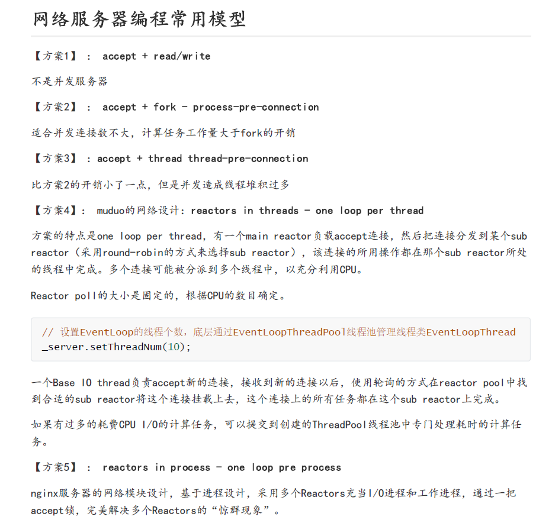
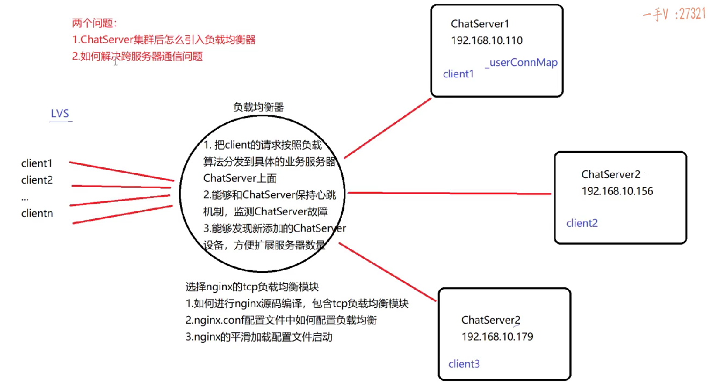
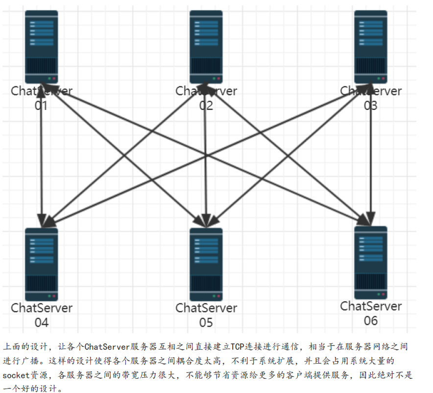
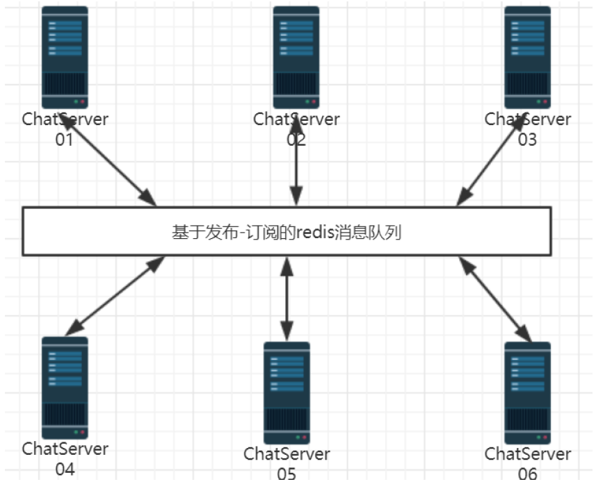
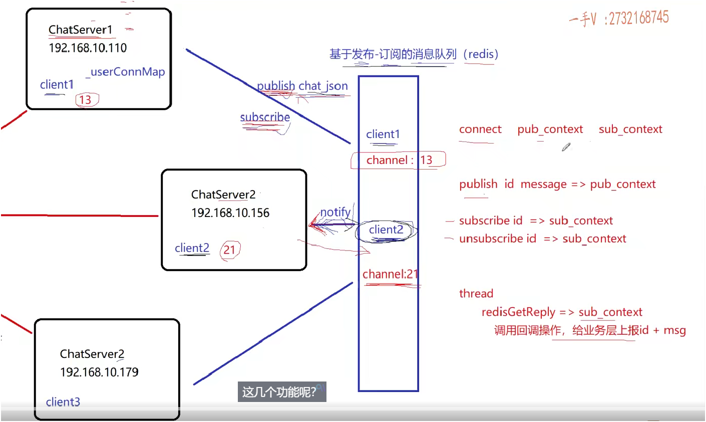

可以多看看pdf, 有一些理论

------

# 2025-4-26

# 负载均衡

## 常见网络模型




## 为什么要引入集群

**1. 单台服务器并发能力有限**

- 在 32 位 Linux 下，一个进程默认能使用的文件描述符是 1024 个。
- 即使通过 `ulimit` 增加上限，也只能撑到 2 万左右。
- 所以单台服务器最大只能支持约 2 万个用户同时在线聊天。

**2. 想支持更多用户怎么办？**

- 横向扩展：**服务器集群部署**，即多台服务器协同处理用户请求。
- 垂直扩展: 意思是 升级这台单机, 让这台单机更强
- 每台服务器运行同一个 `ChatServer` 程序，互不干扰。
- 本质上是“复制多台服务”，每台承接一部分用户。

------

## 用户怎么知道连接哪台服务器？

**问题**

- 像 QQ、微信那样的客户端不会让你选择连接哪台服务器。
- 因为用户不知道哪台服务器空闲、哪台繁忙。

**解决方案：引入“负载均衡器”**

- 用户统一连接 **负载均衡器**（Load Balancer）。
- 负载均衡器再根据一定策略，把请求分发到后端的某台 `ChatServer`。


------

## 负载均衡分层理解

| 层级                    | 代表技术 / 工具                      | 负载方式                    | 特点                                                 |
| ----------------------- | ------------------------------------ | --------------------------- | ---------------------------------------------------- |
| **数据链路层（第2层）** | Switch（交换机）                     | 基于 MAC 地址               | 很低层，常用于局域网广播控制，不用于业务层面负载均衡 |
| **网络层（第3层）**     | LVS（DR 模式、TUN 模式）             | 基于 IP 分发                | 性能极高，只做 IP 层转发，不理解上层协议             |
| **传输层（第4层）**     | LVS、Nginx（stream 模块）、HAProxy   | 基于 TCP/UDP 端口分发       | 适合聊天这种 TCP 长连接业务                          |
| **应用层（第7层）**     | Nginx（http 模块）、HAProxy、Traefik | 基于 URL、Cookie、Header 等 | 灵活但性能略低，适合 Web 请求                        |


## 负载均衡器的核心作用（3 个关键功能）

**1.** **客户端请求的分发者**

- 接收所有客户端连接。
- 根据**负载算法**（轮询、权重、IP 哈希等）**将连接分发给某台后端服务器**。
- 对于聊天这种**长连接**业务，客户端连接会**一直保持**，不关闭。

**2. 服务器状态的监测者（心跳机制）**

- 要实时知道后端哪些 `ChatServer` 还能用，哪些已经故障。
- 做法：
  - 与后端服务器之间建立长连接。
  - 定时发送心跳包，如果**连续几次无响应**，就认为该服务器失效。
- 如果某台服务器宕机或网络异常，立即**停止将新请求分发过去**。

**3. 支持动态扩容，平滑接入新服务器**

- 用户量增加后，可以**动态添加新服务器**。
- 负载均衡器可以在**不中断服务**的情况下，**热加载新配置**（如 nginx 的 `reload` 命令）。
- 不影响原有用户在线聊天，**真正做到“平滑扩容”**。





------

## 选择的负载均衡器：Nginx TCP 模块

**牛逼的人--- 可以去看看 nginx 源码**

**为什么选 Nginx？**

- 支持高并发：一台 Nginx **轻松支持 5～6 万连接**。
- 拓展能力强：可以配置多种负载算法。
- 稳定性好：Nginx 本身的网络模型是高性能的。

**Nginx 如何处理聊天这种长连接业务？**

- 保持连接通道**一直存在**（不是每次请求都重连）。
- 所有消息进出（客户端→服务端、服务端→客户端）都**经过负载均衡器**。
- 而 如果 客户端发送经过负载均衡, 服务器回应不经过负载均衡 也是可行的, 只要知道 客户端ip信息即可 

------

## 更高级的扩展方案（**LVS** + Nginx）

**如果要支持十几万连接？**

- 单个 Nginx 可能瓶颈了，可以再前置一个更底层的负载均衡器：

  - **LVS（Linux Virtual Server）**
  - 工作在 IP 层或传输层（性能更高）

- 架构变为：

  ```
  客户端 → LVS → 多台 Nginx → 多台 ChatServer
  ```

------

## 负载均衡算法（简要了解）

- **轮询（Round Robin）**：每个请求轮着来，最简单。
- **加权轮询**：给性能高的机器多分配一些请求。
- **IP 哈希**：同一 IP 的用户总是分配到同一台服务器上。
- **最少连接数**：选择当前连接数最少的服务器。

------

## 结合聊天业务的特点总结(gpt)

| 方面     | 说明                                                         |
| -------- | ------------------------------------------------------------ |
| 连接类型 | **长连接**（用户连接一旦建立，就持续存在）                   |
| 分发要求 | 请求分发需保持一致性（一个用户连接在哪台服务器，就一直在那里） |
| 响应路径 | 服务端响应必须走负载均衡器（除非配置直连隧道）               |
| 心跳监测 | 防止把请求分发给失效的服务节点                               |
| 热扩展   | 添加新服务器时不需要重启负载均衡器                           |

------

## 面试或项目总结时可以怎么讲？(gpt)

> “在我们的项目中，为了解决单机并发瓶颈，我们采用了集群部署 + Nginx TCP 负载均衡。客户端只连接到 Nginx，由它根据配置的负载算法把请求转发给后端服务器。为了保证可用性，我们还实现了心跳监测机制，能动态剔除失效节点，同时支持服务的平滑扩展。通过这种方式，我们系统的并发能力从 2 万提升到了 6 万以上，且具备良好的可扩展性。”


# 聊天系统集群中的跨服务器通信

## 问题背景：

- 在集群架构中，用户 A 和用户 B 可能登录在不同服务器上，如何实现两人之间的一对一聊天？

造成该问题的根本原因在于：
 **当用户登录在不同服务器上时，原本用于存储在线用户连接的 `_userConnMap`（只在本地服务器维护）无法获取到其他服务器上已登录用户的连接信息**，从而导致无法直接向其转发消息。


最简单的想法是 服务期间建立连接,  但是这样, 服务器压力就大了




## 高内聚低耦合:

一、什么是高内聚？

**定义：**
 一个模块内部的功能尽量相关，集中完成某一类任务。

**通俗理解：**
 一个模块只做一件事，而且把这件事做好。

**好处：**

- 易于维护和修改
- 易于理解和测试
- 逻辑清晰、职责单一

**示例：**
 在聊天系统中，把“消息发送”相关的逻辑（如构造消息、转发消息、存储离线消息）放在一个 `MessageService` 模块里，而不是散落在多个地方。

------

二、什么是低耦合？

**定义：**
 模块与模块之间的依赖尽量少，依赖的内容尽量简单。

**通俗理解：**
 模块之间互不干扰，改变一个模块对其他模块影响最小。

**好处：**

- 提升模块的独立性
- 更容易替换、扩展模块
- 降低系统出错的可能性

**示例：**
 在聊天系统中，客户端与服务器通过 JSON 协议交互，而不是直接调用彼此的函数。这种“协议通信”就是一种低耦合的体现。

------

三、一句话总结：

> 高内聚是“自己事自己干”，低耦合是“别人的事少管”。

## 设计目标：

- **客户端无感知集群结构**
- **服务器之间不直接连接，避免强耦合**
- **支持任意用户间的通信，无论在哪台服务器登录**

## 解决方案：引入 Redis 发布订阅机制

> `集群部署的服务器`之间进行通信，最好的方式就是`引入中间件消息队列`，解耦各个服务器，使整个系统松耦合，提高服务器的响应能力，节省服务器的带宽资源



## 常用中间件

> 在集群分布式环境中，经常使用的`中间件消息队列有ActiveMQ、RabbitMQ、Kafka等`，都是应用场景广泛并且性能很好的消息队列，供集群服务器之间，分布式服务之间进行消息通信。

**`kafka` 企业用的多**--大型, 十几万, 几十万

限于我们的项目业务类型并不是非常复杂，对并发请求量也没有太高的要求，因此我们的中间件消息队列选型的是-**基于发布-订阅模式的redis**。

## Redis

**观察者设计模式的应用**

**1. Redis 作为中间件的作用：**

- **消息转发中心**：用于转发跨服务器的聊天消息
- **状态共享工具**：可存储用户在线状态、服务器分配信息等（可选）

**2. 服务端订阅用户频道：**

- 每台服务器在用户登录时订阅 Redis 频道 `channel_userId`，表示当前用户在此服务器上活跃

**3. 跨服务器消息流程：**

- 用户 A 发消息 → 所在服务器判断 B 是否在本地
  - 是：直接发送
  - 否：将消息发布到 Redis 的 `channel_userIdB`
- 用户 B 所在服务器收到 Redis 推送后 → 将消息转发给 B

**4. 用户退出处理：**

- 用户退出时，取消对应频道的订阅，释放资源

# linux负载均衡配置与验证

## ngnix安装

> nginx**默认并没有编译**tcp负载均衡模块，编写它时，需要加入--with-stream参数来激活这个模块。

把nginx 安装在 package文件夹

```bash
./configure --with-stream

make && make install

```

## 报错问题

```c++
src/os/unix/ngx_user.c: In function ‘ngx_libc_crypt’:
src/os/unix/ngx_user.c:36:7: error: ‘struct crypt_data’ has no member named ‘current_salt’
   36 |     cd.current_salt[0] = ~salt[0];
      |       ^
```

nginx 版本太久, linux版本太新

## nginx配置文件

```c++
/usr/local/nginx 
```

  这个文件夹很重要!!!

里面有 

```c++
./conf/nginx.conf-----配置文件
./sbin/nginx----服务的启动
```


## 负载均衡配置

```c++
vim ./conf/nginx.conf
```

```c++
event{....}
//---
stream {
    # 1️⃣ 定义一个后端服务器集群（upstream）
    upstream MyServer {
        server 127.0.0.1:6000 weight=1 max_fails=3 fail_timeout=30s;
        server 127.0.0.1:6002 weight=1 max_fails=3 fail_timeout=30s;
    }

    # 2️⃣ 设置监听端口，接收客户端请求
    server {
        listen 8000;                       # Nginx 对外开放的 TCP 端口
        proxy_connect_timeout 1s;         # 连接后端服务器超时时间
        proxy_timeout 3s;                 # 与后端建立连接后的传输超时时间
        proxy_pass MyServer;              # 把请求转发到名为 MyServer 的后端集群
        tcp_nodelay on;                   # 优化 TCP，禁用 Nagle 算法，降低延迟
    }
}

//----
http{...}
```

### 用法说明

- `listen 8000`: Nginx 监听 8000 端口，客户端连接这个端口。
- `proxy_pass MyServer`: 请求被转发给后端的 `MyServer` 集群（你定义的两个端口）。
- `proxy_connect_timeout`: 连接后端超时设置。最多等待多久, 超过这个时间，连接就会被判定失败。
- `proxy_timeout`: 转发请求后的超时时间。已连接后、数据多久没动就超时----本项目不需要!!长连接不断开
- `tcp_nodelay`: 减少延迟（禁用 Nagle 算法）

### 解释

这段配置使用了 **Nginx 的 `stream` 模块**，用于**四层 TCP 代理和负载均衡**，也就是：

> 把客户端发往 Nginx（如端口 8000）的 TCP 请求，按负载策略转发到后端多个服务器（如 6000、6002 端口）。

### 工作流程图示（逻辑）：

```
[客户端] ---> [Nginx:8000] ---> (负载均衡) ---> [127.0.0.1:6000 或 6002]
```

- Nginx 接收客户端 TCP 请求
- 根据**轮询策略**将请求转发给后端服务器
- 如果某个后端连接**失败超过 3 次**，**30 秒内不会再尝试连接**（`max_fails + fail_timeout` 控制）

### 参数意义

| 参数                       | 含义                                                         |
| -------------------------- | ------------------------------------------------------------ |
| `listen 8000`-重点         | Nginx 监听的 TCP 端口                                        |
| `proxy_pass MyServer`-重点 | 使用上面定义的后端集群                                       |
| `proxy_connect_timeout 1s` | 后端连接超时,Nginx 给后端发 TCP 连接请求，多久没连上就放弃   |
| `proxy_timeout 3s`         | 数据传输超时（连接建立后）,建立连接后，多久没收到数据就断开连接 |
| `tcp_nodelay on`           | 禁用 Nagle 算法，提升小包实时性                              |
| `weight=1`                 | 每个后端权重                                                 |
| `max_fails=3`              | 最多失败 3 次判定该节点不可用                                |
| `fail_timeout=30s`         | 在 30 秒内不再访问故障节点                                   |

负载均衡算法 可以配置, 但是需要插件

## 平滑启动

```c++
netstat -tanp
   
/usr/local/nginx/sbin/nginx 

# 修改配置, 平滑启动
/usr/local/nginx/sbin/nginx -s reload

# 停止服务,杀进程不可取
/usr/local/nginx/sbin/nginx -s stop
```

## 修改服务器main.cpp代码

从命令行获取 ip 和 port

```c++
int main(int argc, char **argv)
{
    if(argc < 3)
    {
        cerr << "command invalid example ./bin/chatserver"<<endl;
        exit(-1);
    }
    // 解析通过命令行参数传递的ip和port
    char *ip = argv[1];
    uint16_t port = atoi(argv[2]);

    signal(SIGINT, resetHandler);
    EventLoop loop;
    InetAddress addr(ip, port);
    ChatServer server(&loop, addr, "ChatServer");

    server.start();
    loop.loop();


    return 0;
}
```

## 测试

```c++
// 服务器
./bin/Chatserver 127.1 6000
./bin/Chatserver 127.1 6002
```

```c++
// 客户端
./bin/Chatclient 127.0.0.1 8000
./bin/Chatclient 127.0.0.1 8000
```

```c++
20250426 06:49:00.026995Z 28142 ERROR sockets::fromIpPort - SocketsOps.cc:241

原因是 127.1 没有写正规的 127.0.0.1
```

**此时没有 使用中间件, 可以测试得到, 不同服务器没法通信**


# Redis环境安装

## Redis 在项目中的角色

- Redis 作为 **服务器中间件消息队列**
- 解决多个 Chat Server 之间的“**强耦合连接问题**”
- 通过 **发布/订阅机制（Pub/Sub）** 实现消息的跨服务器分发
- 实际上 Redis 本质是一个“**基于内存的键值对缓存数据库**”，但在本项目中用它来**解耦通信逻辑**
- 运行在内存中的 **键值对存储数据库**，速度非常快。

## 安装

```c++
sudo apt-get install redis-server
```

默认端口:   6379

数据库: 3306

## 键值对操作

```c++
redis-cli
```

```c++
set "键" "值"
```

```c++
get "键"
```

还可以存**存 链表, 数组,复杂数据结构等**

**存储在 内存上**, 效率很高

有些时候, 会舍弃mysql, 直接使用 redis

## 持久化存储(简单了解)

**想深入, 有时间自己研究研究**

Redis 的数据**默认是存在内存中的**，为了防止服务重启后数据丢失，它支持两种**数据持久化存储机制**

- Redis 是**内存数据库**，内存断电即失。
- 为了在 Redis **重启后能“恢复数据”**，必须有**“写入磁盘”**的手段。
- Redis 提供两种方式：**RDB** 和 **AOF**

1. **RDB（快照）**

- **做法**：定时把内存数据一次性保存成 `.rdb` 文件。
- **优点**：文件小，恢复快。
- **缺点**：非实时，可能丢失几分钟数据。
- **适合场景**：数据量大、变化不频繁、用于灾备。

------

2. **AOF（操作日志）**

- **做法**：把每次写命令都追加写入 `.aof` 文件。
- **优点**：数据更完整，最多丢 1 秒数据。
- **缺点**：文件大，恢复慢。
- **适合场景**：对数据完整性要求高，比如聊天记录、交易数据。

------

3. **组合使用**

- 可同时开启 RDB + AOF。
- Redis 优先用 AOF 恢复，确保数据最全。

## 发布 / 订阅机制的原理

**发布 / 订阅的核心思想：**

- Redis 可以建立很多`“频道”（Channel）`
- 你可以订阅某个频道，监听它是否有新消息
- 当别人向**这个频道“发布”一条消息**时，Redis 会把这条消息**“推送”给所有订阅**了这个频道的用户

## 客户端订阅频道

```
subscribe 13
```

- 阻塞命令，监听频道 `13` 的消息
- 通常以 **用户ID** 作为频道ID，比如订阅 “用户13 的消息”

## 发布消息到频道

```
publish 13 "hello world"
```

- Redis 会立即将消息推送给所有订阅了 `13` 频道的客户端（如服务器）

## 项目中如何应用发布/订阅

**用户登录时**

- Chat Server 会向 Redis **订阅以用户ID为频道名的通道**

  ```
  subscribe 用户ID
  ```

**发送消息时（跨服务器）**

- 若目标用户在**其他服务器**，当前服务器通过 Redis 向该用户ID对应的频道发布消息：

  ```
  publish 用户ID 消息内容
  ```

**Redis 发现订阅了该频道的服务器**

- 将消息推送给对应的 Chat Server，由它通知在线用户

# 补充:A给B发消息的全过程

## 场景

- 用户A（id: 1001），连接到了**服务器1**。
- 用户B（id: 1002），连接到了**服务器2**。
- A想给B发一条"hello"。

------

## 步骤 1：A发送消息

- A在客户端输入："hello"，发给1002。
- 客户端把消息打包成JSON，通过TCP发给服务器1。

------

## 步骤 2：服务器1处理

- 服务器1收到消息：
  - 解析出目标用户是**1002**。
- 服务器1查询自己这台机器的在线用户列表：
  - 发现没有1002（因为B在服务器2）。

------

## 步骤 3：服务器1向Redis发布

- 服务器1从数据库知道，B可能在其他服务器上。
- 所以，它在Redis上**发布**到通道`1002`，内容是"hello"。

```
Redis.publish("1002", "来自1001的消息：hello")
```

------

## 步骤 4：Redis分发

- Redis收到这个publish。
- 检查有哪些服务器**订阅**了`1002`这个通道。
- 发现服务器2订阅了！
- Redis立刻把这条消息推送给服务器2。

------

## 步骤 5：服务器2回调触发

- 服务器2收到Redis推送。
- 触发了之前注册的**回调函数**。
- 回调函数处理消息：
  - 查找本地连接，找到用户1002在线。

------

## 步骤 6：服务器2推给客户端B

- 服务器2直接通过TCP连接，把"来自1001的消息：hello"推送给用户B的客户端。

✅ 至此，消息送达！

## 这个例子里面有哪些关键点？

| 步骤                          | 关键点           | 说明                         |
| ----------------------------- | ---------------- | ---------------------------- |
| 发布（服务器1 ➔ Redis）       | **发布消息**     | 不关心谁来接，发到Redis      |
| 订阅（服务器2订阅`1002`通道） | **订阅机制**     | 服务器提前订阅用户ID对应通道 |
| 推送（Redis ➔ 服务器2）       | **推送到订阅者** | Redis负责找对应服务器        |
| 分发（服务器2 ➔ 用户B）       | **最终推送**     | 本地推给客户端               |

------

## 最后总结

Redis在这里干了两件事：

- 统一收消息（**Publish**）
- 按订阅推消息（**Subscribe**）

服务器之间自己啥都不用干，只要：

- 登录时订阅
- 下线时取消订阅
- 发消息时 publish

全靠Redis帮忙转发，服务器自己专心处理连接和逻辑！

# Redis编程

不需要了解太多怎么写, redis编程本身不重要, 重要的是 要了解逻辑
代码很多都是 复制过来 进行修改的

## 支持多语言

**redis**支持多种不同的客户端编程语言，例如Java对应`jedis`、php对应`phpredis`、C++对应的则是`hiredis`

## 安装hiredis

```c++
git clone https://github.com/redis/hiredis

// cd
make && make install
```

## 为什么要用 Redis 客户端？

- **我们需要在代码里操作 Redis Server**（连上它，收发消息）。
- 而 收发消息 在代码里, 对应的就是 设置回调函数

## 代码目录调整

```
include/server/redis ➔ 放 redis.hpp
src/server/redis ➔ 放 redis.cpp
```

## 修改CMakeLists.txt

包含头文件目录

```c++
include_directories(${PROJECT_SOURCE_DIR}/include/server/redis) #redis服务头文件
```

加入源文件列表

链接 `-lhiredis` 动态库

```c++
# redis服务源文件
aux_source_directory(./redis REDIS_LIST)
# 生成可执行
add_executable(Chatserver ${SRC_LIST} ${DB_LIST} ${MODEL_LIST} ${REDIS_LIST})

# 链接库
target_link_libraries(Chatserver muduo_net muduo_base pthread mysqlclient hiredis)
```

## 核心设计

维护两个 Redis连接（Context）：

- 一个**发布**消息
- 一个**订阅**通道（因为**订阅是阻塞的**，不能混用）

提供一个**回调函数**，让业务层注册，当有消息发布到订阅通道时通知上层（观察者模式）。

回顾一下----观察者模式的 设计模式

```c++
private:
// hiredis 同步上下文对象, 负责publish
redisContext *_publish_context;

// hiredis 同步上下文对象, 负责subscribe
redisContext *_subscribe_context;

// 回调操作, 收到订阅消息, 给service层上报
function<void(int, string)> _notify_message_handler;  // 在业务层定义具体函数
/*
    int, string
    对应 redis 回应的 (2)(3)
    1) "message"
    2) "13"
    3) "hello"
    */
```

## 功能类

- **connect()**
   ➔ 连接 Redis Server，分别建两个连接（发布+订阅）。
   ➔ 订阅连接要开**独立线程**，因为`subscribe`是**阻塞式的**，不能影响主线程。
- **publish(channel, message)**
   ➔ 往指定通道发布一条消息（简单调用`redisCommand`就行）。
- **subscribe(channel)**
   ➔ 订阅某个通道，但注意：
- - 不能直接用`redisCommand`，因为它会阻塞等服务器返回（不行）----发布不阻塞
  - 只能用`redisAppendCommand`+`redisBufferWrite`：
     只发出去，不等返回，这样线程不卡死。
- **unsubscribe(channel)**
   ➔ 取消订阅，逻辑跟订阅一样（非阻塞发送指令）。
- **observerMessage()** ➔ 独立线程中阻塞式监听订阅连接上有没有消息到来，一旦有，调用注册的回调通知上层。

```c++
// 链接redis服务器
bool connect();

// 向redis指定的频道channel发布消息
bool publish(const string &channel, const string &message);

// 向redis指定的频道channel订阅消息
bool subscribe(const string &channel);

// 向redis指定的频道channel取消订阅
bool unsubscribe(const string &channel);

// 在独立线程中接受订阅频道的消息
bool oberver_channel_message();

// 初始化向业务层上报消息的回调函数
void init_notify_message_handler(function<void(int, string)> fn);
```




## 老师有两个bug解决

**在老师博客里**

## redisAppendCommand和redisCommand

### 为什么用 `redisAppendCommand`?

不用 `redisCommand`？

**`redisCommand`**

- 发送命令 ➔ 然后**等待服务器响应** ➔ 返回响应结果
- **同步**的（卡住线程直到有回复）
- 其调用的第一个命令就是**`redisAppendCommand`**, 先把命令**缓存**到本地

**`redisAppendCommand`**

- 只是把命令**写到发送缓冲区**
- 不等服务器回响应，不阻塞
- 后面自己调用 `redisBufferWrite` ➔ 把缓冲区数据真正发出去
- 如果要读取响应，再手动`redisBufferRead`+`redisGetReply`


**一句话总结：**

- `redisCommand` 是一条龙（发+收+返回结果）。
- `redisAppendCommand` 只发，不收。

### `redisCommand` 的内部流程（实际上是分三步走的）

1. **`redisAppendCommand`** —— *构造命令并缓存到本地发送缓冲区*
   - 它把你要发的 Redis 命令（比如 `SET key value`）按照 Redis 的 RESP 协议格式化好，**先放到本地的输出缓冲区**。
   - 这个阶段只是准备，并没有真正发到服务器上。
2. **`redisBufferWrite`** —— *把本地缓冲区的数据真正发送给 Redis 服务器*
   - 这一步负责把上一步缓存好的命令，通过 TCP 连接**真正发出去**。
3. **`redisGetReply`** —— *阻塞等待 Redis 服务器返回响应*
   - 发送完命令后，就**阻塞住等待**服务器的响应数据。
   - 收到数据后，会解析成一个 `redisReply` 结构体返回给应用程序。

```c++
redisCommand
 ├── redisAppendCommand  （命令格式化 + 缓存到本地）
 ├── redisBufferWrite    （把命令发出去）
 └── redisGetReply       （阻塞等待服务器返回结果）

```


## redis小结-问题

**为什么订阅和发布要分开连接？**
 因为一旦用订阅，那个连接就**卡死了**（阻塞），不能再用它发消息。

**为什么订阅要用append/write而不是直接command？**
 因为`redisCommand`默认是同步的，它会等返回（而我们订阅只发命令，不等待）。

**为什么单独线程？**
 因为订阅是**阻塞式监听**，如果不单开线程，主逻辑就卡住了。

# 同步redis代码-**重点代码**

这部分代码, 可以保存下来, 只要做 同步redis 差不多的, 大体上就长这样!!

## redis.hpp

```c++
#ifndef REDIS_H
#define REDIS_H

#include <hiredis/hiredis.h>
#include <thread>
#include <functional>
using namespace std;

class Redis
{
public:
    Redis();
    ~Redis();

    // 链接redis服务器
    bool connect();

    // 向redis指定的频道channel发布消息
    bool publish(const string &channel, const string &message);

    // 向redis指定的频道channel订阅消息
    bool subscribe(const string &channel);

    // 向redis指定的频道channel取消订阅
    bool unsubscribe(const string &channel);

    // 在独立线程中接受订阅频道的消息
    void oberver_channel_message();

    // 初始化向业务层上报消息的回调函数
    void init_notify_message_handler(function<void(int, string)> fn);

private:
    // hiredis 同步上下文对象, 负责publish
    redisContext *_publish_context;

    // hiredis 同步上下文对象, 负责subscribe
    redisContext *_subscribe_context;

    // 回调操作, 收到订阅消息, 给service层上报
    function<void(int, string)> _notify_message_handler;
    /*
    int, string
    对应 redis 回应的 (2)(3)
    1) "message"
    2) "13"
    3) "hello"
    */
};

#endif
```

## redis.cpp

连接 Redis 后你要检查两个东西：

- `_publish_context == nullptr` —— 完全没连上，指针为空。
- `_publish_context->err != 0` —— 指针存在，但连接内部有错误（比如超时、拒绝连接等）

```c++

```


# 添加redis到服务器

## ChatService.hpp

- 包含 `redis.hpp`
- 定义一个 `Redis` 成员变量 `_redis`

```c++
#include "redis.hpp"
#include <iostream>
using namespace std;

Redis::Redis()
    : _publish_context(nullptr), _subscribe_context(nullptr)
{
}

Redis::~Redis()
{
    if (_publish_context != nullptr)
    {
        redisFree(_publish_context);
    }
    if (_subscribe_context != nullptr)
    {
        redisFree(_subscribe_context);
    }
}

bool Redis::connect()
{
    // publish连接redis服务器
    _publish_context = redisConnect("127.0.0.1", 6379);
    if (_publish_context == nullptr || _publish_context->err)
    {
        cout << "connect redis server failed" << endl;
        return false;
    }

    // subscibe连接redis服务器
    _subscribe_context = redisConnect("127.0.0.1", 6379);
    if (_subscribe_context == nullptr || _subscribe_context->err)
    {
        cout << "connect redis server failed" << endl;
        return false;
    }

    // 在独立线程(是线程)中, 监听通道上的事件, 有消息给业务层进行上报
    thread t([&]()
             { oberver_channel_message(); });
    t.detach();

    cout << "connect redis server success" << endl;
    return true;
}

// 向redis指定的频道channel发布消息
bool Redis::publish(const int channel, const string message)
{
    redisReply *reply = (redisReply *)redisCommand(_publish_context, "PUBLISH %d %s", channel, message.c_str());
    if (reply == nullptr)
    {
        cout << "publish message failed" << endl;
        return false;
    }
    freeReplyObject(reply);
    return true;
}

// 向redis指定的频道channel订阅消息
bool Redis::subscribe(const int channel)
{
    // SUBSCRIBE命令本身会造成线程阻塞等待通道里面发生消息,这里只做订阅通道,不接收通道消息
    //  通道消息的接收专门在observer_channel_message函数中的独立线程中进行----这就是接收函数存在的意义
    // 只负责发送命令,不阻塞接收redis server响应消息,否则和notifyMsg线程抢占响应资源
    if (REDIS_ERR == redisAppendCommand(this->_subscribe_context, "SUBSCRIBE %d", channel))
    {
        cerr << "subscribe command failed!" << endl;
        return false;
    }

    //  redisBufferWrite 可以循环发送缓冲区, 直到缓冲区数据发送完毕
    int done = 0;
    while (!done)
    {
        if (REDIS_ERR == redisBufferWrite(this->_subscribe_context, &done))
        {
            cerr << "subscribe command failed!" << endl;
            return false;
        }
    }
    // redisGetReply
    /*
    redisCommand 包含的 3个 函数:
    redisAppendCommand  （命令格式化 + 缓存到本地）
    redisBufferWrite    （把命令发出去）
    redisGetReply       （阻塞等待服务器返回结果）-- 在单独的一个接收线程上!!!
    */
    return true;
}

// 向redis指定的频道channel取消订阅
bool Redis::unsubscribe(const int channel)
{
    if (REDIS_ERR == redisAppendCommand(this->_subscribe_context, "UNSUBSCRIBE %d", channel))
    {
        cerr << "unsubscribe command failed!" << endl;
        return false;
    }
    //  redisBufferWrite 可以循环发送缓冲区, 直到缓冲区数据发送完毕
    int done = 0;
    while (!done)
    {
        if (REDIS_ERR == redisBufferWrite(this->_subscribe_context, &done))
        {
            cerr << "subscribe command failed!" << endl;
            return false;
        }
    }
    return true;
}

// 在独立线程中接受订阅频道的消息--存在的意义 看订阅那里
void Redis::oberver_channel_message()
{
    redisReply *reply = nullptr;
    while (REDIS_OK == redisGetReply(this->_subscribe_context, (void **)&reply))
    {
        // 订阅收到的消息 是一个带三个元素的数组
        if (reply != nullptr && reply->element[2] != nullptr && reply->element[2]->str != nullptr)
        {
            // 给业务层上报通道上发生的消息
            _notify_message_handler(atoi(reply->element[1]->str), reply->element[2]->str);
            /*
            数组的下标1, 2
            对应 redis 回应的 (2)(3)
            1) "message"
            2) "13"
            3) "hello"
            */
        }
        freeReplyObject(reply);
    }

    cerr << ">>>>>>>>>>>>>>>>>observer_channel_message quit<<<<<<<<<<<<<<<<<<<<" << endl;
}

// 初始化向业务层上报消息的回调函数
void Redis::init_notify_message_handler(function<void(int, string)> fn)
{
    this->_notify_message_handler = fn;
}

```

## ChatService.cpp

### 构造函数

- **连接 Redis**。
- **注册回调函数**（Redis订阅的通道有新消息时，回调告诉我们哪个通道、什么消息）。

```c++
// redis连接
if(_redis.connect())
{
    // 设置上报消息的回调
    _redis.init_notify_message_handler(std::bind(&ChatService::handleRedisSubscribeMessage, this, _1, _2));
}

```

### 登陆成功

**订阅通道**：以用户ID命名的通道。

> 这样如果别的服务器发来消息，当前服务器就能收到。

```c++
// id用户登陆成功, 向redis订阅id channel
_redis.subscribe(id);
```

### 退出登录时

- **取消订阅**用户ID对应的通道。

```c++
_redis.unsubscribe(userid);
```

### 客户端异常断开

- 也要 **取消订阅**（因为用户掉线了）。

```c++
_redis.unsubscribe(user.getId());
```

### 服务器异常

**正常退出**的时候，服务器会主动：

- 取消订阅（unsubscribe）
- 断开和Redis的连接

这样Redis知道：这个订阅者没了，不给它推消息了。


**异常崩溃**，比如：

- 程序崩了
- 服务器宕机
- 网络断了

那么来不及 `unsubscribe`，怎么办？

**Redis自己会清理。**

**原因：**

- Redis的订阅是基于**连接**的（TCP连接）。
- 如果服务器异常退出，Redis检测到TCP连接断了。
- Redis就会**自动把这个服务器的所有订阅取消掉**。

**不会出现僵尸订阅，不会浪费资源。**

### 一对一聊天（oneChat）逻辑

- 如果目标用户在本机：
  - 直接推送消息。
- 如果目标用户不在本机，但状态是 **online**：
  - **发布消息** 到对应用户ID的Redis通道。
- 如果目标用户是 **offline**：
  - 存离线消息。

```c++
// 增加不同服务器判断
User user=_usermodel.query(toid);
if(user.getState()=="online") //在另一个服务器上
{
    _redis.publish(toid, js.dump());
    return;
}
```

### 群聊（groupChat）逻辑

- 给群内每个成员判断：
  - 在本机就直接发。
  - 在其他机器且是online，就往对应用户ID的通道发布消息。
  - offline则存离线消息。

```c++
for (int id : userVec)
{
    // 用户在线, 就直接转发
    auto it = _userConnMap.find(id);
    if (it != _userConnMap.end())
    {
        // 在线, 转发消息
        it->second->send(js.dump());
    }
    else
    {
        // 查询是否在另一台主机上
        User user = _usermodel.query(id);
        if(user.getState()=="online")
        {
            _redis.publish(id, js.dump());
        }
        else{
            // 不在线, 存储离线消息
            _offlineMsg.insert(id, js.dump());
        }
    }
}
```

### Redis回调处理

- Redis发现某个通道有新消息，会调用我们的回调函数。
- 回调函数中：
  - 查找用户connection，能找到就推送到客户端。
  - 找不到说明用户下线了，就存离线消息。

```c++
// redis 接收消息并上报 的回调
void ChatService::handleRedisSubscribeMessage(int userid, string msg)
{
    // 不需要反序列化, 客户端都做完了
    lock_guard<mutex> lock(_connMutex);
    auto it = _userConnMap.find(userid);
    if(it!=_userConnMap.end())
    {
        // 在线, 转发消息
        it->second->send(msg);
        return;
    }

    // 也可能在发送时 离线了
    _offlineMsg.insert(userid, msg);
}
```

## 测试

自行测试

## **错误-1-拼写错误,很隐晦**

客户端**登录出现下列这个错误:**

```c++
terminate called after throwing an instance of 'nlohmann::json_abi_v3_12_0::detail::parse_error'
  what():  [json.exception.parse_error.101] parse error at line 1, column 1: attempting to parse an empty input; check that your input string or stream contains the expected JSON
```

- 程序用 `nlohmann::json`（这个 JSON 库）去**解析一个 JSON 字符串**。
- 但是传进去的字符串是**空的**（根本没东西，连 `{}` 都没有）。
- 所以它抛出了 `parse_error` 异常。


这个错误  有两种情况:   

- 要么 就是 json本身传输有问题---客户端和服务端

- 要么 就是 redis 提前结束了


很可能是：
 **在 `_redis.subscribe(id);` 的时候，Redis库里出现了问题**！

- **订阅之后**，Redis客户端（比如 redis-plus-plus）**会新起一个线程监听订阅消息**。

- 但是你的 Redis 客户端用法可能不对，**导致订阅线程把程序搞崩了**。

- > 于是服务器自己断开了 TCP 连接，客户端收到空包，再去 `json::parse`，就炸了。-----**这是客户端收到那个错误的 主要原因!!!**

**总结一句话：问题不是你后面的登录逻辑写错了，是 `_redis.subscribe(id)` 之后 Redis那边出锅了。**


**解决办法:**

经过测试,  确实是 订阅出问题了

**把 redis  命令 拼写错了----->**  导致 **没有订阅成功**, 在`oberver_channel_message() 独立线程` 发送得到了 错误, reply 接收的 是这个错误, reply 在if 那里 使得 整个程序退出了,  应该是 访问了非法内存

**根本原因是 `reply` 的结构不符合预期**，导致访问了非法内存


# 负载均衡算法

在数据结构里,  一致性哈希

------

# 今日小结

要明白 nginx 负载均衡怎么配置, 要能说出来, 对着面试

# 2025-4-27-1:26

# 2025-4-27-19:36

# 代码优化

## 优化代码1--详见博客错误

```c++
char buffer[1024] = {0};               // 接收服务器返回的数据
len = recv(clientfd, buffer, 1024, 0); // 接收数据

if (len < 0 || len == 0)
{
    if (len == 0)
    {
        cout << "server quit!" << endl;
        return 0;
    }
    else
    {
        cerr << "recv error" << endl;
    }
}
```

## 优化代码2-cin问题

### 刷新cin错误日志

```c++
int choice;
cin >> choice;
cin.get(); // 清空输入缓冲区
```

加入 手速快, 按错了,输入 **按成多个字符**啥的, cin错误日志不刷新, 会一直循环错误了

不然输入错误, cin一直是 错误, 循环错误了

### `cin.get()`：

- **读取一个字符**：`cin.get()` 是读取单个字符，包括空格和换行符。
- **不会跳过空格和换行符**：`cin.get()` 会读取输入流中的所有字符，不会忽略空格、制表符和换行符（这与 `cin >>` 的行为不同，`cin >>` 会忽略空白字符）。
- **用于读取包含空格的输入**：当你想读取包括空格的字符串或者逐字符输入时，`cin.get()` 更合适。

### `cin.ignore()`: 

用于清空输入缓冲区，避免缓冲区中残留的数据影响后续输入。

### 主要用法：

1. **忽略一个字符**：

   ```
   cin.ignore();
   ```

   - 用于丢弃一个字符，通常是换行符。

2. **忽略直到指定字符**：

   ```
   cin.ignore(numeric_limits<streamsize>::max(), '\n');
   ```

   - **读取并丢弃所有字符，直到遇到 `\n`**（包括 `\n`）。
   - **`\n` 也会被丢弃**，不会留在缓冲区中。

3. **没有指定字符（比如 `\n`）时：**

   如果你不指定字符，`cin.ignore()` 会继续丢弃缓冲区中的所有字符，直到达到指定的字符数或缓冲区末尾。例如：

   ```
   cin.ignore(numeric_limits<streamsize>::max());
   ```

   这会忽略缓冲区中的所有字符，直到缓冲区为空。

4. **处理无效输入（如输入非数字时）**--重点

   ```
   int num;
   while (!(std::cin >> num)) {  // 如果输入的不是整数
       std::cin.clear();         // 清除错误状态
       std::cin.ignore(std::numeric_limits<std::streamsize>::max(), '\n');  // 丢弃整行
       std::cout << "Invalid input. Try again: ";
   }
   ```

### 优化后

```c++
if (!(std::cin >> choice)) {  // 如果输入不是整数
    std::cin.clear();  // 清除错误状态
    std::cin.ignore(std::numeric_limits<std::streamsize>::max(), '\n');  // 丢弃整行
    continue;  // 重新尝试输入
}
// cin.get(); // 读出 换行
cin.ignore(std::numeric_limits<std::streamsize>::max(), '\n');  // 丢弃剩余字符, 直到遇到换行（如换行符）
```


# 2025-4-28

# 项目一键编译与github项目管理

## github管理

先创建 github 仓库

```c++
git clone <github 仓库地址>
// 把项目文件 都放入 拉下来的文件里, 然后
git add .  
git commit -m "初次提交项目代码"  
git push origin master
```

## shell一键编译

shell脚本:  .sh文件

```bash
#!/bin/bash
rm -rf build/*
cd build && cmake .. && make
```


# END