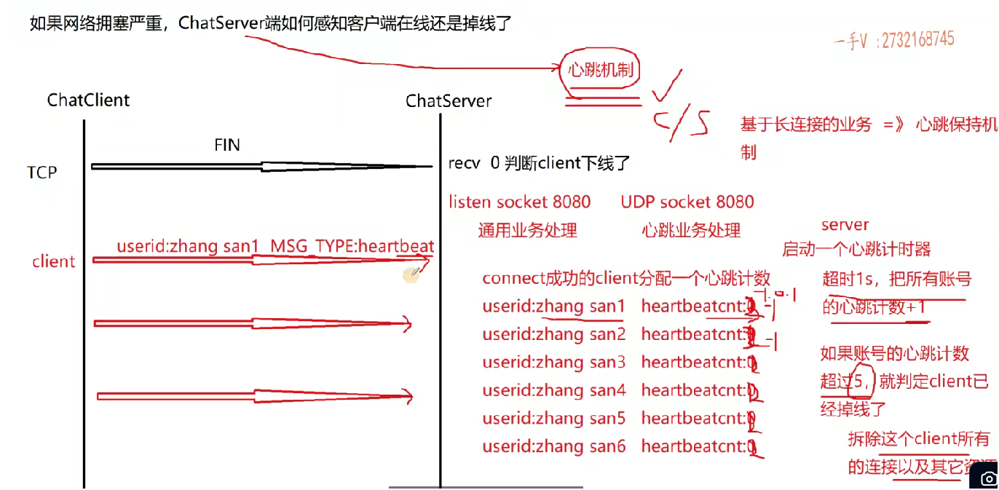

# 简历输出

## deepseek

### 项目简介
使用muduo网络库构建的高并发集群聊天服务器，支持跨服务器通信和数据库存储。

### 技术栈
- **核心框架**: muduo网络库
- **数据格式**: JSON序列化/反序列化
- **中间件**: 
  - Nginx (TCP负载均衡)
  - Redis (发布-订阅功能)
- **数据库**: 
  - MySQL (数据持久化)
  - 连接池技术 (提升数据库性能)

### 系统架构
1. 网络层: muduo提供高并发IO
2. 协议层: JSON私有通信协议
3. 集群层: 
   - Nginx负载均衡
   - Redis跨服务器通信
4. 数据层: MySQL数据存储

### 项目亮点
- 实现服务器集群部署
- 解耦网络与业务模块
- 优化数据库访问性能

### 开发环境
- 开发工具: VSCode远程Linux开发
- 构建工具: CMake
- 辅助工具: Linux Shell脚本

### 性能优化
- 通过压力测试工具评估并发能力
- 调整进程文件描述符上限提升并发

### 项目成果
掌握服务端程序设计、中间件配置及数据库优化技术


## 老师

**项目地址：github地址或者gitee地址**

**平台工具：vscode远程linux开发，cmake构建，linux** shell输出项目编译脚本

---

**项目内容：**----写技术点, 用了什么技术, **不要罗列业务**

1. 使用muduo网络库作为项目的网络核心模块，提供高并发网络IO服务，解耦网络和业务模块代码  

   > **配合手写muduo网络库项目**
2. 使用json序列化和反序列化消息作为私有通信协议  

   > b/s 或 c/s 用的最多的序列化 **json 和 protobuf**
3. 配置nginx基于tcp的负载均衡，实现聊天服务器的集群功能，提高后端服务的并发能力  

   > nginx 基于轮询的,  基于权重的,  负载均衡(学一致性哈希) 
4. 基于redis的**发布-订阅**功能，实现跨服务器的消息通信 
5. 使用mysql关系型数据库作为项目数据的落地存储  
6. 使用连接池提高数据库的数据存取性能  

   > **数据库连接池 项目**

---

**【收获】**：熟悉了基于开源网络库进行服务端程序设计，掌握了nginx的负载均衡配置，存储和服务端中间件的应用  

> 学习  **mysql 核心课程**, 可以写多点

**【问题以及解决方案】**：通过**代码脚本或者专业的压测工具jmeta测试服务器的并发量**，通过**设置进程可使用fd资源上限数量**，提高并发能力


# 老师文稿

根据视频内容，总结如何在简历上呈现ChatServer项目：

## 项目基本信息

1. **项目名称**：可以命名为"集群聊天服务器"或"基于muduo网络库实现的ChatServer服务器"等，围绕项目主题即可
2. **项目地址**：将代码推送到GitHub或国内代码托管平台(如Gitee)，附上正确的仓库地址
3. **开发平台工具**：
   - VS Code远程Linux开发(推荐Ubuntu 18.04 Server或CentOS 7)
   - CMake构建工程
   - Linux Shell脚本

## 项目内容撰写要点

1. **重点写技术点而非业务功能**：
   - 基于Reactor模型的高性能开源网络库muduo作为网络核心模块
   - 使用JSON序列化/反序列化
   - 配置Nginx基于TCP的负载均衡(轮询、IP哈希、权重等算法)
   - 基于Redis发布订阅功能实现跨服务器通信
   - 使用MySQL关系型数据库存储数据，配合连接池提高性能
2. **避免单纯罗列业务功能**：
   - 不要只写"实现了登录、注册、修改密码、聊天"等功能
   - 业务实现是"体力活"，重点展示技术难点和解决方案

## 可选的加分内容

1. **项目收获**：
   - 熟悉基于开源网络库的服务端程序设计
   - 掌握Nginx负载均衡配置
   - 理解存储和中间件应用(MySQL、Redis)
   - 了解高性能服务器设计原理
2. **项目问题及解决方案**：
   - 客户端注销登录问题及解决过程
   - 并发连接量优化(调整进程fd上限)
   - 其他遇到的典型问题及解决思路

## 简历撰写建议

1. 控制篇幅：校招1页，社招不超过2页
2. 语言专业：使用技术术语，避免太通俗
3. 布局合理：字体整齐，避免错别字，适当调整格式
4. 体现亮点：突出技术难点和解决方案，展示自学能力和实践经验
5. **个性化**：
   - 不要完全照搬模板
   - 根据自己的理解和实际项目经验调整内容
   - 可以加入自己特有的问题和解决方案

记住，简历是敲门砖，要能体现你的技术能力和项目经验的价值。


# 并发测试-待做

## 提高并发连接数(FD限制优化)

```c++
# 查看当前用户限制
ulimit -n     // 1048576

# 查看系统全局限制
cat /proc/sys/fs/file-max //9223372036854775807
```

## 临时提高限制(重启后失效)

```
# 用户会话级别
ulimit -n 65535

# 系统全局级别(需要root)
sysctl -w fs.file-max=100000
```

## 永久修改限制

**编辑/etc/security/limits.conf**:

```
sudo nano /etc/security/limits.conf
```

添加以下内容(将yourusername替换为实际用户名):

```
yourusername soft nofile 65535
yourusername hard nofile 65535
* soft nofile 65535
* hard nofile 65535
```

**编辑/etc/sysctl.conf**:

```
sudo nano /etc/sysctl.conf
```

添加/修改:

```
fs.file-max = 100000
fs.nr_open = 100000
```

然后应用:

```
sudo sysctl -p
```

## 针对特定进程的限制

对于systemd管理的服务(如你的ChatServer)，创建或编辑服务文件:

```
sudo nano /etc/systemd/system/your_service.service
```

添加:

```
[Service]
LimitNOFILE=100000
```

然后重新加载并重启服务:

```
sudo systemctl daemon-reload
sudo systemctl restart your_service
```


# 两大关键问题

### **一、项目介绍（1-3分钟）**

#### **1. 核心结构（分模块+技术栈+设计思想）**

- **开头一句话定位**：
  *“这是一个基于C++的即时通讯项目，核心解决高并发下的消息实时传输和跨服务器通信问题。”*
  （用一句话概括项目类型和核心目标，避免泛泛而谈。）
- **分模块详解**（结合技术选型理由）：
  1. **网络层**：
     - 使用`muduo`库（解释原因：Reactor模型、非阻塞IO、性能优势）。
     - 对比传统方案（如直接调用Socket API的维护成本）。
  2. **业务逻辑层**：
     - 消息路由设计（如通过消息ID绑定回调函数，避免if-else泛滥）。
     - 序列化协议选择（JSON vs. Protobuf，说明权衡点）。
  3. **数据层**：
     - MySQL表设计（用户表、消息表的索引优化）。
     - Redis作用（缓存热点数据？还是纯消息队列？说明选型原因）。
  4. **扩展性设计**：
     - 如何解决跨服务器通信？（如Redis Pub/Sub或RPC框架对比）。
     - 负载均衡策略（Nginx的TCP长连接配置要点）。
- **量化成果**（若有）：
  *“单机压测支持1.2万并发连接，平均延迟<50ms”*
  （数据能让面试官眼前一亮。）

#### **2. 避坑指南**

- **忌流水账**：不要按时间顺序讲“我先做了A，再做了B”，而要用技术逻辑串联。
- **忌过度吹嘘**：避免“我一个人重构了全部代码”，可改为“主导了XX模块的重构”。
- **留钩子**：故意埋点让面试官追问。
  *比如：“当时在消息可靠性上遇到了重复投递问题，最后通过消息ID去重解决”*
  （引导到你准备好的技术难点。）

------

### **二、自我介绍（1-3分钟）**

#### **1. 三段式结构优化**

- **第一部分：背景标签**（10秒）
  *“我是XX大学计算机专业应届生，主修课程包括操作系统、网络编程，在校期间参与过省级ACM竞赛。”*
  （社招改为：“有X年C++服务端开发经验，主导过分布式消息系统架构设计。”）
- **第二部分：技术亮点**（核心！）
  - **技能树**：按“语言→框架→领域”分层。
    *“熟练掌握C++11/14，理解多线程、智能指针的实现原理；
    熟悉Linux网络编程，基于muduo实现过万人并发的IM系统；
    对分布式系统的CAP问题有实践，比如用Redis解决过会话一致性问题。”*
  - **项目挂钩**：自然过渡到项目介绍。
    *“最近在做的IM项目中，我负责设计了消息推送模块……”*
- **第三部分：动机与规划**
  *“我始终关注高性能服务端技术，读过《Linux多线程服务端编程》等书，希望未来在分布式系统方向深耕。”*
  （避免假大空，结合具体技术兴趣。）

#### **2. 高阶技巧**

- **差异化竞争**：突出独特经历。
  *比如：“业余时间在GitHub贡献过muduo的文档翻译，提交过2个PR修复日志模块的线程安全问题。”*
- **性格标签**：用事例证明软技能。
  *“在团队协作中，我习惯用文档沉淀技术方案，比如用Markdown编写了项目的消息协议设计文档，降低了沟通成本。”*

------

### **三、附加建议**

1. **模拟面试**：
   - 用手机录下自己的回答，检查是否卡顿、逻辑是否连贯。
   - 找同学模拟“压力面试”，故意打断你，训练临场应变。
2. **简历一致性**：
   - 自我介绍和简历上的技能/项目必须完全匹配，避免被追问穿帮。
3. **HR面试准备**：
   - 高频问题：职业规划、离职原因、加班看法。
   - 参考话术：
     *“我看重团队的技术成长性，希望和公司共同进步。加班如果是项目必要，我愿意高效投入，但反对无意义的耗时间。”*

## 1. **项目介绍（1-3分钟）**

- **核心要点**：
  - 从全局角度描述项目，避免过于简短或冗长（切忌逻辑混乱）。
  - **分模块说明**（示例模板）：
    1. **网络模块**：如使用`muduo`库解耦网络与业务代码。
    2. **服务层**：C++11技术（如消息ID与**回调绑定**(去了解和 c 的区别)）。
    3. **数据存储**：MySQL存储用户数据、离线消息等。
    4. **扩展性**：支持Nginx负载均衡（TCP长连接）、Redis跨服务器消息队列（发布订阅）。
  - **逻辑清晰**：先单机模块，再集群扩展，突出技术选型理由（如长连接的必要性）。
- **注意事项**：
  - 避免过度细节，留白给面试官提问。
  - 提前练习，确保流畅性和时间控制。

## 2. **自我介绍（1-3分钟）**

- **结构化表达**：
  1. **基本信息**：学历、专业等（校招可加奖学金/活动）。
  2. **学习能力**：
     - 权威书籍（如《C++ Primer》《深入理解计算机系统》）。
     - 技术社区参与（Stack Overflow、GitHub开源项目学习）。
  3. **职业规划**：积极正向，如“希望在技术上持续积累，为公司创造价值”。
- **面试官关注点**：
  - 逻辑清晰、沟通能力（开发中70%时间与人协作）。
  - 自学能力和行业热情（通过书籍、社区等体现）。

------

**最终建议**：提前反复练习这两个问题，确保表达简洁、专业、有逻辑。这两个环节的表现直接影响面试官的第一印象，占成功率的30%以上。


# 数据明文安全

## 1. 问题背景

- 在项目中，客户端与服务器之间的数据传输采用明文方式（如JSON序列化），存在安全隐患。
- 面试官可能会询问如何解决明文传输的安全问题，仅回答“加密”是不够的，需要详细说明实现方案。


## 2. 加密的必要性

- 明文传输容易被窃取或篡改，需通过加密转换为密文传输。
- 加密的核心目标是确保数据在传输过程中的机密性和完整性。

## 3. 加密算法分类

- **对称加密**：
  - 特点：加密和解密使用**同一把密**钥（如**AES算法**）。
  - 优点：加解密效率高。
  - 缺点：**密钥需要在通信双方之间安全传输**，容易被截获。
  - **AES有源码, 自己拉下来 看**
- **非对称加密**：
  - 特点：使用**公钥（public key）和私钥（private key）**配对（如**RSA算法**）。
    - 公钥加密的数据只能用私钥解密。
    - // 私钥加密的数据只能用公钥解密。
  - 优点：安全性高，无需传输私钥。
  - 缺点：加解密效率低。

#### 4. 混合加密方案

- **结合对称和非对称加密的优点**：
  1. **密钥交换阶段**：
     - 客户端使用服务器提供的**公钥（RSA）加密对称密钥（AES密钥）**，生成密文发送给服务器。
     - 服务器用**私钥解密**，获取对称密钥。
     - 此过程确保密钥传输的安全性。
  2. **数据传输阶段**：
     - 后续通信使用对称密钥（AES）加密数据，兼顾效率和安全性。

#### 5. 面试回答策略

- **结构化回答**：
  1. **承认问题**：说明项目中确实存在明文传输的安全隐患。
  2. **提出解决方案**：
     - 采用混合加密（对称加密+非对称加密）。
     - 详细描述密钥交换和数据传输的过程。
  3. **补充细节**：
     - 提到具体算法（如AES和RSA）。
     - 说明如何区分不同客户端的密钥（如用户ID或设备唯一标识）。
  4. **谦逊态度**：
     - 若未实际实现，可表示需进一步学习或参考资料完善。

#### 6. 沟通技巧

- **避免简单回答**：如仅说“加密”，需展开说明。
- **展现思考过程**：即使不完全清楚，也要有条理地分析问题。
- **自然表达**：避免背诵，以交流的态度与面试官互动。

#### 7. 核心要点

- **安全性**：通过非对称加密保护密钥交换，对称加密保护数据传输。
- **效率**：对称加密的高效性适合大量数据传输。
- **实现**：客户端内置公钥，服务器保存私钥，密钥交换后使用对称加密通信。


# 消息按序显示

## 1. 问题背景

- 客户端发送消息时，发的是有序的，比如先发"Hello"，再发"World"。
- **但在真实网络环境**中，由于路由不同、网络拥堵，**消息到达服务器和客户端的顺序可能乱序**。
- 如果直接按收到的顺序显示，会导致对方看到的聊天记录顺序错乱，影响交流体验。

## 2. 之前讨论的常见解决方案：加时间戳

- 给每条消息打上**发送时间戳**。
- 客户端收到后**按时间戳排序**再显示。

### 2.1 时间戳方案的问题

> 每条消息, 选择的 **路由节点 不一样**, 有可能 后面的消息, 选择的路由节点 更通畅, 将会 最快到达

- 客户端接收是**实时流式**的，一边收一边显示，不是先收完一批再统一排序显示。
- 必须人为设定一个“**时间窗口**”(时间周期)（比如1秒钟）：
  - 1秒内到达的消息**统一排序**后一起显示。
  - 但不同窗口之间的消息，**无法跨窗口排序**，仍可能乱序。
- 根本原因：**消息不是批量到达的，是连续到达的**，所以纯时间戳排序不完美。


## 3. 正确可靠的解决方案：加序列号（sequence）

- **每个聊天会话（针对人或群）维护一份独立的消息序列号**，从0开始自增。
  - 如甲发的第1条消息 sequence(序列队列) = 0，第2条是1，依此类推。
- 每条消息携带自己的**序列号**一起发送。

### 3.1 服务端与客户端处理方式

- 服务端只负责消息转发，不保证顺序。
- 客户端维护每个会话（或好友）的当前期望的**下一条sequence号**。
- **接收到消息时按序处理**：
  1. 如果收到的消息 sequence == 当前期望的 sequence，立即显示。
  2. 如果大于当前期望（说明漏了前面消息），**缓存**起来，等待前面的消息补齐。
  3. 每显示完一条正确的消息，sequence +1，再查缓存，看是否有下一条。
  4. 缓存命中就继续显示，一直循环，直到没有下一条。
- 要考虑 **消息 丢失问题**----**ttl限制**
  - 路由器节点 数量超过了, 会丢弃节点, 消息可能就被 删除了
  - 可以让服务器重发消息, 等等

### 3.2 为什么序列号比时间戳更好？

- **绝对有序**，无论网络延迟如何，客户端都能百分百还原发送顺序。
- 不依赖网络传输时间，不依赖人为时间窗口。
- 简单、直接、可靠。


------

# TTL限制

## TTL 和 消息丢失的问题

1. **什么是 TTL？**
   - TTL 是 IP 数据包中的一个字段，表示数据包在网络中可以经过的**最大跳数（经过的路由器数量）**。
   - 每经过一个路由器，TTL 值会减 1。当 TTL 变成 0 时，路由器就会丢弃这个数据包，并向源主机发送一个错误报告。
2. **为什么会丢包？**
   - 如果一条消息在网络中传输时，经过的路由节点过多，导致 TTL 超过初始设定值（如 64），则该消息会被某个路由器丢弃。
   - 这会导致消息无法到达目标客户端，造成消息“丢失”。

------

## 消息丢失对 Sequence 机制的影响

- 我们使用了 **消息序列号（Sequence）** 来保证消息按顺序显示。
- 如果某条消息（比如 sequence = 0）丢失了，而后续的消息（sequence = 1、2）先到达客户端：
  - 客户端会将这些提前到达的消息缓存起来。
  - 等待前面的消息（sequence = 0）到达后，再按顺序显示所有消息。

------

## 如果丢失的消息一直没来怎么办？

1. **重传机制（Reliable Transmission）**
   - 客户端发现本地长时间缺少某条消息（比如 sequence = 0），可以主动向服务端请求补发这条消息。
   - 服务端收到请求后，可以通知发送方重新发送该消息。
2. **超时丢弃处理**
   - 如果尝试多次请求仍未能获取到 sequence = 0 的消息，系统可以判定该消息已无法送达。
   - 此时可以：
     - 直接显示已经缓存的消息（sequence = 1、2）；
     - 并更新期望接收的下一个序列号为 sequence = 3；
     - 放弃对 sequence = 0 的等待。

# 附加补充：长连接 vs 短连接

## 1. 为什么要用长连接？

- **短连接**（比如HTTP）是“请求-响应-关闭”，服务器无法主动推送消息。
- **长连接**（如TCP常连/WebSocket）可以让服务器主动推送消息给客户端。
- 聊天属于典型的**服务器主动推送场景**，必须保持**长连接**。

## 2. 如果用短连接会怎样？

- 客户端必须**轮询**服务器（不断主动发请求问有没有新消息）。
- 消耗大量服务器资源（即使没消息也要处理很多无效请求）。
- 消息实时性差（轮询间隔限制了最快收消息速度）。
- 所以：**必须使用长连接，客户端与服务器保持TCP连接不断开**。

------

## 总结一句话

✅ **正确做法是：消息加上序列号，客户端按序列号严格顺序显示！**
 ✅ **聊天系统必须使用长连接保证服务器能随时推送消息！**


# server端感知客户端

## **网络拥塞下，ChatServer如何感知客户端掉线？**

## 1. 局域网正常情况下是怎么感知客户端掉线的？

- 客户端主动关闭 socket（`close(fd)`），即 **TCP 四次挥手**。
- 服务端 `recv` 返回 `0`，就能判断客户端下线。
- 这种方式在局域网**（网络良好）**情况下基本没问题。

## 2. 真实复杂网络环境下的问题

- 如果网络**拥塞严重**，客户端发送的 **FIN 包**可能丢失，Server端收不到。
- TCP虽然有**超时重传**机制，但如果多次重传失败，连接最终 **reset**，导致 Server 无法及时感知客户端已掉线。
- **总结问题**：Client 已经掉线，但 Server 可能**感知不到**，保持了一个无效连接。

------

## 3. 解决方案一：**应用层心跳机制**




### 心跳机制基本思路

- **心跳（Heartbeat）**：客户端定期（如每秒一次）发送心跳消息到服务器。
- 服务端维护**每个连接的心跳计数器**。
- 如果某客户端连续一段时间（比如 5 秒）**没有心跳消息**，认为其掉线，释放资源。

### 具体实现方式

1. **服务端**
   - 给每个登录的客户端账号（userID）分配一个心跳计数器（初始化为0）。
   - 启动一个**统一心跳定时器**，**每秒**：
     - 遍历**所有用户**的心跳计数器，**加1**。
     - 如果某用户心跳计数器 > 预设值（如5），判定该用户**掉线**，释放资源。
2. **客户端**
   - 每秒向服务器发送一条**心跳消息**（通过 UDP/TCP 均可）。
   - 心跳消息格式包含：
     - userID
     - messageType = HeartBeat
3. **服务端接收心跳消息后**
   - 对应 userID 的心跳计数器**减1**或**重置为0**。

### 心跳消息使用的通信方式

- 为了不干扰业务数据，可以设计：
  - **业务数据用 TCP（如8080端口）。**
  - **心跳数据用 UDP（可以同一个端口或不同端口）**。

### 正常情况下

- 客户端定期发心跳，Server每秒加1、每次心跳减1，心跳计数器波动在0、1之间。
- 如果心跳丢失，计数器不断增长，超过阈值判定掉线。


------

## 4. 解决方案二：**TCP Keep-Alive机制**

> **保活功能**

### TCP Keep-Alive机制概念

- TCP协议**本身**在**传输层**提供了 **KeepAlive** 功能，用于检测长时间静默连接是否还存在。
- **默认关闭**，需要通过 `setsockopt(fd, SOL_SOCKET, SO_KEEPALIVE, ...)` **手动开启**。

### KeepAlive机制参数

- `tcp_keepalive_time`（默认7200秒=2小时）：连接空闲多久后开始探测。---发送空的报文段,若响应,继续静默等2小时
- `tcp_keepalive_intvl`（默认75秒）：探测包之间的间隔。
- `tcp_keepalive_probes`（默认9次）：最大探测次数。
- 整个超时时间大约是：7200 + 75 × 9 = 7875秒（约2小时10分钟）。

### KeepAlive机制的局限

- **启动太慢**：等2小时才开始探测，不适合对实时性要求高的系统。
- **仅关闭TCP连接**：只是内核层面销毁socket，不会自动清理业务数据。
- **应用层异常感知不到**：比如**应用程序死锁**，KeepAlive感知不到（因为**连接层面是正常的**）。

------

## 5. 结论总结

- **心跳机制（应用层）** **更适合** Chat Server，需要快速、主动地检测客户端是否掉线，并能及时回收业务资源。
- **TCP Keep-Alive** 可以作为辅助措施，但不能完全依赖。
- 在面试/项目中，如果问到"如何感知客户端掉线？"，标准回答应该是：
  - **业务层实现心跳检测机制**；
  - 可以**辅以TCP Keep-Alive机制**作为兜底。


# 心跳 / TCP 消息确认 / 业务层消息确认

看[保证消息可靠传输(乱)](#保证消息可靠传输(乱))之前, 先了解清楚

| 类型                            | 目的                             | 检测内容                    | 层次                           | 特点                                     |
| ------------------------------- | -------------------------------- | --------------------------- | ------------------------------ | ---------------------------------------- |
| **心跳**                        | 检测连接是否存活（对端是否在线） | 对方是否还在                | 应用层（或系统 TCP KeepAlive） | 周期发送小包，长时间无回应就断开连接     |
| **TCP消息确认（ACK）**          | 确保数据包可靠送达对方           | 某段TCP数据是否到达         | 传输层（TCP协议自带）          | 自动重传丢包，保证字节流完整可靠         |
| **业务层消息确认（应用层ACK）** | 确保某条**业务数据**送达且被处理 | 某条应用消息是否被收到/处理 | 应用层                         | 需要自己协议定义，比如聊天回执、支付确认 |

------

## 详细解释：

- **心跳**：
  - 是为了检测**连接级别**是否还存在，适用于长连接（如WebSocket、MQTT）。
  - 例子：每隔30秒发一个PING，如果对方1分钟没回，就认为连接断了。
- **TCP消息确认（TCP ACK）**：
  - TCP自动完成的。
  - 保证的是**底层数据包**正确到达，不丢不重，不保证**应用理解**。
  - 你不用管，它是内核TCP协议栈处理的。
- **业务层消息确认**：
  - 即使TCP确认包收到了，但你的业务逻辑还是需要确认，比如：
    - 聊天消息，对方到底收到/读了吗？
    - 金融交易，指令到底处理了吗？
  - 所以业务层要定义比如"ACK消息"或"回执"机制来确认。
- **心跳还可以辅助 业务消息确认**:
  - 

>  **心跳**活着没？
>  **TCP确认**收到了没？
>  **业务确认**看懂了没？


# 保证消息可靠传输(乱)

**主要 是靠  心跳+业务消息确认**

> 为什么 TCP 已经是可靠传输了，还要在业务层做消息确认？

## **总结思路：**

------

### 1. 先明确：TCP的"可靠传输"是怎么实现的？

- TCP 协议在**内核空间**中实现了**超时重传机制**。
- 具体来说，每次**发送一个数据段**，都必须等待对端返回**ACK确认**。
- 如果一定时间内收不到 ACK，TCP 内核会**自动重发数据**，直到超时重试次数耗尽。
- 超时重传次数达到上限后，TCP 内核会发送一个 **RST（重置连接）**，断开连接。

**重点：**
 TCP所谓"可靠"只是保证**数据段**在**网络层面**能送到对端的内核TCP协议栈中，但**"应用程序是否成功收到并正确处理"**，TCP管不了！

------

### 2. TCP协议的“可靠”是什么意思？

- TCP可靠指的是：
  - 通过**发送窗口**、**接收窗口**管理数据流；
  - 每个数据包发送后，**对端TCP模块**要返回一个**ACK确认**；
  - 如果ACK超时未收到，**内核会自动重发**；
  - 重传次数达到上限后，**连接直接断开（RST）**。

**注意**：

> TCP保证的是**字节流传输可靠**，即数据**从一个进程的内核发送缓冲区**进入**另一个进程的内核接收缓冲区**，中间不会丢，不会错，不会乱。

但这只是**内核空间之间**的传输。

------

### 3. send() 成功 ≠ 消息到达对方


- 在应用层，当你调用 `send()` 发送数据时，**发送成功**（返回值大于0）**仅意味着**：
  - 用户态的 buffer 数据已经**拷贝到了本地内核的 TCP发送缓冲区**。
  - send()就立刻返回了。

**但是**：

- 数据是否成功通过网络发出去？
- 服务器是否真正收到？
- 应用程序是否已经处理完？

这些send()都**不知道**！

简单理解：

| 状态             | 是否意味着成功                  |
| ---------------- | ------------------------------- |
| send成功         | 仅拷贝到TCP发送缓冲区           |
| TCP栈发送出去    | 依赖网络传输，不可控            |
| 对方TCP栈收到    | 可能丢包/网络问题               |
| 对方应用程序读到 | 应用层还没读呢，TCP层收到也没用 |
| 对方业务处理成功 | 需要业务逻辑确认                |

所以，TCP协议保证的是**内核到内核**之间的可靠传输，不保证**应用到应用**的成功处理！

------

### 4.同学想法-全错

#### 注册回调

- 能不能**由内核TCP协议栈提供一个接口**？
- 允许用户**注册一个回调函数**？
- 如果TCP重传次数用尽、最终传输失败了，就**调用这个回调**，这样应用层能及时感知传输失败？


怎么可能？人家内核上还让你用户才提供一个注册函数。对不对啊？

**原因一：内核空间 vs 用户空间，隔离保护**

- **TCP协议栈是内核模块的一部分**，它服务于**所有进程**，是整个系统级别的网络通信基础设施。
- 如果允许用户态应用注册回调到内核中执行：
  - 用户态的回调函数质量不可控（可能有**空指针**、**野指针**、**非法访问**等bug）
  - 一旦用户回调出现异常，**直接把内核TCP模块搞挂**，导致**整个系统网络功能崩溃**
- **内核设计原则**就是**不信任用户态代码**，**绝对不能随意让用户代码在内核中执行**！

总结一句话：

> **内核必须保护自己，不能相信用户提供的任何函数。**


**原因二：TCP协议栈的复杂性**

- TCP协议栈本身要处理极其复杂的网络场景：
  - 拥塞控制
  - 超时重传
  - 包乱序重组
  - 丢包检测
  - 快速重传
  - 拥塞窗口调整
  - KeepAlive机制
- 这已经非常复杂且对实时性有很高要求了。
- 如果再在每一个失败路径里增加**回调调用逻辑**，不但会增加代码复杂度，还会引入不可控的不稳定性。

简单来说：

> TCP协议栈的职责是“**保证网络数据流传输尽量可靠**”，而不是“**帮你搞业务通知**”。


**原因三：系统稳定性与资源隔离**

- TCP协议栈是**系统公共资源**，服务于**所有进程**。
- 如果允许一个进程注册了TCP内部的失败回调，那：
  - 其他用TCP的进程怎么办？
  - 出了问题是影响整个系统，不是影响你自己！
- 举个对比：
  - **信号机制（signal）\**允许注册信号处理函数（signal handler），因为那只是\**属于你自己进程内部的信号**；
  - 你自己的进程挂了，影响的是你自己；
  - 但**TCP协议栈**是所有进程公用的，挂了是整个系统网络崩溃。

总结：

> **自己搞挂自己可以接受，自己搞挂全世界就不行了。**


#### 使用信号机制 vs TCP协议栈 

**信号（signal）机制**是进程级别的：

- 进程收到某种内核信号（如SIGSEGV、SIGPIPE等），可以自己注册回调处理。
- 信号是**内核给单个进程发的消息**，影响范围仅限于**这个进程本身**。

而**TCP协议栈**属于系统级别的：

- 是整个内核网络子系统的一部分。
- 服务对象是**所有用户进程**。
- **内核绝不允许应用程序代码直接侵入内核协议处理流程**。

因此：

> 信号处理是"我自己挖坑我自己跳"，而TCP协议栈不能让你"一个人跳坑，拉全世界一起掉坑"。

------

### 5. 为什么业务层必须自己做**消息确认（ACK机制）？**

因为你无法仅靠TCP来确保：

- **服务器端的应用层**（比如聊天服务器）真正**读到了你的消息**并**正确处理了**。
- 甚至有可能你这边send()成功，但服务器应用还没来得及处理就**宕机/崩溃了**，导致消息**丢失**。
- 还有一种情况是服务器收到但处理失败，或者发送给对方客户端时出错。
- 所以必须**应用层**自己定义：
  - 服务器收到消息，处理成功后，主动回复一个**应用层ACK确认包**。
  - 客户端拿到应用层ACK后，才能认为本次消息真正"可靠到达"。
  - 否则客户端应该提示"发送失败"，让用户选择**重新发送**。

------

### 6.业务层消息确认

#### 1. 应用层 ACK（业务确认）

- 发送方发出业务消息（如聊天内容、订单请求等）后：
  - 等待接收方返回一条“业务处理成功”的确认消息（ACK）
- 超过一定时间未收到 ACK，发送方可选择：
  - 超时重发
  - 通知用户失败
  - 或写入失败日志等待人工补偿

这就是“**应用层的可靠消息机制**”。

#### 2. 消息标识 + 幂等处理

- 每条业务消息分配一个唯一消息ID
- 接收方处理消息后记录消息ID（避免重复处理）
- 允许发送方重发相同消息（即便对方已处理过）
- 这就是“**幂等性保障机制**”

#### 3. 心跳机制 / 长连接保活（保持 TCP 连接状态）

- **传统上**是服务器检测客户端是否存活，但**现代常见设计**是客户端主动检测服务器是否存活。
- 目的是为了及时发现连接断开，便于重连或告警。
- 使用 `SO_KEEPALIVE`（系统级心跳）或应用层心跳包（PING/PONG）
- 检测连接是否存活，及时发现断连

------

### **客户端心跳超时后**，**客户端自己做出“断开”的决定**

#### ➤ **客户端主动发送心跳**时，如果超时未收到响应（如服务器的 PONG 或 ACK），客户端可以采取如下操作：

1. **认为连接已失效**（比如服务端宕机、网络断开等）；
2. **主动关闭 socket 连接**；
3. **执行重连机制或提示用户网络异常**。

------

#### 🚫 注意：

TCP 本身**不会因为你“没发心跳”而断开连接**，也**不会因为你“心跳超时”而自动断开连接**。

- TCP 层只能检测到物理连接断开（比如收到了 RST、FIN），或者由 `SO_KEEPALIVE` 检测；
- **应用层心跳超时，断不代表 TCP 自动断，只是应用自己判定连接“不可用”后去断掉它。**


### 7.**如果客户端已经“认为”连接失效，为什么还要发送一个断开请求？这不多余了吗？**

#### ✅ 答案：**正常情况下，客户端是无法真正“通知”服务端断开连接的**

------

#### 🔍 更细致地说：

#### 一、**心跳超时后，客户端是“认为”服务端不可达**

- 它**不是真的知道服务端挂了**，只是从应用层角度“猜测”网络或服务异常。
- 此时**发送断开请求（如 close 命令、FIN 包）大概率失败**，因为连接可能已经断了，服务端无法收到。

#### 二、**发送断开请求的作用是有条件的**


| 场景                         | 发送断开请求是否有意义 | 原因                                                       |
| ---------------------------- | ---------------------- | ---------------------------------------------------------- |
| ✅ 连接还在（只是应用层超时） | 有意义                 | 有些超时是误判，断开请求能优雅通知服务端关闭连接、释放资源 |
| ❌ 连接真的断了（如网络断开） | 没意义                 | 服务端收不到，客户端断不断都一样，只能依赖超时机制清理资源 |

------

### 8.所以客户端发“断开请求”主要是为了：

1. **在连接还没真正断开的情况下优雅退出**；
2. **帮助服务端及时释放资源**；
3. **符合协议要求**（如 WebSocket 要先发 close frame，MQTT 要发 DISCONNECT）。

------

总结一下：

> **“发送断开请求”只是“尝试通知”，是可选的、最优方案，而不是必要或始终有效的动作。真正的断开往往靠客户端自己关闭 socket + 服务端超时清理。**

## 9.udp-音视频用

虽然 udp 不可靠, 但是 也会有 心跳机制

### 10. 总结金句（可以直接背面试官）：

> TCP协议的可靠性只保证了数据在网络传输过程中不会因为丢包导致丢失，但无法保证应用层已经正确接收并处理，因此在**业务层必须引入应用级别的消息确认机制**，确保消息真正可靠送达，否则用户体验无法保障。

------

## 小结出重点

| 问题                 | 解释                                                         |
| -------------------- | ------------------------------------------------------------ |
| TCP可靠性是什么？    | 保证数据段可靠送到对端内核协议栈                             |
| send成功了代表啥？   | 仅仅是用户态到内核态发送缓冲区拷贝成功                       |
| 为什么还要业务确认？ | 防止应用未读、服务器处理失败、链路断开、服务崩溃等情况导致消息丢失 |
| 怎么做？             | 业务层自己实现"应用层ACK"，消息收发需要双向确认              |


# 历史消息存储问题


## 一、存储场景划分

### 1. 本地存储（仅当前设备可查看）

- **按用户分类**：每个好友或群一个独立文件夹。
- **按时间或大小分文件**：如按天存储、每200MB切新文件。
- **安全性**：可以使用对称加密（如AES）加密内容，密钥可基于好友ID和时间动态生成。

### 2. 云端存储（跨设备可查看）

- **存在数据库中**：
  - 用**MySQL或SQLite**等关系型数据库。
  - 表字段包括：消息ID、发送者、接收者、群ID、消息内容、时间戳等。
  - 支持查询、检索（关键词过滤、分页等）。
- **冷热数据分层**：
  - 热数据：近期消息存MySQL，便于快速查询。
  - mysql最多支持千万行, 再大, 索引就太大了, 花费的磁盘io就多了
  - 冷数据：**老消息定期Dump**成文件存入**文件服务器**，节省数据库空间。

------

## 二、查询效率与存储形式权衡

- **数据库查询方便**，支持SQL语句检索、模糊搜索、分页等。
- **文件存储适合归档**，不便于检索，但节省数据库空间，适合冷数据。
- **Redis不适合存历史消息**：是内存型，适用于高频、低延迟访问，如在线消息分发。

------

## 三、思维方式建议

1. **先区分“个人 vs 群聊”，再想结构设计。**
2. **本地 vs 云端**，取决于是否要跨设备同步。
3. **数据冷热分层、加密、安全性、查询性能**都要考虑。
4. **逻辑清晰、表达有条理**，比方案本身更重要。


# Redis及其他组件的功能与应用总结 


## Redis核心功能 

- **缓存数据库**：Redis是一个高性能的**键值对存储**系统，支持快速读写操作。 
- **分布式锁**：可用于控制多个客户端之间的**同步**访问。 
- **发布/订阅模式**：实现消息的广播和接收，但**不如专业消息队列**稳定可靠。 
- **数据持久化**：提供将内存中的数据保存到硬盘的能力，以防止数据丢失。 

## Redis在项目中的局限性 

- **发布/订阅模式的不稳定性**：  
  - 当**消费速度慢于生产速度**时可能导致服务崩溃。  
  - 消息发送后**不管接收情**况，缺乏可靠性保证。 
- **不适合用于核心业务逻辑的消息传输**，如即时通讯软件的核心聊天功能。 

## Redis运行不稳定

容易挂掉, 怎么办?

实际上, redi还是**比较稳定**的-->**主从复制和数据持久化**

- **正确看待服务稳定性：**没有绝对不挂的服务，需设计应对中断方案。
- **配置合理的阈值：**为避免因内存或消息超载导致崩溃，超限时可丢弃额外消息。

- **使用主从复制和数据持久化：**对配置主从服务器和数据持久化，保障数据安全与服务可用性，主服务故障时可切换从服务。
- **考虑替代方案：**高并发、关键业务场景下，Redis 发布 / 订阅功能不足时，改用 Kafka、RabbitMQ 等专业消息队列。
- **优化使用场景：**非核心、流量小的场景仍可用 Redis 发布 / 订阅功能，注意及时清理过期数据。
- **增强分布式锁的可靠性：**若项目中使用了Redis作为分布式锁的实现，需要注意可能出现的**锁无法释放**的问题。可以考虑采用**其他更稳定**的分布式锁解决方案，或是改进现有的策略以保证锁的正确释放。

## 可选替代方案——消息队列（MQ） 

- **Kafka, zeroMQ, RabbitMQ, RocketMQ等**：
  - 提供更稳定的发布/订阅机制。
  - 支持高并发处理，具有更好的可靠性和消息确认机制。
  - **大多**支持数据持久化，确保即使服务器故障也不会丢失数据。 --也有不支持的, 自行查询
  - 商业级 消息队列, 有可靠的消息机制, 知道是否被消费了
  - **kafka**---> 分布式环境中日志收集

## 使用消息队列的好处-面试

 


- 减少服务器间的耦合度，提高系统的可扩展性和灵活性。**避免服务器, 既是 s, 又是 c**
- 只让 s 当 s
- 通过解耦来优化资源利用，让服务器专注于处理客户端请求。
- 服务器间 还要维持 心跳, 更麻烦 
- 消息队列: 新增服务器 不需要通知 别的服务器, 加入到队列就行了

## 本项目redis优化

项目目前**仅用 Redis 发布订阅**功能，还可利用其**键值对存储功能**。将用户登录状态**从数据库转存**到 Redis，查询时先查 Redis，未命中再查数据库，查到后写入 Redis 缓存，后续即可直接从 Redis 快速获取，减轻数据库压力，提升系统性能。

## 面试建议 

- 对于面试中提到的关于Redis不稳定的问题，应从应用场景出发，解释为什么选择或不选择Redis作为解决方案。
- 强调对于非关键业务场景下，Redis仍然是一个快速且有效的选择；而对于关键业务，则推荐使用专业的消息队列服务。
- 展示对技术选型背后的思考过程，说明如何根据项目的具体需求做出合适的选择。

> 具体的你想了解一下，比如说每个mq它的性能有多强？它是不是支持数据的序列化啊？它使用的时候有什么需要注意的地方，那么这些东西大家都可以查一下，它的官网都有详细的一些说明文档的啊。好，那这节课我们就给大家说到这里。