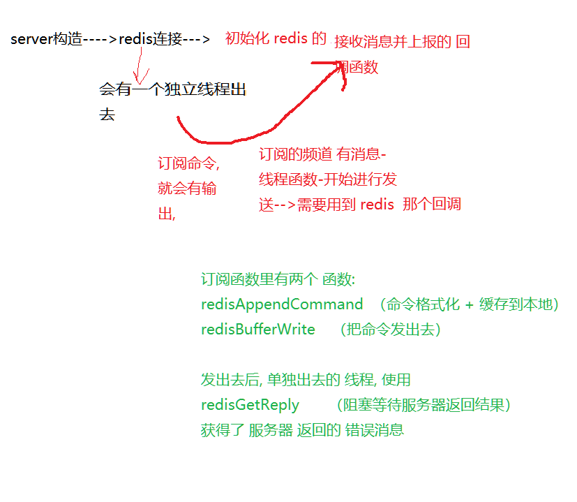
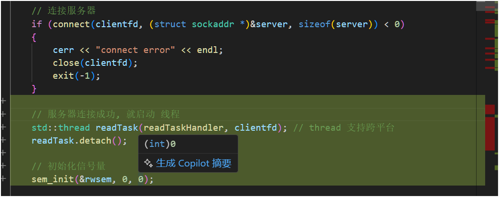

# redis 部分的错误

## oberver_channel_message测试



## 测试代码

```c++
// 在独立线程中接受订阅频道的消息--存在的意义 看订阅那里
void Redis::oberver_channel_message()
{
    redisReply *reply = nullptr;
    while (REDIS_OK == redisGetReply(this->_subscribe_context, (void **)&reply))
    {
        cout<<"jajjaja"<<endl;
        cout<<reply->dval<<endl;
        cout<<reply->element<<endl;
        cout<<1<<endl;
        cout<<reply->element[0]->str<<endl;
        cout<<2<<endl;
        cout<<reply->element[1]->str<<endl;
        cout<<3<<endl;
        cout.flush();
        // cout<<reply->element[2]->str<<endl;
        cout.flush();
        cout<<4<<endl;
        cout.flush();
        cout<<reply->elements<<endl;
        cout.flush();
        cout<<5<<endl;
        cout.flush();
        cout<<reply->integer<<endl;
        cout.flush();
        cout<<6<<endl;
        cout.flush();
        cout<<reply->len<<endl;
        cout<<7<<endl;
        // cout<<reply->str<<endl;
        cout<<8<<endl;
        cout<<reply->type<<endl;
        cout<<9<<endl;
        cout<<reply->vtype<<endl;
        cout<<10<<endl;
        // 订阅收到的消息 是一个带三个元素的数组
        if (reply != nullptr && reply->element[2] != nullptr && reply->element[2]->str != nullptr)
        {
            // 给业务层上报通道上发生的消息
            _notify_message_handler(atoi(reply->element[1]->str), reply->element[2]->str);
            /*
            数组的下标1, 2
            对应 redis 回应的 (2)(3)
            1) "message"
            2) "13"
            3) "hello"
            */
        }
        freeReplyObject(reply);
    }

    cerr << ">>>>>>>>>>>>>>>>>observer_channel_message quit<<<<<<<<<<<<<<<<<<<<" << endl;
}
```

## 问题

仅是个人理解, 记录一下, 

```c++
cout<<reply->element[2]->str<<endl;
```

和

```c++
cout<<reply->str<<endl;
```

这两行 不注释, 服务器那边  会 的 打印 会停到 这两句的上一句


源码 还没看,  推测是, reply 里面的 str, , 做了 特殊处理, 应该是为了安全吧, 不让看,不让访问, 怎么输入, 都看不出来,  注释掉后, 会每通信一次, 就会打印一轮


## 订阅命令错误--分析原因

实际就是 昨天总结的那样, 就是访问 非法内存导致 段错误, 段错误触发的 SIGSEGV 信号 会导致 整个进程 崩溃


# 为什么客户端还会报空json呢

## 问题分析

```c++
char buffer[1024] = {0};               // 接收服务器返回的数据
len = recv(clientfd, buffer, 1024, 0); // 接收数据
cout<<"recv"<<endl;
cout<<buffer<<endl;
if (len < 0)
{
    cerr << "recv error" << endl;
}
```

这部分代码, 按理说, 服务器那边段错误, 也算是 异常退出

代码 应该终止在 recv函数这里,   

## 但是!但是!

段错误崩溃,  导致tcp断开连接, tcp连接断开,  **recv() 在本地会返回 `0`**，就跟对方**正常关闭**是一样的!!!!


这种 内核点的 东西 还不是很了解, 先这样吧

- **TCP协议**下，一般操作系统在**进程崩溃**后：
  - 会帮你把**socket连接直接关闭（发送一个 FIN 包，表示我要断开连接）**。
  - **或者**如果异常崩溃严重（比如段错误没机会正常 close() socket），
    - **可能发 RST (Reset) 包**，告诉对方连接重置。

具体发 **FIN** 还是 **RST**，取决于崩溃当时**socket的状态**和**内核的策略**。


这是最关键的, 也因为这个, buffer 本身就是空, 往后走, json反序列化 报 空json, 也就报  json空 的 错误了


## 改进

```c++
char buffer[1024] = {0};               // 接收服务器返回的数据
len = recv(clientfd, buffer, 1024, 0); // 接收数据

if (len < 0 || len == 0)
{
    if(len == 0)
    {
        cout<<"server quit!"<<endl;
        return 0;
    }
    else{
        cerr << "recv error" << endl;
    }

}
```


# 2025-4-28

# 老师解决问题

## 问题现象

1. **复现场景**：---- 这是 **概率出现的 问题!!**--不是一定出现!!
   - 客户端登录成功后注销，`再次登录`时程序`“假死”`，`无响应`。
   - 在Ubuntu 18.04下**概率低**，但某些环境（如**CentOS）复现概率高**。
2. **定位方法**：
   - 使用`gdb attach`附加到客户端进程，查看线程堆栈：
     - **主线程**阻塞在`recv`等待登录响应。
     - **子线程**（读线程）同样阻塞在`recv`，导致双方互相等待。
   - `gdb attach 进程ID` 是**挂到已经在运行的程序上**
   - `info threads` 是 GDB 里的一个命令，用来**查看当前调试程序里的所有线程信息**。
   - `bt` 是 GDB 中的一个命令，缩写是 **backtrace**，意思是 **打印当前线程的调用栈（函数调用路径）**。----- **查看 究竟在哪个函数 阻塞了**

## 问题原因

1. **线程设计缺陷**：

   - 原设计：主线程发送登录请求后直接`recv`等待响应，登录成功后才启动子线程接收消息。
   - **注销时未关闭子线程**---`重点`，导致二次登录时：
     - 主线程发送请求后尝试`recv`。
     - 子线程（仍存活）抢先`recv`到响应但不处理，主线程因未收到响应而阻塞。

2. **共享资源竞争**：

   - 主线程和子线程**同时操作同一个socket**的`recv`，**未做同步**控制。---- 整个客户端进程 用的都是 clientfd 这个套接字文件描述符, 

   > deepseek:
   >
   > **问题**：
   > 主线程和子线程同时调用 `recv()` 读取同一个 `clientfd`，导致：
   >
   > 1. **数据竞争**：内核随机选择一个线程接收数据，可能造成数据错乱
   > 2. **逻辑错误**：登录响应可能被子线程误当作普通消息处理
   > 3. **死锁风险**：双方线程可能同时阻塞在 `recv()`
   >
   > **推荐方案**：
   > **单线程独占接收**：
   >
   > - 子线程专门负责 `recv()`
   > - 主线程通过信号量等待响应
   > - 避免多个线程同时操作 `clientfd`
   >
   >  

## 解决方案

1. **重构线程职责**：
   - **主线程**：仅负责发送请求（如登录、注册）。
   - **子线程**：在连接服务器后**立即启动**，**全程独占`recv`**，处理所有响应（登录结果、聊天消息等）。
2. **线程间通信**：
   - **信号量**（`sem_t`）：主线程发送请求后通过`sem_wait`阻塞，子线程处理完响应后`sem_post`唤醒主线程。
   - **原子变量**（`atomic<bool>`）：子线程记录登录状态（成功/失败），主线程据此决定跳转界面。**(单变量, 就不用 互斥锁了)**
3. **关键代码改动**：

- **子线程启动时机**：移至`connect`成功后，而非登录成功时。


## 代码

```c++
#include <semaphore.h>
#include <atomic>

```



```c++
// 修改登录和注册----业务逻辑不放在主线程

switch (choice)
{

        // # 3
    case 1: // 登录  根据业务, 需要id与密码
        {
            int id = 0;
            char password[50] = {0};
            cout << "please input your id: ";
            cin >> id;
            cin.get(); // 清空输入缓冲区
            cout << "please input your password: ";
            cin.getline(password, 50); // 读取一行, 包括空格 cin和scanf不能读空格

            // 组装json数据
            json js;
            js["msgid"] = LOGIN_MSG; // 登录消息
            js["id"] = id;
            js["password"] = password;
            // 发送登录请求
            string request = js.dump(); // json转字符串  序列化

            // 重置登录状态
            g_isLogin_Success = false;

            int len = send(clientfd, request.c_str(), strlen(request.c_str()) + 1, 0); // 发送数据
            if (len <= 0)
            {
                cerr << "send login msg error: " << request << endl;
                cerr << "connect error" << endl;
            }
            // else // 登陆成功, 就不在这里接收了

            // 等待信号量
            sem_wait(&rwsem);
            if (g_isLogin_Success == true)
            {
                // 主线程继续执行, 进入聊天菜单页面
                isMainMenuRunning = true;
                mainMenu(clientfd);
            }
        }
        break;
        // # 2
    case 2: // 注册
        {
            char name[50]; // 比string更好, 因为string会有内存分配, 还可以限制长度
            char password[50];
            cout << "please input your name: ";
            cin.getline(name, 50); // 读取一行, 包括空格 cin和scanf不能读空格
            cout << "please input your password: ";
            cin.getline(password, 50);

            // 组装json数据
            json js;
            js["msgid"] = REG_MSG; // 注册消息
            js["name"] = name;
            js["password"] = password;

            // 发送注册请求
            string request = js.dump(); // json转字符串  序列化

            // int len = send(clientfd, request.c_str(), request.size(), 0); // 发送数据
            // 第二个参数必须这么写, 因为规定是const void*类型, 不能直接传入string类型
            int len = send(clientfd, request.c_str(), strlen(request.c_str()) + 1, 0); // 发送数据 这样的+1, 是加了 \0, strlen不算这个
            if (len <= 0)
            {
                cerr << "send error" << request << endl;
            }

            sem_wait(&rwsem); // 注册完, 会通知
        }
        break;
        // # 1
    case 3: // 这个最简单 quit业务
        {
            cout << "exit system" << endl;
            // 销毁信号量
            sem_destroy(&rwsem);
            close(clientfd);
            exit(0);
        }
    default:
        {
            cout << "input error" << endl;
        }
        break;
}

```

```c++
// 修改 子线程 以及 登录和注册 逻辑
void doRegResponse(json &js)
{
    json response = js;
    if (response["errno"] == 0)
    { // 根据业务代码处理
        cout << "register success, userid: " << response["id"] << " do not forget it!" << endl;
    }
    else
    {
        // 注册失败
        cout << "register failed, error: name is already exit!" << endl;
    }
}

void doLoginResponse(json &js)
{
    json response = js;
    if (response["errno"] == 0)
    {
        // 设置登录状态
        g_isLogin_Success = true;

        // 根据业务代码处理 1.登录成功返回 2.好友列表 3.群组列表 4.离线消息
        cout << "login success" << endl;

        // 客户端记录登录用户信息
        g_currentUser.setId(response["id"]);
        g_currentUser.setName(response["name"]);

        // if(response["friends"].is_null())
        // 处理好友列表
        // if (response["friends"].contains("friends")) // 判断是否包含字段, 跟好点,  而不是看 是不是空
        if (response.contains("friends"))
        {
            vector<string> friends = response["friends"]; // 类型是vector<string>, 不是vector<User>,  根据服务器业务,存的是js.dump() 字符串
            g_currentUserFriendsList.clear();
            for (auto &friendUser : friends)
            {
                json js = json::parse(friendUser); // 反序列化
                User user;
                user.setId(js["id"]);
                user.setName(js["name"]);
                user.setState(js["state"]);
                g_currentUserFriendsList.push_back(user);
            }
            for (auto &friendUser : g_currentUserFriendsList)
            {
                cout << "friendid: " << friendUser.getId() << " name: " << friendUser.getName() << " state: " << friendUser.getState() << endl;
            }
        }
        else
        {
            cout << "friends list is empty" << endl;
        }

        // 处理群组列表
        if (response.contains("groups")) // 判断是否包含字段, 跟好点,  而不是看 是不是空
        {
            vector<string> groups = response["groups"]; // 类型是vector<string>, 不是vector<User>,  根据服务器业务,存的是js.dump() 字符串
            g_currentUserGroupsList.clear();
            for (auto &groupl : groups)
            {
                json js = json::parse(groupl); // 反序列化
                string tmp = js.dump();
                Group group;
                group.setId(js["id"]);
                group.setName(js["groupname"]);
                group.setDesc(js["groupdesc"]);

                // 处理群组成员列表
                vector<string> users = js["users"];
                for (auto &userl : users)
                {
                    json js = json::parse(userl); // 反序列化
                    GroupUser user;
                    user.setId(js["id"]);
                    user.setName(js["name"]);
                    user.setState(js["state"]);
                    user.setRole(js["role"]);
                    group.getUsers().push_back(user);
                }
                g_currentUserGroupsList.push_back(group);
            }
            for (auto &group : g_currentUserGroupsList)
            {
                cout << "groupid: " << group.getId() << " name: " << group.getName() << " desc: " << group.getDesc() << endl;
                for (auto &groupUser : group.getUsers())
                {
                    cout << "group user id: " << groupUser.getId() << " name: " << groupUser.getName() << " state: " << groupUser.getState() << " role: " << groupUser.getRole() << endl;
                }
            }
        }
        else
        {
            cout << "groups list is empty" << endl;
        }

        // 显示当前登录用户的基本信息---包含好友列表和群组列表
        showCurrentUserInfo();

        // 处理离线消息
        if (response.contains("offlinemsg")) // 判断是否包含字段, 跟好点,  而不是看 是不是空
        {
            vector<string> offlinemsg = response["offlinemsg"]; // 类型是vector<string>, 不是vector<User>,  根据服务器业务,存的是js.dump() 字符串
            for (auto &msg : offlinemsg)
            {
                json js = json::parse(msg); // 反序列化
                // 时间+fromid+fromname+msg-----详看笔记 一对一聊天发送的格式

                // 分一下 个人离线和群组离线
                if (js["msgid"] == ONE_CHAT_MSG)
                {
                    cout << js["time"].get<string>() << "[" << js["id"].get<int>() << "] " << js["name"].get<string>() << " said: " << js["msg"].get<string>() << endl;
                }
                if (js["msgid"] == GROUP_CHAT_MSG) // 群组聊天消息
                {
                    cout << "群消息-->[" << js["groupid"] << "] " << js["time"].get<string>() << "[" << js["id"] << "] " << js["name"].get<string>() << " said: " << js["msg"].get<string>() << endl;
                }
            }
        }
        else
        {
            cout << "offlinemsg list is empty" << endl;
        }
    }
    else // 不分那么细, 服务器已经确定错误信息了
    {
        g_isLogin_Success = false; // 登录失败

        // 登录失败
        cout << "login failed, error: " << response["errmsg"] << endl;
    }
}

// 接收线程---实时就收 服务器返回的数据--包括别人发来的聊天消息
void readTaskHandler(int clientfd)
{
    for (;;)
    {
        char buffer[1024] = {0};                   // 接收服务器返回的数据
        int len = recv(clientfd, buffer, 1024, 0); // 接收数据
        if (len < 0)                               // ==-1
        {
            cerr << "recv error" << endl;
            close(clientfd);
            exit(-1);
        }
        else if (len == 0) // 服务器关闭连接
        {
            cout << "server close" << endl;
            close(clientfd);
            exit(-1);
        }

        // 解析json数据
        json response = json::parse(buffer);   // 反序列化 字符串转json
        if (response["msgid"] == ONE_CHAT_MSG) // 一对一聊天消息
        {
            cout << response["time"].get<string>() << "[" << response["id"] << "] " << response["name"].get<string>() << " said: " << response["msg"].get<string>() << endl;
            continue;
        }

        if (response["msgid"] == GROUP_CHAT_MSG) // 群组聊天消息
        {
            cout << "群消息-->[" << response["groupid"] << "] " << response["time"].get<string>() << "[" << response["id"] << "] " << response["name"].get<string>() << " said: " << response["msg"].get<string>() << endl;
        }

        // 登录成功
        if (response["msgid"] == LOGIN_MSG_ACK)
        {
            doLoginResponse(response); // 处理登陆成功的 业务逻辑
            sem_post(&rwsem);          // 通知主线程, 登录结果是什么
            continue;
        }

        // 注册
        if (response["msgid"] == REG_MSG_ACK)
        {
            doRegResponse(response);
            sem_post(&rwsem);
            continue;
        }
    }
}

```


## 注意

如果stl容器 都不是线程安全的, 要仔细检查一下, 是不是只在一个线程里使用, 若不是, 就要考虑 线程安全问题


# 留一个优化

mysql的id 有许多没用, 却跳过了

